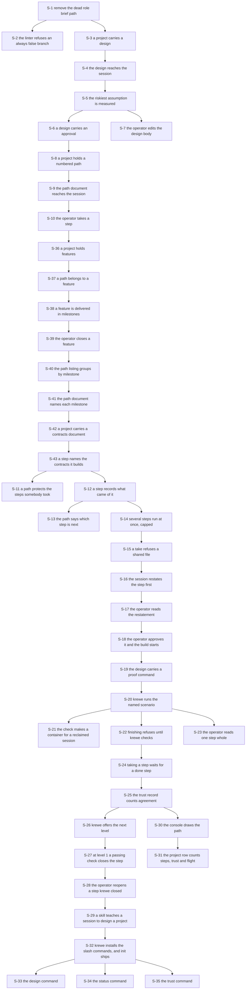
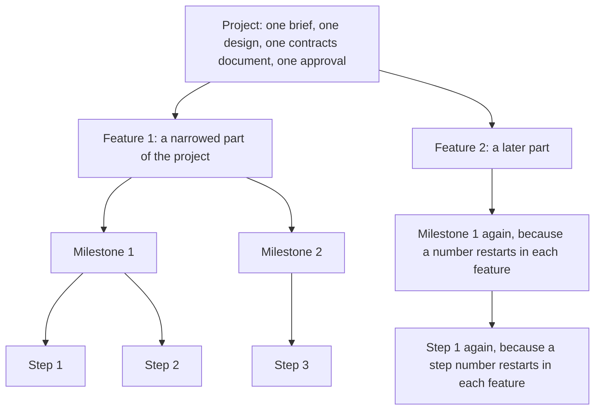

# Contracts: a project carries its own context

Written 2026-09-04, and written again the same day after the design was revised three times.
Amended 2026-09-05, after the operator settled the four levels.
Amended again on 2026-09-05, after the session listing was measured.

The source is `.greenlight/DESIGN.md`, `.greenlight/DECISIONS.md` and the code the design touches.

These contracts are the source of truth for the tests. A contract states the input, the output and
every error. A contract with no stated error is an incomplete contract.

Nothing here is code. Nothing here is a test. No code exists before the operator approves the path.

## How to read this

Each contract carries an identifier. `GRAPH.json` names those identifiers, so a slice says exactly
which contracts it satisfies.

The groups are:

- `REMOVE` for the dead code the work clears first.
- `LEVEL` for the four levels a project is built from.
- `TABLE` for a database table, at field level.
- `STORE` for one method on the `Store` interface.
- `WIRE` for one protobuf message or one service method.
- `GRAMMAR` for the path document format.
- `RENDER` for what the control plane writes into a sandbox.
- `FLIGHT` for the rules that hold when several steps run at once.
- `PROOF` for the run of a step's named scenario.
- `TRUST` for the ladder that moves the word done.
- `COMMAND` for one command line verb.
- `CONSOLE` for one view.
- `SKILL` for the design skill.
- `SLASH` for the commands the operator's own session reads.
- `MEASURE` for the proof of the riskiest assumption.

Verification is `auto` or `verify`. `auto` means a green test fully proves the contract. `verify`
means the operator looks at the result before the slice closes.

## What changed since the first version of this file

The first version predates four revisions of the design. Eight things moved.

1. The proof runs in the session's sandbox. When the session was reclaimed and holds no container,
   krewe starts one and restores the working tree into it. The first version refused a reclaimed
   session, which left a step that nothing could close.
2. There is a trust ladder. Krewe runs the check and states a verdict. The operator says the word
   done. Krewe counts the agreements, offers the next level, and the operator accepts the offer. A
   disagreement lowers the level by one and restarts the run.
3. Gate 3 changed. `krewe step done` refuses a step nothing checked. It no longer refuses a failing
   verdict, because the word belongs to the operator.
4. Gate 2 changed. `krewe step take` refuses while the step before it is not done, rather than while
   it carries no passing proof.
5. Several steps may be in flight at once. The operator takes each one, and each take starts its own
   session. One session still builds one step. No command reads the graph and dispatches, and a step
   that finishes starts nothing.
6. A take is refused when the step's `touches` names a file that a step in flight also names. The
   comparison is line by line, after the spaces at each end are removed.
7. A project caps the steps in flight, and the default is three. FLIGHT-2 holds the cap and FLIGHT-3
   holds the collision refusal.
8. Krewe writes the slash commands the operator's own session reads. One markdown file per command,
   carried by the binary, installed by `krewe commands install`. Four commands ship. Nothing in that
   work touches the store.

Identifiers survive where the contract survives. `REMOVE-1` still names the same removal. Nothing in
the fan out revision renamed a contract. It added `FLIGHT-1` to `FLIGHT-3`, `STORE-17`, `WIRE-18`
and `COMMAND-20`, and it widened `TABLE-1`, `STORE-0`, `STORE-8`, `WIRE-1`, `WIRE-9`, `GRAMMAR-1`,
`COMMAND-9`, `CONSOLE-2` and `SKILL-1`.

The commands revision renamed nothing either. It added `SLASH-1` to `SLASH-7` and `COMMAND-21` to
`COMMAND-23`, and it widened the preamble of the COMMAND group from four taken words to five.

## What the four level revision changed, 2026-09-05

The operator settled a shape the design did not carry. A project holds one design and many features.
A feature is delivered in milestones. A milestone holds steps.

The reason for the layer is parallel delivery. A website runs an authentication feature and a payment
feature at once, and each holds its own path of milestones. Seven things moved.

1. There is a `LEVEL` group. `LEVEL-1` states the four levels. `LEVEL-2` states how a step is
   addressed after the key moves, and it lists every contract that reads differently because of it.
2. The step table is renamed. `TABLE-2` is now `feature_steps`, keyed by (`feature`, `number`).
   Migration `0066` renames it, moves the key, and carries the rows that exist.
3. There are two more tables. `TABLE-3` holds `features` and `TABLE-4` holds `milestones`.
4. `SetPath` replaces one feature's path, and it writes that feature's milestones in the same
   transaction. Before this, a second feature would wipe the first.
5. A project carries a contracts document, a second body beside the design. `RENDER-8` renders it
   to `.krewe/contracts.md`, exactly as `RENDER-2` renders the design.
6. A step names the contracts it builds, and the scope of each. `RENDER-4` puts both into the take
   text, so nobody types the scoping by hand.
7. The cap and the collision check still read the whole project, across every feature. `STORE-8`,
   `FLIGHT-2`, `FLIGHT-3` and `LEVEL-2` each state it. The new key invites a query scoped to the
   feature, and that query lets two features write one file at once.

Identifiers survive again. Nothing was renamed. The revision added `LEVEL-1`, `LEVEL-2`,
`TABLE-3`, `TABLE-4`, `STORE-18` to `STORE-23`, `WIRE-19` to `WIRE-25`, `RENDER-8` and
`COMMAND-24` to `COMMAND-30`. It widened `TABLE-1`, `TABLE-2`, `STORE-5`, `STORE-6`,
`STORE-8`, `WIRE-1`, `WIRE-2`, `WIRE-7`, `WIRE-8`, `GRAMMAR-1`, `FLIGHT-2`, `FLIGHT-3`,
`RENDER-2`, `RENDER-3`, `RENDER-4`, `COMMAND-7` and `COMMAND-8`.

## What the archive amendment changed, 2026-09-05

The session listing was measured on 2026-09-05. `krewe sessions system` reported 296 sessions and
printed 298 lines. 282 of those sessions read `stopped`, 9 read `idle`, 3 read `awake` and 2 read
`running`. So 282 rows of finished work buried the four rows a person wanted. Fourteen session
containers stood behind the 296 rows, so the cost was the listing and not the disk.

The amendment adds one slice, S-44, and one milestone, 22. Four things are worth stating before the
contracts.

1. The stamp exists. Migration `0004_archive_sessions` added `archived_at` on 2026-04-11, with the
   partial index `sessions_live_idx`. The store, the wire calls and the console view exist too. This
   amendment adds no column and no migration.
2. What is missing is the command line. A person can archive from the console and from nowhere else.
   `krewe sessions` already hides an archived session, and it says nothing about how many it hid.
3. One behaviour is replaced rather than added. `ArchiveSession` stops a session of any status today
   and archives it. It refuses a session that holds an open exec from this slice on.
4. The archive is a stamp, never a state word. The eight status words stay as they are.

Identifiers survive again. Nothing was renamed. The amendment added `TABLE-5`, `STORE-24`,
`STORE-25`, `WIRE-26`, `WIRE-27`, `WIRE-28` and `COMMAND-31` to `COMMAND-33`. It widened no
contract, because it touches no contract the path work states.

## Decisions the architect took, beyond the design

The design does not answer these. Each one is a decision, not a fact. The operator can reverse any
of them.

1. The migrations split into thirteen numbered pairs, `0062` to `0074`, one per slice that adds
   columns. Section 11 of the design says one pair. One reviewable pull request per slice forces the
   split. Migrations `0043` and `0044` already add one column each to `projects`, so this follows
   the house style. Migrations `0062`, `0063` and `0064` shipped, and their numbers are fixed.

   The numbers follow the order the slices ship. The four level revision took `0065` to `0069`,
   because those five migrations land before every unbuilt slice. Five reserved numbers moved up by
   five.

   The cap column moved from `0065` to `0070`. The restatement columns moved from `0066` to
   `0071`. The proof command columns moved from `0067` to `0072`. The proof result columns moved
   from `0068` to `0073`. The trust columns moved from `0069` to `0074`. None of those five
   shipped, so no applied migration moved.
2. `SetPath` carries the markdown document, and the control plane parses it. The design says the
   grammar is the architect's contract. One grammar in one place keeps the console and the command
   line from drifting. It is the same reason the control plane composes the step text.
3. `written_by` is a claim the caller sends, not an authenticated fact. The token says operator or
   driver, and it does not say which session. Carrying the caller identity through the interceptor
   is real work in `internal/auth`, and the field grants nothing. Deferred.
4. Six calls join `DeniedToDriver`: `ApproveDesign`, `ApproveRestatement`, `SetProofCommand`,
   `RaiseTrust`, `SetTrustThreshold` and `SetStepsInFlightCap`. Each one is the operator's word or
   the operator's grant. A session that could approve its own restatement defeats the gate that
   exists to read it. A session that could raise the cap grants itself more sessions.
5. The store computes `operator_agreed`, in the same statement that writes `state`. Section 6.3 of
   the design requires that. The control plane cannot do it without a read then a write, and a race
   between them writes the wrong answer.
6. The store moves the trust counters in the same transaction as the finish. One write, so no
   reader sees a closed step whose counters did not move.
7. `ListSteps` with an empty project answers for every project. `ListProjects` and
   `ListSessionEvents` already read an empty identifier as "every one". It is what lets the console
   count steps for a page of projects in one call.
8. An empty path document is refused. There is no way to empty a path, and that is deliberate: a
   wrong file path must not delete a path. Recorded as deferred.
9. The design section in the memory file is capped at 400 characters. When the four lines would run
   past the cap, the brief is cut further so the other three lines survive.
10. `krewe trust` reads through `GetDesign`. The trust record lives on the design row, so a second
    read call would answer the same row twice.
11. Section 9 of the design says twelve service methods and then names sixteen. These contracts
    carry the sixteen it names.
12. The collision check compares the `touches` field of the step against every step in state
    `taken`. The store does that in the same statement as the take. A read then a write in the
    control plane would let two takes pass the check at the same moment.
13. A step with an empty `touches` collides with nothing and takes a slot under the cap. The design
    does not say which, and refusing every such take would block a path whose design session left
    the field empty. GRAMMAR-1 warns instead.
14. The marker on a command file is line one, written as a markdown comment. The design says each
    file carries a marker and does not say where. Line one lets the install read it without reading
    the body, and a comment means the agent reads it as nothing.
15. The install writes to `$KREWE_COMMANDS_DIR` when that variable holds a value. Otherwise it
    writes to `commands/krewe` under the agent's own configuration directory in the operator's home.
    The design says "the agent's command directory" and names no path. The variable is what lets a
    scenario install into a temporary directory.
16. `krewe commands` takes no address and no flag, and `krewe commands install` takes none either.
    The house style is addresses instead of flags, and these files belong to the machine rather than
    to a project. The design already refuses a flag that forces a write.

The five below came with the four level revision.

17. A step is named as one token, `<feature>.<number>`. The address already holds three parts, and
    the third is a session, so a feature cannot go in the address. Two bare numbers in a row is the
    other option, and a reader swaps them. LEVEL-2 states the refusal that meets the old form.
18. The milestones travel inside `ListStepsResponse` rather than through a service method of their
    own. A caller that draws a grouped listing needs both, and one call cannot answer half of it.
    The store keeps `ListMilestones` as STORE-22, because the render reads milestones without
    reading steps.
19. The step table is named `feature_steps`. The house names a table after the row's owner, as
    `project_designs` does, and the key is (`feature`, `number`). Rejected: keeping
    `project_steps`, which names a column the table no longer holds. Rejected: a bare `steps`,
    which reads as one global list in a store where every other table carries its owner.
20. Writing the contracts document does not clear the approval. The approval is the operator's word
    about the design body, and the contracts document is read from that body. Rejected: clearing it,
    which asks the operator to approve the design again every time an architect writes a contract.
    The operator can reverse this.
21. The pointer to `.krewe/contracts.md` goes in the take text of RENDER-4, and not in the memory
    file of RENDER-1. The memory file is read on every exec of every session in the project, and it
    is capped at 400 characters. A fourth pointer there would cut the brief further.

One word now names two things in this repository. `features/` holds the scenario files, and a
feature is a level of this model. The prose says "a feature file" for the first and "a feature" for
the second, everywhere.

## The order of the work



S-5 is the gate. It costs no code. If the answer is no, every slice after it is cancelled.

S-36 to S-43 sit between S-10 and everything else. S-37 moves the key of the step table from the
project to the feature. Every unbuilt slice hangs off S-11 or S-12, and both wait for S-43. So no
slice after this chain is built on the old key.

Slice identifiers after S-13 moved by two, because milestone 7 inserted two slices. No contract
identifier moved. The commands revision appended S-32 to S-35 and moved nothing.

## REMOVE: the dead code that goes first

### REMOVE-1: a memory file carries no role section

Boundary: control plane to the file the model reads.

Today `renderContext` at `internal/controlplane/server.go:585` declares `brief` as the empty string.
It never assigns it again. The `RoleScope` section therefore never renders. Lines 597 to 598 hold an
`if false` branch left from the roles removal.

Input: a session, and the store's four levels of context.

Output: two memory files. The outer file holds system context, workspace context and the skills
index. The inner file holds project context and session context.

Errors:
- A store read that fails skips that level and renders the rest. This is today's behaviour and it
  does not change. A failure here never fails an exec.

Invariants:
- No section carries the mark `role`, in either file.
- `sandbox.RoleScope` does not exist after this contract is satisfied.
- The read back in `syncContextExcept` at line 527 no longer names `RoleScope` in its scope list.
- The skills index still renders into the outer file, and is still never read back.
- Every existing context scenario stays green.

Verification: verify
Acceptance criteria:
- A dispatched session's memory file carries the project context and no role section.
- A session that writes into its own memory still keeps that writing.
Steps:
- Read `features/context.feature` and confirm every scenario in it still passes in continuous
  integration.

### REMOVE-2: a sandbox is configured without a role

Boundary: control plane to sandbox.

Input: a `sandbox.Config` for one session.

Output: a sandbox whose conversation store sits at `workspaces/<workspace>/claude`, always.

Errors:
- None new. The layout carries one branch fewer.

Invariants:
- `sandbox.Config` carries no `Role` field.
- `layout` in `internal/sandbox/storage.go:87` has one path, not two.
- `conversationDir` in `internal/sandbox/usage.go:170` has no role branch.
- A session's working directory does not move. It stays at
  `workspaces/<workspace>/projects/<project>/sessions/<session>/workspace`.

Verification: auto
The reason: the removed branch was unreachable, so a green suite fully proves the removal. The
existing directories scenarios cover the paths.

### REMOVE-3: the lint gate refuses a branch on a boolean literal

Boundary: repository to continuous integration.

Input: the Go source of this module, except `gen/` and the hook modules.

Output: a `make constant-branches` run. It names every branch whose condition is the bare word
`true` or `false`. It gives the file and the line of each one.

This contract was measured and corrected. It said `staticcheck` joins the enabled set and then
refuses the branch. Both halves were false. `default: standard` already enables `staticcheck`, and
`golangci-lint linters` lists it. Naming it again changes nothing.

Nothing in golangci-lint 2.12.2 reports the branch. An `if false` in a live path passed the
repository's own configuration. It also passed every linter enabled at once, with the optional
checks of `gocritic`, `revive` and `staticcheck` turned on. The other half of the old output needs
no work. An assigned but unused value is already reported by `ineffassign`, which the standard set
enables.

So the guard is a command in this repository, not a linter entry.

Errors:
- A branch on a boolean literal fails the lint job. The refusal names the file, the line and what to
  write instead.
- Reading no Go source fails too. A guard over a moved or empty tree reports the same silence as a
  guard over clean source. Only one of the two means anything.

Invariants:
- `make constant-branches` reads the module. It refuses a branch whose condition is `true` or
  `false`, in an `if` and in an `else if`.
- It parses the source, and does not match text. The words in a comment are not a finding. An
  identifier such as `falsePositive` is not a finding. The words inside a string are not a finding.
- A test of the guard may therefore hold the forbidden source as an ordinary string. No directory of
  tests is excluded.
- `lint` depends on `constant-branches`. The lint step of `.github/workflows/ci.yml` calls the same
  target, so a machine and the pipeline cannot drift.
- It reads the literal form only. A condition that is always false through a variable still needs a
  person to see it. That is the shape the dead role path had.
- The guard is added after REMOVE-1, never before. Added first, it turns the build red on code that
  goes away anyway.

Verification: verify
Acceptance criteria:
- `make constant-branches` passes on a clean tree. It names the count of files it read.
- It refuses a deliberately added `if false` branch, and names its file and line.
- It refuses a tree it read no Go source in.
Steps:
- Run `make constant-branches` and read what it prints.

## LEVEL: the four levels a project is built from

### LEVEL-1: a project, a feature, a milestone and a step

Boundary: the model every other contract in this file is written against.

The layer exists because a project delivers several features at the same time. A website runs an
authentication feature and a payment feature at once. Authentication ships sign up, then sign in,
then reset, then sessions. Payment ships checkout, then refunds, then webhooks. Two paths, each with
its own milestones, and neither one waits for the other.

A project is one. It holds one brief, one design, one contracts document and one approval. Nothing
about those moves down a level.

A feature is many per project. It carries a number, a title, and one line saying which part of the
project it narrows to. A project grows features over time.

A milestone belongs to one feature. It carries a number, a title and one line.

A step belongs to one milestone. It carries everything the step table holds today.



Errors: none. This contract states a model, and the tables under it carry the behaviour.

Invariants:
- A project holds one design and one approval. A feature carries no approval of its own.
- Gate 1 reads the project's design. Taking a step is refused while that design carries no approval,
  whichever feature the step sits in.
- Feature numbers restart in each project.
- Milestone numbers restart in each feature.
- Step numbers restart in each feature, and not in each milestone. So a feature holds one step 3, and
  `after` keeps naming a lower step number in the same path.
- A step may belong to no milestone. Its `milestone` is then 0, and 0 is not a row in `milestones`.
- A feature holds a path. A project does not.
- Several features of one project run at the same time. Nothing orders one feature against another,
  and no feature waits for another to close.

Verification: verify
Acceptance criteria:
- A project with two features holds two paths. Setting the path of one leaves the other whole.
- Step 1 exists in each of two features at the same time.
- A step of feature 1 and a step of feature 2 are both in state `taken` at the same time.
- Taking a step in the second feature is refused while the project's design carries no approval.

### LEVEL-2: how a step is addressed after the key moves

Boundary: every contract in this file that names a step.

Migration `0066` moves the key of the step table from the project to the feature. This contract
states what that does to every contract already written, so no contract is left saying the old
thing.

The substitution is one rule. A store method, a request message or a command took a project to
reach a step. It takes a feature instead.

The store methods: STORE-5, STORE-6, STORE-7, STORE-8, STORE-9, STORE-11, STORE-12, STORE-13 and
STORE-14 take a feature identifier where they took a project identifier.

The service methods: WIRE-7, WIRE-8, WIRE-9, WIRE-10, WIRE-11, WIRE-12, WIRE-14 and WIRE-15 carry a
`feature` field where they carried a `project` field. Each keeps its field number, because the field
type does not change and no message shipped yet.

The commands: COMMAND-7 to COMMAND-16 and COMMAND-20 name a step as one token, `<feature>.<number>`.
`krewe step take me/house-bills 2.3` takes step 3 of feature 2.

The console: CONSOLE-1 draws one feature's path and names the feature above it. CONSOLE-2 counts
every open feature of the project in the project row, so the row keeps saying what the project
reached.

The renders: RENDER-3 writes one block per feature, and RENDER-4 names the feature the step sits in.

Input: a feature identifier and a step number, wherever a project identifier and a step number were
read before.

Output: the same output each of those contracts already states.

Errors:
- A step token with no full stop in it is refused, on every command that names a step. The refusal
  reads: "name a step as <feature>.<number>, for example 2.3", and it lists the project's open
  features with their numbers. This is the way off the old form, and it is refused rather than
  guessed at, even when the project holds exactly one feature.
- A step token whose feature part names no feature of the project is refused, naming the number and
  the features that exist.
- A step token whose feature part or number part is not a number is refused, naming the token.

Invariants:
- **The substitution does not change what the cap and the collision check read.** They read the
  whole project, across every feature, exactly as they did before the key moved. A read filtered by
  feature is the defect this contract exists to refuse, and it is the one the new key invites.
  STORE-8, FLIGHT-2 and FLIGHT-3 each state it.
- `after` is the one thing that stays inside the feature. A step waits for a lower step of its own
  path, and never for a step of another feature.
- The old form never resolves. A bare number was a whole step address before this change, so it is
  in somebody's notes and in their shell history. It names nothing now, and it says so.
- A feature alone is still a bare number, because a feature address has one part. `krewe path
  me/house-bills 2` reads the path of feature 2.
- Nothing else about any listed contract changes. The errors, the invariants and the output of each
  one stand as they are written.

Verification: verify
Acceptance criteria:
- `krewe step take me/house-bills 2.3` takes step 3 of feature 2.
- `krewe step take me/house-bills 3` is refused, and the refusal names the form and the features.
- Two features each hold a step 3, and taking one leaves the other ready.

## TABLE: the tables, at field level

### TABLE-1: table `project_designs`

Boundary: store to Postgres.

One row per project. The row appears when somebody sets a brief or a design body. A project with no
row has no design, and that is the normal state.

The columns migration `0062` creates:

- `project` text, primary key, references `projects (id)` on delete cascade.
- `brief` text not null default `''`. What the project is for, one paragraph.
- `body` text not null default `''`. The design document, whole, in markdown.
- `written_by` text not null default `''`. The session that last wrote `body`, empty when the
  operator wrote it. Not a foreign key: the session may be archived or deleted, and the record of
  who wrote the design must survive that.
- `created_at` timestamptz not null default now().
- `updated_at` timestamptz not null default now().

The columns migration `0063` adds, for the approval:

- `approved` boolean not null default false. The operator's word. Any write to `body` sets it false.
- `approved_at` timestamptz, null while `approved` is false.

The column migration `0070` adds, for the fan out:

- `steps_in_flight_cap` integer not null default 3. How many steps may be in state `taken` at one
  time. The number is provisional, and section 4 of the design says why.

The columns migration `0072` adds, for the proof command:

- `proof_command` text not null default `''`. The command krewe runs inside the session's sandbox to
  run one scenario. It must carry the token `{scenario}`. For this repository the value is
  `go test ./features/... -run 'TestFeatures/{scenario}' -v -count=1`.
- `proof_count_pattern` text not null default `'([0-9]+) scenarios'`. A regular expression with one
  capture group, read against the run output for the number of scenarios that ran.
- `proof_timeout_seconds` integer not null default 900. The budget for one proof run.

The column migration `0068` adds, for the contracts document:

- `contracts` text not null default `''`. The contracts document, whole, in markdown. It is a second
  body beside the design, and RENDER-8 renders it into the session's working directory.

The columns migration `0074` adds, for the trust ladder:

- `trust_level` integer not null default 0. Level 0: krewe checks and the operator says done. Level
  1: krewe closes a step its own check passed.
- `trust_threshold` integer not null default 5. The run of agreements that earns an offer of the
  next level. The number is provisional, and section 4 of the design says why.
- `trust_run` integer not null default 0. Consecutive agreements since the last disagreement or the
  last level change.
- `trust_offered` boolean not null default false. True after krewe offers the next level, until the
  operator answers.
- `trust_agreements` integer not null default 0. Every agreement this project recorded.
- `trust_disagreements` integer not null default 0. Every disagreement this project recorded.

Indexes: the primary key is the only read path. A design is read by project identifier and is never
scanned.

Errors:
- An insert naming a project that does not exist fails on the foreign key. The store maps this to
  `store.ErrNotFound`.

Invariants:
- Every text column defaults to the empty string. Every boolean defaults to false. Every integer
  defaults to a stated number. The only nullable column is `approved_at`.
- Setting `body` sets `approved` to false and `approved_at` to null, in the same write.
- Setting `brief` does not touch `approved`.
- Setting any proof column does not touch `approved`. None of them changes what the design says.
- Setting `contracts` does not touch `approved`. The approval is the operator's word about the
  design body, and the contracts document is read from that body. Architect decision 20 records
  this, and the operator can reverse it.
- Setting `steps_in_flight_cap` does not touch `approved`, and it moves no trust column. The cap
  governs the fan out, not the word done.
- Writing `body` does not touch any trust column. Trust records the checking, not the text.
- `trust_level` never goes below 0 and never goes above 1.
- `steps_in_flight_cap` is between 1 and 20. WIRE-18 refuses anything outside that.
- Deleting a project deletes its design row through the cascade.
- Each down migration drops what its up migration added, and says in its own comment that the data
  goes with it and exists nowhere else.

Verification: verify
Acceptance criteria:
- The control plane starts against an empty database and applies every migration above.
- The control plane starts twice against the same database without failing.
- A design row reads back with the default proof command pattern, a trust level of 0 and a cap of
  3.
- A design row reads back with an empty contracts document.
Steps:
- Read each up migration file and confirm every column above, with the stated default.

A separate table rather than columns on `projects`, for two reasons. Every project listing reads
`projects`, and a design body is the largest text in the system. The row also carries its own
timestamps and its own writer.

### TABLE-2: table `feature_steps`

Boundary: store to Postgres.

One row per step of one feature's path.

The table is named after the row's owner, as `project_designs` is. Its key is (`feature`,
`number`), so `project_steps` would name a column the table does not hold. Architect decision 19
records the name and what was rejected.

Migration `0064` created this table as `project_steps`, keyed by the project. Migration `0066`
renames it and moves the key to the feature. The list below reads in the order the migrations ran.

The columns migration `0064` created, as `project_steps`:

- `project` text not null, references `projects (id)` on delete cascade. Migration `0066` drops
  it.
- `number` integer not null. Where in the path, counting from one.
- `title` text not null. One line, one intention.
- `intention` text not null default `''`. What changes and why, in the words a stranger needs.
- `touches` text not null default `''`. The files or packages this step writes, one per line. The
  take reads it line by line, so a file this field does not name goes through the collision check.
- `proof` text not null default `''`. What proves it, and the value it delivers, in prose.
- `proof_scenario` text not null default `''`. The exact name of the scenario that proves it, as the
  feature file writes it. This is what krewe runs.
- `after` integer not null default 0. The step number this one waits for. Zero means nothing blocks
  it.
- `state` text not null default `'ready'`. One of `ready`, `taken`, `done`, `stopped`.
- `session` text not null default `''`. The session that took it. Not a foreign key, for the same
  reason `written_by` is not one.
- `result` text not null default `''`. What somebody wrote that the step produced, or why it
  stopped.
- `taken_at` timestamptz, null until taken.
- `finished_at` timestamptz, null until done or stopped.
- `created_at` timestamptz not null default now().
- `updated_at` timestamptz not null default now().
- primary key (`project`, `number`). Migration `0066` moves it.

What migration `0066` changes, for the feature:

- The table is renamed to `feature_steps`.
- `feature` text not null, references `features (id)` on delete cascade, is added.
- `project` is dropped.
- The primary key moves from (`project`, `number`) to (`feature`, `number`).
- Step numbers restart in each feature. So `after` keeps its meaning: a lower step number in the
  same path.
- The index `project_steps_session_idx` is renamed to `feature_steps_session_idx`, and it keeps
  its shape.
- The up migration carries the rows that exist. It adds one feature for every project that holds
  steps. That feature is numbered 1 and takes the project name as its title. Every step of the
  project then points at it. A project that holds no step gets no feature.
- The down migration puts `project` back from each row's feature, drops `feature` and the
  `milestone` column, and renames the table again. It then drops every feature the up migration
  made. A feature the operator added after the up migration ran cannot be reversed, and its steps
  move to the project that holds it. The down migration says so in its own comment.

The column migration `0067` adds, for the milestone:

- `milestone` integer not null default 0. Which milestone of the feature this step belongs to. Zero
  means the step belongs to no milestone.

The columns migration `0069` adds, for the contracts a step builds:

- `contracts` text not null default `''`. The contracts this step builds, one identifier per line.
- `contract_scope` text not null default `''`. One line per contract, reading
  `<identifier>: <sentence>`. The sentence says which part of the contract is this step's, and which
  part waits for a later step. RENDER-4 puts both into the take text.

The columns migration `0071` adds, for the restatement:

- `restatement` text not null default `''`. What the session wrote about this step, before it built
  anything. RENDER-5 states what it contains.
- `restated_at` timestamptz, null until the session writes one.
- `restatement_approved` boolean not null default false. The operator's word about this exact text.
- `restatement_approved_at` timestamptz, null while `restatement_approved` is false.

The columns migration `0073` adds, for the proof result:

- `proof_state` text not null default `'unproven'`. One of `unproven`, `passing`, `failing`.
- `proof_scenarios_run` integer not null default 0. How many scenarios the last run reported. Zero
  means nothing ran, and zero never passes.
- `proof_output` text not null default `''`. The last 4,000 characters of the last run. When the
  output was cut, the first line says how much.
- `proof_ran_at` timestamptz, null until a proof runs.

The columns migration `0074` adds, for the trust ladder:

- `closed_by` text not null default `''`. Who spoke the word: `operator` or `krewe`. Empty while the
  step is ready or taken.
- `operator_agreed` text not null default `''`. Whether the operator's word matched krewe's last
  verdict: `yes`, `no`, or empty while nothing is decided.

Indexes:
- The primary key serves the only ordinary read: one feature's path in number order.
- `feature_steps_session_idx on feature_steps (session) where session <> ''`. It answers which step
  a session is on, which a session listing needs to draw one row.
- No index on `proof_state`, on `state` or on `milestone`. A whole path is read by the primary
  key prefix, then filtered and grouped in memory. An index nothing reads is a cost with no reader.
- The take reads every step in state `taken` in the whole project. It reads the project's features
  through `features_project_idx`, then each feature's steps by the primary key prefix, and filters
  in memory. Tens of features holding tens of steps each is what this store is sized for, so no
  index on `state` is added for it.

The four state words:
- `ready`: nobody took it.
- `taken`: a session holds it. `session` names that session and `taken_at` says when.
- `done`: somebody closed it. `closed_by` says who.
- `stopped`: somebody stopped it. `result` says why.

Three phases a reader wants, each derived from the row and none of them stored:
- Waiting for a restatement: `state` is `taken` and `restatement` is empty.
- Waiting for the operator: `state` is `taken`, `restatement` is not empty, and
  `restatement_approved` is false.
- Building: `state` is `taken` and `restatement_approved` is true.

Errors:
- An insert naming a feature that does not exist fails on the foreign key, mapped to
  `store.ErrNotFound`.
- A second row with the same feature and number fails on the primary key. The store never writes
  one, because `SetPath` replaces.

Invariants:
- `number` is one or greater. Zero and negative numbers never reach the table.
- `after` is zero, or a lower number that exists in the same feature's path. It never equals the
  row's own number.
- The state words do not grow past four. A phase a reader wants is derived from the row.
- `milestone` is zero, or a milestone number that exists for the same feature.
- Two features each hold a step 3, and neither one blocks the other.
- `contract_scope` names only identifiers that `contracts` names. GRAMMAR-1 refuses a document
  that breaks this.
- Deleting a project deletes its features, and each feature deletes its steps, through the cascades.
- Each down migration drops what its up migration added, and says the data exists nowhere else.

Verification: verify
Acceptance criteria:
- The control plane starts against an empty database and applies every migration above.
- Deleting a project leaves no rows in `feature_steps` for it.
- A fresh step reads back with a proof state of `unproven`, an empty closer and a milestone of 0.
- A database holding steps written before migration `0066` reads them back after it, under one
  feature numbered 1, with every column and every number kept.

### TABLE-3: table `features`

Boundary: store to Postgres.

Many rows per project. One row is one narrowed part of the project. A project grows features over
time, and each one is delivered in milestones.

The columns migration `0065` creates:

- `id` text, primary key. The identifier the step table and the milestone table point at.
- `project` text not null, references `projects (id)` on delete cascade.
- `number` integer not null. Where in the project, counting from one. This is
  the number a person types.
- `title` text not null. One line.
- `intention` text not null default `''`. One line. It says which part of the project this feature
  narrows to.
- `state` text not null default `'open'`. One of `open`, `done`, `stopped`.
- `created_at` timestamptz not null default now().
- `updated_at` timestamptz not null default now().
- unique (`project`, `number`).

Indexes:
- The primary key answers a read by identifier. Every step read goes through it.
- `features_project_idx on features (project)`. It answers a listing of one project's features, in
  number order. It also answers the take, which counts the steps in flight across every feature of
  the project. STORE-8 states why that count is by project and never by feature.

The three state words:
- `open`: somebody works on this feature, or nobody started it yet.
- `done`: the feature finished.
- `stopped`: somebody stopped it. It keeps its steps.

Errors:
- An insert naming a project that does not exist fails on the foreign key. The store maps this to
  `store.ErrNotFound`.
- A second row with the same project and number fails on the unique constraint. The store never
  writes one, because it reads the highest number and adds one in the same statement.

Invariants:
- `number` is one or greater.
- The state words do not grow past three. This follows the four step state words: the state says who
  holds the row, and nothing else.
- Closing a feature keeps its steps and its milestones. A state is not a delete.
- A feature carries no design, no contracts document and no approval. Those belong to the project.
- Deleting a project deletes its features through the cascade. Each feature then deletes its steps
  and its milestones through theirs.
- Each down migration drops what its up migration added, and says the data exists nowhere else.

Verification: verify
Acceptance criteria:
- The control plane starts against an empty database and applies the migration.
- Adding two features to one project gives them the numbers 1 and 2.
- Deleting a project leaves no rows in `features` for it.
- A fresh feature reads back in state `open` with an empty intention.

### TABLE-4: table `milestones`

Boundary: store to Postgres.

Many rows per feature. A milestone groups the steps of one feature. It is written by `SetPath`,
from the same document that writes the steps, so a feature carries one path in one place.

The columns migration `0067` creates:

- `feature` text not null, references `features (id)` on delete cascade.
- `number` integer not null. Where in the feature, counting from one.
- `title` text not null. One line.
- `intention` text not null default `''`. One line.
- `created_at` timestamptz not null default now().
- `updated_at` timestamptz not null default now().
- primary key (`feature`, `number`).

Indexes: the primary key serves the only read, which is one feature's milestones in number order.

Errors:
- An insert naming a feature that does not exist fails on the foreign key, mapped to
  `store.ErrNotFound`.
- A second row with the same feature and number fails on the primary key. `SetPath` replaces, so the
  store never writes one.

Invariants:
- `number` is one or greater. Numbers are unique inside the feature. They need not be contiguous, so
  a feature may hold milestones 1, 2 and 5.
- Milestone numbers restart in each feature.
- A milestone holds no state of its own. What a milestone reached is counted from the steps under
  it, and it is never stored.
- A milestone is written only by `SetPath`. There is no command that writes one on its own.
- Deleting a feature deletes its milestones through the cascade.
- Milestone `0` is never a row. A step whose `milestone` is 0 belongs to no milestone.

Verification: verify
Acceptance criteria:
- The control plane starts against an empty database and applies the migration.
- A path document with three milestone headings writes three rows, in number order.
- Deleting a feature leaves no rows in `milestones` for it.

### TABLE-5: table `sessions`, the archive stamp

Boundary: store to Postgres.

This contract states one column of an old table, and the two reads that use it. It states no other
column, because this design changes no other column.

The column exists already. Migration `0004_archive_sessions` added it on 2026-04-11, and it reads:

- `archived_at` timestamptz, null while the session is in the default listing.

The same migration added the index that serves the default read:

- `sessions_live_idx on sessions (project) where archived_at is null`.

This slice adds no column and no migration. It reads the stamp that is there.

The stamp is not a state word. A session keeps its own status. The listing draws that status from
the row and from the sandbox: `running`, `idle`, `awake`, `attached`, `unknown`, `failed`,
`stopped` and `reclaimed`. An archived session keeps the word it ended on, because a reader still
wants to know how the session finished. TABLE-5 never writes a status.

Errors:
- An update naming a session that does not exist changes no row, and the store maps that to
  `store.ErrNotFound`.

Invariants:
- Archiving writes `archived_at` and clears `skills_fingerprint`. The sandbox goes with the archive,
  so the fingerprint of the skills that sandbox was born with describes nothing.
- Archiving deletes nothing. The row, the conversation handle, the conversation store on the host,
  the exec history and the project files all stay where they are.
- Restoring sets `archived_at` back to null. Nothing else on the row moves.
- A listing reads the live sessions or the archived ones, never both. `store.SessionFilter` carries
  the choice as one boolean.
- Deleting a project deletes its sessions, archived or not, through the cascade that exists today.

Verification: verify
Acceptance criteria:
- A fresh session reads back with a null stamp.
- Archiving a session, then restoring it, leaves every other column as it was.
- An archived session keeps the status word it ended on.

## STORE: the methods on the one `Store` interface

Every method here runs against both implementations through the conformance suite in
`internal/store/storetest`. A behaviour proved against one is proved against both.

The store keeps what it is given. Whether a word belongs to a vocabulary is the control plane's
question. The exception is a rule only an atomic write can hold, and each such rule says so.

Three value types carry what a caller may set, so no method takes more than three arguments:

- `store.Step` carries `Number`, `Title`, `Intention`, `Touches`, `Proof`, `ProofScenario`, `After`,
  `Milestone`, `Contracts` and `ContractScope`.
- `store.Milestone` carries `Number`, `Title` and `Intention`.
- `store.Finish` carries `State`, `Result`, `ClosedBy`.
- `store.ProofSettings` carries `Command`, `CountPattern`, `TimeoutSeconds`.
- `store.ProofResult` carries `State`, `ScenariosRun`, `Output`.

### STORE-0: the new sentinel errors

Boundary: store to control plane.

- `ErrNothingToApprove`: the design body is empty, so there is nothing to approve.
- `ErrPathHoldsTakenSteps`: the incoming path drops or renames a step that is taken, done or
  stopped. The error text names those step numbers.
- `ErrStepNotReady`: the step is not in state `ready`, so nobody can take it.
- `ErrPredecessorNotDone`: the step named by `after` is not done. The error text names that step and
  its state. This is gate 2.
- `ErrTooManyStepsInFlight`: the count of steps in state `taken` reaches the project's cap. The
  error text names those steps and the cap.
- `ErrStepsTouchTheSameFile`: a line of the step's `touches` matches a line of `touches` on a step in
  state `taken`. The error text names the file and the step that holds it.
- `ErrNothingRestated`: the step's restatement is empty, so there is nothing to approve.
- `ErrRestatementNotApproved`: the step's restatement carries no approval, so the check refuses.
- `ErrNoScenarioNamed`: the step's `proof_scenario` is empty, so krewe cannot run anything.
- `ErrNotChecked`: `proof_ran_at` is null, so nobody read a verdict yet. This is gate 3.
- `ErrNoProofCommand`: the design carries no proof command, so krewe cannot run anything.
- `ErrNoOfferStanding`: `trust_offered` is false, so there is no offer to accept.
- `ErrNotClosedByKrewe`: the step was closed by the operator, so a reopen teaches krewe nothing.

Errors:
- Each one is a package level `errors.New`, tested with `errors.Is`.

Invariants:
- Each sentinel names a rule that only the store can hold at write time. The control plane maps each
  one to a `FailedPrecondition` with a sentence a person can act on.
- `store.ErrNotFound` covers a project that does not exist or was deleted, as it does today.

Verification: auto
The reason: the sentinels carry no user visible behaviour of their own. The refusal sentences are
verified where the control plane builds them.

### STORE-1: `GetDesign`

Signature: `GetDesign(ctx context.Context, project string) (*quaycrewv1.Design, error)`

Input: a project identifier.

Output: the project's design, including the proof settings and the trust record.

Errors:
- `store.ErrNotFound` when the project does not exist or is deleted.

Invariants:
- A project that exists with no design row answers with a `Design` carrying `project` and nothing
  else. Its proof settings hold the column defaults, and its trust level is 0.
- Nothing written is the normal state and is not an error. `GetContext` already answers this way.
- The returned `Design` carries the body whole. No length is trimmed on read.

Verification: auto
The reason: input and output are fully stated, and the conformance suite proves both stores agree.

### STORE-2: `SetProjectBrief`

Signature: `SetProjectBrief(ctx context.Context, project, brief string) (*quaycrewv1.Design, error)`

Input: a project identifier, and one paragraph saying what the project is for.

Output: the design row after the write.

Errors:
- `store.ErrNotFound` when the project does not exist or is deleted.

Invariants:
- The row is created on first use.
- `approved` and `approved_at` are untouched. A brief does not change what the design says.
- No trust column moves.
- An empty brief clears the brief. It is a value, not an absence.
- `updated_at` moves.

Verification: auto
The reason: a store write with a stated output, proved against both stores.

### STORE-3: `SetProjectDesign`

Signature:
`SetProjectDesign(ctx context.Context, project, body, writtenBy string) (*quaycrewv1.Design, error)`

Input: a project identifier, the design document whole, and who wrote it. `writtenBy` is empty when
the operator wrote it.

Output: the design row after the write.

Errors:
- `store.ErrNotFound` when the project does not exist or is deleted.

Invariants:
- The row is created on first use.
- The same write sets `approved` to false and `approved_at` to null. Approval is a statement about a
  specific text, so a rewrite clears it. One write, never two, so no reader sees an approved row
  carrying a new body.
- No trust column moves. Trust records the checking, not the text.
- `written_by` records what the caller sent, including empty.
- No length refuses the body. The body is kept whole.
- `brief` and every proof setting are untouched.

Verification: verify
Acceptance criteria:
- Writing a body over an approved design leaves the design unapproved.
- The body reads back exactly as it went in, including its line breaks.
- The trust level and the run of agreements do not move.

### STORE-4: `ApproveProjectDesign`

Signature: `ApproveProjectDesign(ctx context.Context, project string) (*quaycrewv1.Design, error)`

Input: a project identifier.

Output: the design row after the write, with `approved` true and `approved_at` stamped.

Errors:
- `store.ErrNotFound` when the project does not exist, or the project has no design row.
- `ErrNothingToApprove` when `body` is empty.

Invariants:
- The check on the body and the write happen in one statement. Only the store sees the body at write
  time, which is why the refusal lives here rather than in the control plane.
- Approving an already approved design is allowed and moves `approved_at`.

Verification: verify
Acceptance criteria:
- Approving a design with an empty body is refused, and the refusal says there is nothing to
  approve.
- An approved design reads back with an approval time.

### STORE-5: `SetPath`

Signature:
`SetPath(ctx context.Context, feature string, milestones []store.Milestone, steps []store.Step) ([]*quaycrewv1.Step, error)`

Input: a feature identifier, the whole set of milestones, and the whole path.

Output: the feature's whole path after the write, in number order.

It replaces one feature's path. It never touches another feature of the same project. Before the
four level revision this method took a project. A second path then wiped the first.

Errors:
- `store.ErrNotFound` when the feature does not exist.
- `ErrPathHoldsTakenSteps` when the incoming path drops or renames a step in state `taken`, `done`
  or `stopped`. The error text names those numbers.

Invariants:
- Every step in state `ready` is replaced, including its `proof_scenario`, its `after`, its
  `milestone`, its `contracts` and its `contract_scope`.
- The milestones of the feature are replaced whole, in the same transaction as the steps. A
  milestone the document does not carry is dropped, whatever the steps under it reached. A milestone
  holds no state of its own, so nothing is lost.
- A step whose `milestone` names a milestone the document does not carry is refused. GRAMMAR-1
  cannot see this, because it reads one document and the refusal needs the write.
- Steps of another feature of the same project are untouched, in every case, including a refusal.
- A step in state `taken`, `done` or `stopped` keeps its state, its session, its result, its proof
  columns, its restatement columns and its stamps. Its title, intention, touches, proof, scenario
  and `after` are updated from the incoming step.
- A step is dropped when the incoming path holds no step of that number. A step is renamed when the
  incoming path holds that number with a different title.
- The whole write is one transaction. A refused write changes nothing.
- Number order is the order the rows come back in, always.

Verification: verify
Acceptance criteria:
- Setting a path of five steps and reading it back gives five steps in number order.
- Setting a path again, without step 2, is refused when step 2 is taken, and the refusal names
  step 2.
- Setting a path again, without step 2, succeeds when step 2 is ready.
- Changing `after` on a ready step moves it past a stopped step.
- Setting the path of feature 2 leaves the path of feature 1 whole.
- A document with three milestone headings writes three milestone rows, and each step carries the
  number of the milestone above it.

### STORE-6: `ListSteps`

Signature: `ListSteps(ctx context.Context, feature string) ([]*quaycrewv1.Step, error)`

Input: a feature identifier, or the empty string for every feature.

Output: steps in number order. For every feature, the order is by feature identifier, then number.

Errors:
- `store.ErrNotFound` when a named feature does not exist.

Invariants:
- A feature with no path returns an empty slice and no error.
- No pagination. One operator, tens of features in a project, tens of steps in a path.
- The empty identifier is what lets the console count the steps of a page of projects in one call,
  as architect decision 7 states.

Verification: auto
The reason: order and emptiness are both stated, and the conformance suite proves both stores agree.

### STORE-7: `GetStep`

Signature: `GetStep(ctx context.Context, project string, number int32) (*quaycrewv1.Step, error)`

Input: a project identifier and a step number.

Output: one step.

Errors:
- `store.ErrNotFound` when the project does not exist, or the path holds no step of that number.

Invariants:
- The step comes back whole, including its restatement, its proof columns and its stamps.

Verification: auto
The reason: one read with one error, proved against both stores.

### STORE-8: `TakeStep`

Signature:
`TakeStep(ctx context.Context, feature string, number int32, session string) (*quaycrewv1.Step, error)`

Input: a feature identifier, a step number, and the session that takes it.

Output: the step after the write, in state `taken`.

**The step is addressed by its feature. The cap and the collision check read the whole project.**
This is the trap in the re-keying, and it is written here because the natural query after the key
moves is the wrong one. "Steps in flight in this feature" lets two features write one file at the
same moment. The store resolves the feature's project, then reads every step in state `taken` in
that project, across every feature of it. There is one rule at one level.

Errors:
- `store.ErrNotFound` when the project does not exist, or the path holds no step of that number.
- `ErrStepNotReady` when the step is not in state `ready`.
- `ErrPredecessorNotDone` when the step named by `after` is not in state `done`. The error text
  names that step and its state.
- `ErrTooManyStepsInFlight` when the count of steps in state `taken` in the whole project reaches
  the design's `steps_in_flight_cap`. The error text names those steps, their features, and the cap.
- `ErrStepsTouchTheSameFile` when a line of the step's `touches` matches a line of `touches` on a
  step in state `taken` anywhere in the project. The error text names the file, the step that holds
  it, and that step's feature.

Invariants:
- The four checks and the write happen in one statement, so two callers cannot both take one step.
- The count and the collision check read the same rows the write locks. A read in the control plane,
  then a write, would let two takes pass the cap at the same moment.
- The count and the collision check are scoped to the project, never to the feature. The store joins
  `feature_steps` to `features` on the project to read them. A query filtered by feature is the
  defect this invariant exists to refuse.
- `after` and `ErrPredecessorNotDone` stay inside the feature. A step waits for a lower step of its
  own path, and never for a step of another feature.
- Several steps may be in state `taken` at once, in one feature or across several. Nothing here
  refuses a second take on a different step, as long as the cap and the collision check allow it.
- `session` and `taken_at` are set in the same write as the state.
- A step taken again after a stop starts clean. The write sets `proof_state` to `unproven`, clears
  `restatement`, `restated_at`, `restatement_approved` and every proof column. A new attempt proves
  itself again.
- `after` of zero blocks nothing.

Verification: verify
Acceptance criteria:
- Taking a ready step leaves it in state taken, naming the session.
- Taking it a second time is refused.
- Taking step 3 while step 2 is not done is refused, and the refusal names step 2 and its state.
- Taking a stopped step again leaves its proof state at `unproven`.
- Taking a fourth step with three in flight is refused, and the refusal names the three and the cap.
  The three sit in three different features, and the refusal counts them all.
- Taking a step whose `touches` names a file a step in flight also names is refused.
- A taken step of the authentication feature names a file. Taking a step of the payment feature that
  names the same file is refused, and the refusal names authentication.
- Taking the next step of the payment feature goes through, because it names a different file. One
  step waits, and the feature carries on.

### STORE-9: `FinishStep`

Signature:
`FinishStep(ctx context.Context, project string, number int32, finish store.Finish) (*quaycrewv1.Step, *quaycrewv1.Design, error)`

Input: a project identifier, a step number, and what closes it. `finish.State` is `done` or
`stopped`. `finish.ClosedBy` is `operator` or `krewe`.

Output: the step after the write, and the design after the counters move.

Errors:
- `store.ErrNotFound` when the project does not exist, or the path holds no step of that number.
- `ErrNotChecked` when `proof_ran_at` is null and `finish.State` is `done`. This is gate 3.

Invariants:
- The store writes the state it is given. Whether `done` and `stopped` are the only two words is the
  control plane's question, the way a permission mode already is.
- A failing verdict does not refuse the write. The word done belongs to the operator, and the row
  records the disagreement.
- `finished_at` and `closed_by` are stamped in the same write.
- The store computes `operator_agreed` in that same statement. It is `yes` for done after a proof
  state of `passing`, and `yes` for stopped after a proof state of `failing`. Anything else is `no`.
- The counters on `project_designs` move in the same transaction. TRUST-1 states how.
- `session` and `taken_at` are untouched, so the record still says who took it.
- Stopping a step does not read `proof_ran_at`. A stop closes a step nothing checked.

Verification: verify
Acceptance criteria:
- Marking a step done after a passing check records an agreement.
- Marking a step done after a failing check records a disagreement, and the step still closes.
- Marking a step done before any check is refused, and the refusal names the check command.
- Stopping a step after a failing check records an agreement.

### STORE-10: `SetProofCommand`

Signature:
`SetProofCommand(ctx context.Context, project string, settings store.ProofSettings) (*quaycrewv1.Design, error)`

Input: a project identifier and the three proof settings.

Output: the design row after the write.

Errors:
- `store.ErrNotFound` when the project does not exist or is deleted.

Invariants:
- The row is created on first use.
- `approved` and `approved_at` are untouched. A proof command does not change what the design says.
- No trust column moves.
- The store keeps what it is given. WIRE-13 validates the token, the pattern and the timeout.

Verification: auto
The reason: a store write with a stated output, and every refusal lives at the control plane.

### STORE-11: `SetRestatement`

Signature:
`SetRestatement(ctx context.Context, project string, number int32, text string) (*quaycrewv1.Step, error)`

Input: a project identifier, a step number, and what the session wrote.

Output: the step after the write.

Errors:
- `store.ErrNotFound` when the project does not exist, or the path holds no step of that number.

Invariants:
- The same write sets `restatement_approved` to false and its timestamp to null. Approval is a
  statement about a specific text.
- `restated_at` moves in that same write.
- Writing the same text again is allowed, and it still clears the approval. The store cannot tell an
  unchanged text from a rewritten one that reads the same. RENDER-5 skips the call when the text did
  not change, which is where that saving belongs.
- No length refuses the text. RENDER-5 warns past 2,000 characters.

Verification: verify
Acceptance criteria:
- Writing a restatement over an approved one leaves the step unapproved.
- The text reads back whole, including its line breaks.

### STORE-12: `ApproveRestatement`

Signature:
`ApproveRestatement(ctx context.Context, project string, number int32) (*quaycrewv1.Step, error)`

Input: a project identifier and a step number.

Output: the step, with `restatement_approved` true and the moment stamped.

Errors:
- `store.ErrNotFound` when the project does not exist, or the path holds no step of that number.
- `ErrNothingRestated` when `restatement` is empty.

Invariants:
- The check on the text and the write happen in one statement, for the reason STORE-4 states.
- Approving an already approved restatement is allowed and moves the stamp.
- Nothing about the proof columns moves.

Verification: verify
Acceptance criteria:
- Approving a step whose session wrote nothing is refused, and the refusal says there is nothing to
  approve.
- An approved restatement reads back with an approval time.

### STORE-13: `RecordProof`

Signature:
`RecordProof(ctx context.Context, project string, number int32, result store.ProofResult) (*quaycrewv1.Step, error)`

Input: a project identifier, a step number, and what the run reported.

Output: the step after the write.

Errors:
- `store.ErrNotFound` when the project does not exist, or the path holds no step of that number.

Invariants:
- The four proof columns are written together, whatever the result. A failing run is a record, not a
  gap.
- `proof_ran_at` is stamped in the same write, so gate 3 opens on a failing run too.
- `proof_output` keeps the last 4,000 characters. When the output was cut, the first line says how
  much was dropped.
- The state written is exactly what PROOF-3 computed. The store judges nothing.

Verification: verify
Acceptance criteria:
- A failing run reads back with a proof state of `failing`, a run time and the output.
- A run of 12,000 characters reads back at 4,000 characters, with the first line saying how much was
  cut.

### STORE-14: `ReopenStep`

Signature:
`ReopenStep(ctx context.Context, project string, number int32, why string) (*quaycrewv1.Step, *quaycrewv1.Design, error)`

Input: a project identifier, a step number, and why the operator reopens it.

Output: the step back in state `taken`, and the design after the level drops.

Errors:
- `store.ErrNotFound` when the project does not exist, or the path holds no step of that number.
- `ErrNotClosedByKrewe` when `state` is not `done`, or when `closed_by` is not `krewe`.

Invariants:
- The write sets `state` to `taken`, `operator_agreed` to `no`, and clears `finished_at`,
  `closed_by` and `result`.
- `why` is written into `result` before the state changes, so the record says what was wrong. It is
  then read back by `krewe step show` while the step stays taken.
- The same transaction lowers `trust_level` by one, sets `trust_run` to zero, and adds one to
  `trust_disagreements`. TRUST-4 states the whole rule.
- The proof columns and the restatement columns are untouched. The session still holds the step and
  the conversation.

Verification: verify
Acceptance criteria:
- Reopening a step krewe closed puts it back to taken and lowers the trust level by one.
- Reopening a step the operator closed is refused, and the refusal says why.

### STORE-15: `RaiseTrust`

Signature: `RaiseTrust(ctx context.Context, project string) (*quaycrewv1.Design, error)`

Input: a project identifier.

Output: the design after the level moves.

Errors:
- `store.ErrNotFound` when the project does not exist, or the project has no design row.
- `ErrNoOfferStanding` when `trust_offered` is false.

Invariants:
- The check on the offer and the write happen in one statement.
- The write adds one to `trust_level`, sets `trust_run` to zero, and sets `trust_offered` to false.
- `trust_level` never goes above 1. A raise at level 1 is refused by the same sentinel, because
  krewe never offers a level that does not exist.

Verification: verify
Acceptance criteria:
- Raising the level with no offer standing is refused.
- Accepting an offer leaves the level at 1 and the run at zero.

### STORE-16: `SetTrustThreshold`

Signature:
`SetTrustThreshold(ctx context.Context, project string, threshold int32) (*quaycrewv1.Design, error)`

Input: a project identifier and the run of agreements that earns an offer.

Output: the design after the write.

Errors:
- `store.ErrNotFound` when the project does not exist or is deleted.

Invariants:
- The row is created on first use.
- The store keeps what it is given. WIRE-17 refuses a number below 1 or above 100.
- `trust_run` does not move. Changing the threshold is not an agreement and not a disagreement.
- A threshold set below the current run does not itself make an offer. The offer is made when a
  finish moves the run. TRUST-2 states that.

Verification: verify
Acceptance criteria:
- Setting the threshold to 3 reads back through `krewe trust`.
- Setting the threshold does not move the run of agreements.

### STORE-17: `SetStepsInFlightCap`

Signature:
`SetStepsInFlightCap(ctx context.Context, project string, cap int32) (*quaycrewv1.Design, error)`

Input: a project identifier and how many steps may be in state `taken` at one time.

Output: the design after the write.

Errors:
- `store.ErrNotFound` when the project does not exist or is deleted.

Invariants:
- The row is created on first use.
- The store keeps what it is given. WIRE-18 refuses a number below 1 or above 20.
- No trust column moves. The cap governs the fan out, not the word done.
- Lowering the cap below the count already in flight is allowed, and it refuses the next take. It
  never stops a session that already runs.

Verification: verify
Acceptance criteria:
- Setting the cap to 5 reads back through `krewe path cap`.
- Lowering the cap to 1 with two steps in flight leaves both sessions running.

### STORE-18: `ListFeatures`

Signature: `ListFeatures(ctx context.Context, project string) ([]*quaycrewv1.Feature, error)`

Input: a project identifier, or the empty string for every project.

Output: features in number order. For every project, the order is by project identifier, then
number.

Errors:
- `store.ErrNotFound` when a named project does not exist or is deleted.

Invariants:
- A project with no feature returns an empty slice and no error.
- Every state comes back. Filtering to the open ones is the caller's question.
- No pagination. One operator, tens of projects, tens of features in a project.

Verification: auto
The reason: order and emptiness are both stated, and the conformance suite proves both stores agree.

### STORE-19: `AddFeature`

Signature:
`AddFeature(ctx context.Context, project string, title string) (*quaycrewv1.Feature, error)`

Input: a project identifier and one line of title.

Output: the feature, carrying the number the store gave it.

Errors:
- `store.ErrNotFound` when the project does not exist or is deleted.

Invariants:
- The number is the highest number in the project plus one. The first feature of a project is 1.
- The read of the highest number and the insert are one statement, so two callers at one moment
  never take the same number.
- A number is never reused. A feature that stopped keeps its number.
- The identifier is made the way every other identifier in this store is made.
- The intention starts empty. STORE-20 sets it.

Verification: verify
Acceptance criteria:
- Adding two features to one project gives them the numbers 1 and 2.
- Adding a feature to a second project starts again at 1.
- Adding a feature to a project that does not exist is refused.

### STORE-20: `SetFeatureIntention`

Signature:
`SetFeatureIntention(ctx context.Context, feature string, intention string) (*quaycrewv1.Feature, error)`

Input: a feature identifier and one line.

Output: the feature after the write.

Errors:
- `store.ErrNotFound` when the feature does not exist.

Invariants:
- It touches no other column, and it moves nothing on the project's design row.
- An empty intention is kept. A feature that says nothing yet is the normal state.

Verification: auto
The reason: one write with one error, proved against both stores.

### STORE-21: `FinishFeature`

Signature:
`FinishFeature(ctx context.Context, feature string, state string) (*quaycrewv1.Feature, error)`

Input: a feature identifier, and the word `done` or `stopped`.

Output: the feature after the write.

Errors:
- `store.ErrNotFound` when the feature does not exist.

Invariants:
- The store keeps the word it is given. The control plane refuses a word outside the three.
- It touches no step and no milestone. A closed feature keeps its path.
- A feature may be closed while steps under it are ready or taken. The control plane warns and does
  not refuse, because the operator decides when a feature is finished.
- Setting the state back to `open` is allowed, and it needs no separate method.

Verification: verify
Acceptance criteria:
- Closing a feature leaves its steps readable and unchanged.
- Reading the project's features shows the closed one with the word `done`.

### STORE-22: `ListMilestones`

Signature: `ListMilestones(ctx context.Context, feature string) ([]*quaycrewv1.Milestone, error)`

Input: a feature identifier.

Output: milestones in number order.

Errors:
- `store.ErrNotFound` when the feature does not exist.

Invariants:
- A feature with no milestone returns an empty slice and no error.
- Nothing writes a milestone except `SetPath`, so this read always agrees with the last path
  document.

Verification: auto
The reason: order and emptiness are both stated, and the conformance suite proves both stores agree.

### STORE-23: `SetProjectContracts`

Signature:
`SetProjectContracts(ctx context.Context, project string, body string, writtenBy string) (*quaycrewv1.Design, error)`

Input: a project identifier, the contracts document whole, and who wrote it.

Output: the design row after the write.

Errors:
- `store.ErrNotFound` when the project does not exist or is deleted.

Invariants:
- The row is made when it is missing, exactly as `SetProjectDesign` makes it.
- Writing the contracts body does not touch `approved`. The approval is the operator's word about
  the design body, and the contracts document is read from that body. Architect decision 20 records
  this, and the operator can reverse it.
- Writing the contracts body does not touch any trust column and no step.
- An empty body is kept. It is how a project says it carries no contracts document.

Verification: verify
Acceptance criteria:
- Setting a contracts document on a project with an approved design leaves the approval in place.
- Setting a contracts document on a project with no design row makes the row.
- The body reads back whole, at 140,000 characters.

### STORE-24: `ArchiveSession`, widened

Signature: `ArchiveSession(ctx context.Context, id string) error`

The method exists. This slice adds one refusal to it.

Input: a session identifier.

Output: nothing, or an error.

Errors:
- `store.ErrNotFound` when the session does not exist.
- `store.ErrSessionHoldsAnExec`, a new sentinel, when the session's status is `running`. The control
  plane turns it into the refusal COMMAND-31 states.

Invariants:
- The refusal is one statement, not a read and then a write. The update carries the condition
  `status <> 'running'`, and zero rows changed means the refusal. A read followed by a write lets an
  exec start between the two, and the session is then archived with an open exec in it. Architect
  decision 5 puts `operator_agreed` in the store for the same reason.
- The store keeps what it is given, and this is the stated exception. The rule needs one atomic
  write, so it lives here.
- Archiving a session that is archived already changes no row and returns `store.ErrNotFound`. The
  control plane reads the row first and says the plainer thing, which it does today.
- The write clears `skills_fingerprint`, which TABLE-5 states.

Verification: verify
Acceptance criteria:
- Archiving a session whose status is `stopped` writes the stamp.
- Archiving a session whose status is `running` is refused, and the row is unchanged.
- The conformance suite proves both stores agree on the refusal.

### STORE-25: `ArchiveProjectSessions`

Signature:
`ArchiveProjectSessions(ctx context.Context, project string) ([]string, error)`

Input: a project identifier.

Output: the identifiers of the sessions this call stamped, in the order the listing draws them.

Errors:
- `store.ErrNotFound` when the project does not exist or is deleted.

Invariants:
- It stamps every session of the project that holds no container: the ones whose status is
  `stopped`, `failed` or `reclaimed`. It leaves the others alone and reports nothing about them.
- A session that holds a container is skipped rather than refused. The single form of the command
  refuses one session. The whole project form is a sweep. A sweep that stops at the first live
  session finishes nothing.
- It is one statement, for the reason STORE-24 gives. A dispatch that lands during the sweep either
  runs before the statement and keeps its session out of it, or runs after it.
- A session that is archived already is not stamped again and is not returned.
- It writes no status. An archived session keeps the word it ended on.

Verification: verify
Acceptance criteria:
- A project holding two stopped sessions and one idle session returns two identifiers.
- The idle session stays in the default listing.
- Running it twice returns the two identifiers, then none.
- The conformance suite proves both stores agree.

## WIRE: the protobuf messages and the service methods

All of it lands in `proto/quaycrew/v1/controlplane.proto` and regenerates through `make proto`.

`DispatchRequest` gains no field. `Session` gains no field. `Project` gains no field.

Two messages and sixteen service methods. Section 9 of the design says twelve and then names
sixteen. These contracts carry the sixteen it names.

The archive amendment adds one more call, `ArchiveProjectSessions`. It widens two things that exist
already: the `ArchiveSession` call and the `ListSessionsResponse` message.

### WIRE-1: message `Design`

```protobuf
message Design {
  string project = 1;
  string brief = 2;
  string body = 3;
  bool approved = 4;
  google.protobuf.Timestamp approved_at = 5;
  string written_by = 6;
  google.protobuf.Timestamp updated_at = 7;
  string proof_command = 8;
  string proof_count_pattern = 9;
  int32 proof_timeout_seconds = 10;
  int32 trust_level = 11;
  int32 trust_threshold = 12;
  int32 trust_run = 13;
  bool trust_offered = 14;
  int32 trust_agreements = 15;
  int32 trust_disagreements = 16;
  int32 steps_in_flight_cap = 17;
  string contracts = 18;
}
```

Field mapping: every field of `project_designs` maps to the field of the same name. `created_at` is
not on the wire, because nothing reads it.

The field numbers follow the order the slices add them, not the order section 6.5 lists them. A
field number is fixed once it ships, so a later slice appends rather than renumbers.

Errors: none. A message carries no behaviour.

Invariants:
- `approved_at` is unset while `approved` is false.
- `written_by` is what the caller claimed, never what the system authenticated. It grants nothing.
- A project with no design row answers with a `Design` carrying only `project`.
- `trust_level` is 0 or 1. Nothing else is a level.
- `steps_in_flight_cap` is between 1 and 20, and it is 3 on a row nobody set.
- `contracts` is a second body beside `body`. Writing it does not clear `approved`.

Verification: auto
The reason: a message with a field list is fully proved by a compile and by the calls that carry it.

### WIRE-2: message `Step`

```protobuf
message Step {
  string feature = 1;
  int32 number = 2;
  string title = 3;
  string intention = 4;
  string touches = 5;
  string proof = 6;
  int32 after = 7;
  string state = 8;
  string session = 9;
  string result = 10;
  google.protobuf.Timestamp taken_at = 11;
  google.protobuf.Timestamp finished_at = 12;
  string proof_scenario = 13;
  string restatement = 14;
  google.protobuf.Timestamp restated_at = 15;
  bool restatement_approved = 16;
  google.protobuf.Timestamp restatement_approved_at = 17;
  string proof_state = 18;
  int32 proof_scenarios_run = 19;
  string proof_output = 20;
  google.protobuf.Timestamp proof_ran_at = 21;
  string closed_by = 22;
  string operator_agreed = 23;
  int32 milestone = 24;
  string contracts = 25;
  string contract_scope = 26;
}
```

Field mapping: every field of `feature_steps` maps to the field of the same name. `created_at` and
`updated_at` are not on the wire.

Field 1 held `project` before the four level revision. It holds `feature` now, and it keeps the
number, because the type does not change and no message shipped yet.

Errors: none.

Invariants:
- `state` is one of `ready`, `taken`, `done`, `stopped`.
- `milestone` is zero, or a milestone number of the same feature.
- `contracts` holds one contract identifier per line.
- `contract_scope` holds one line per contract, and it names no identifier that `contracts` does
  not name.
- `proof_state` is one of `unproven`, `passing`, `failing`.
- `closed_by` is `operator`, `krewe`, or empty.
- `operator_agreed` is `yes`, `no`, or empty.
- `taken_at` is unset while the state is `ready`. `finished_at` is unset until `done` or `stopped`.

Verification: auto
The reason: as WIRE-1.

### WIRE-3: `GetDesign`

Request: `GetDesignRequest { string project = 1; }`
Response: `GetDesignResponse { Design design = 1; }`

Input: a project identifier.

Output: the project's design, its proof settings and its trust record.

Errors:
- `InvalidArgument` when `project` is empty: "which project: say where with an address".
- `NotFound` when the project does not exist or is deleted.

Invariants:
- A project with no design row answers with an empty design rather than an error.
- Reading a design records nothing.
- The driver may call it. Reading what the project holds is the point.
- `krewe trust` reads through this call. The trust record lives on the design row.

Verification: auto
The reason: a read with two stated refusals, covered by scenarios in `features/design.feature`.

### WIRE-4: `SetBrief`

Request: `SetBriefRequest { string project = 1; string brief = 2; }`
Response: `SetBriefResponse { Design design = 1; repeated string warnings = 2; }`

Input: a project identifier and one paragraph.

Output: the design after the write, and any warnings.

Errors:
- `InvalidArgument` when `project` is empty.
- `NotFound` when the project does not exist or is deleted.

Invariants:
- No length refuses a brief. A brief past 2,000 characters warns and is kept whole. The warning says
  the length.
- The approval is untouched.
- The design section is rendered again into every live session that reads it. `SetContext` already
  does this.

Verification: verify
Acceptance criteria:
- Setting a brief and reading the design back gives the brief whole.
- A session already in the project reads the new brief on its next exec.

### WIRE-5: `SetDesign`

Request: `SetDesignRequest { string project = 1; string body = 2; string written_by = 3; }`
Response: `SetDesignResponse { Design design = 1; repeated string warnings = 2; }`

Input: a project identifier, the design document whole, and who wrote it.

Output: the design after the write, with `approved` false.

Errors:
- `InvalidArgument` when `project` is empty.
- `NotFound` when the project does not exist or is deleted.

Invariants:
- The write clears the approval. The response says so, so a caller sees the consequence without a
  second call.
- No length refuses the body. A body past 100,000 characters warns and is kept whole. The warning
  says the length.
- The driver may call it. A design session writes the design, and writing a design grants nothing.
- `written_by` is a claim. The system does not check it.

Verification: verify
Acceptance criteria:
- Writing a body over an approved design comes back saying the design is no longer approved.
- The body reads back whole through `GetDesign`.

### WIRE-6: `ApproveDesign`

Request: `ApproveDesignRequest { string project = 1; }`
Response: `ApproveDesignResponse { Design design = 1; }`

Input: a project identifier.

Output: the design, approved, with the moment stamped.

Errors:
- `InvalidArgument` when `project` is empty.
- `NotFound` when the project does not exist, or the project has no design.
- `FailedPrecondition` when the body is empty: "this project has no design to approve: write one
  with krewe design set [<address>] --file <path>".
- `PermissionDenied` when the caller presents the driver token. The refusal is the one
  `DeniedToDriver` already sends, naming `ApproveDesign`.

Invariants:
- `ApproveDesign` is named in `DeniedToDriver` in `internal/controlplane/deny.go`. Nothing inside a
  sandbox can approve a design.
- Approval reaches the store only through the operator's own command.

Verification: verify
Acceptance criteria:
- The operator approves a design and reads it back approved.
- A driver session that tries to approve is refused, and the refusal says it is the operator's to
  make.

### WIRE-7: `SetPath`

Request: `SetPathRequest { string feature = 1; string document = 2; }`
Response:
`SetPathResponse { repeated Step steps = 1; repeated Milestone milestones = 2; repeated string warnings = 3; }`

Input: a feature identifier and the path document, in the grammar of GRAMMAR-1.

Output: the whole path after the write, in number order, the feature's milestones, and any
warnings.

Errors:
- `InvalidArgument` when `feature` is empty.
- `NotFound` when the feature does not exist.
- `InvalidArgument` for every grammar refusal in GRAMMAR-1. The refusal names the line number.
- `FailedPrecondition` when the write would drop or rename a step that is taken, done or stopped.
  The refusal names those step numbers and says to keep them.

Invariants:
- The control plane parses the document. The command line and the console send the same words.
- A refused document changes nothing.
- The driver may call it. A design session writes the path.
- It replaces one feature's path. Another feature of the same project is untouched.
- The milestones and the steps are written in one transaction, from one document.

Verification: verify
Acceptance criteria:
- Setting a path of five steps reads back five steps in number order.
- A document with a bad heading is refused, and the refusal names the line.
- Setting the path of feature 2 leaves the path of feature 1 whole.

### WIRE-8: `ListSteps`

Request: `ListStepsRequest { string feature = 1; }`
Response:
`ListStepsResponse { repeated Step steps = 1; int32 next = 2; repeated Milestone milestones = 3; }`

Input: a feature identifier, or empty for every feature.

Output: steps in number order, `next`, and the milestones of the feature.

`next` is the lowest numbered step in state `ready` whose `after` step is done, or whose `after` is
zero. It is 0 when no step qualifies.

Errors:
- `NotFound` when a named feature does not exist.

Invariants:
- `next` is 0 for an empty path, and 0 when every ready step waits on something unfinished.
- `next` is 0 when the request names no feature, because "what is next" is a question about one
  path.
- A feature with no path answers with an empty list and no error.
- The milestones travel with the steps, so a caller groups the listing without a second call. This
  is why there is no `ListMilestones` service method beside the store method of STORE-22.
- `milestones` is empty when the request names no feature.

Verification: verify
Acceptance criteria:
- A path with steps 1 and 2 done says step 3 is next.
- A path where step 3 waits for step 4 does not say step 3 is next.
- A feature with three milestones answers with three, in number order.

### WIRE-9: `TakeStep`

Request: `TakeStepRequest { string project = 1; int32 number = 2; }`
Response:
`TakeStepResponse { Step step = 1; Session session = 2; string text = 3; repeated string warnings = 4;
int32 in_flight = 5; int32 steps_in_flight_cap = 6; }`

Input: a project identifier and a step number.

Output: the step in state `taken`, the session that took it, and the text that session was given.
`in_flight` counts the steps in state `taken` after this take, and `steps_in_flight_cap` is the
project's cap.

Errors:
- `InvalidArgument` when `project` is empty.
- `InvalidArgument` when `number` is less than one: "a step number counts from one".
- `NotFound` when the project does not exist, or the path holds no step of that number. The refusal
  says how many steps the path has.
- `FailedPrecondition` when the design carries no approval. This is gate 1. The refusal reads: "this
  project's design is not approved, so no step can be taken. Read it with krewe design [<address>].
  Approve it with krewe design approve [<address>]".
- `FailedPrecondition` when the step named by `after` is not done. This is gate 2. The refusal names
  that step and its state, and says to finish it or to rewrite the path.
- `FailedPrecondition` when the step is not ready. The refusal names the state and, where there is
  one, the session that holds it.
- `ResourceExhausted` when the count of steps in state `taken` reaches the project's cap. The refusal
  names those steps and the cap, and says to finish one or to raise the cap with `krewe path cap`.
- `FailedPrecondition` when a line of this step's `touches` matches a line of `touches` on a step in
  state `taken`. The refusal names the file and the step that holds it.

Invariants:
- The approval check comes first. A refusal costs one line of output and starts nothing.
- The session is created by `Dispatch`, which is unchanged. The step text is the dispatch text.
- The store records the session in the same write that moves the state, before the dispatch starts.
- The text tells the session to restate the step and to write no code. RENDER-4 states it.
- The response carries the composed text, so a caller can show what the session was asked to do
  without a second call.
- Several steps may be in state `taken` at once. The cap and the file check are the only two limits.
- Nothing in this method reads the graph and takes a second step. Every take is one command the
  operator typed.

Verification: verify
Acceptance criteria:
- Taking a step on an unapproved design is refused, and the refusal says to approve the design.
- Taking step 3 while step 2 is not done is refused, and the refusal names step 2.
- Taking a step dispatches a session whose text names the step number and its title.
- Taking the same step twice is refused, and the refusal names the session that holds it.
- Taking a fourth step with three in flight is refused, and the refusal names the cap.
- Taking a step whose `touches` names a file another taken step names is refused, and the refusal
  names that file.

### WIRE-10: `GetStep`

Request: `GetStepRequest { string project = 1; int32 number = 2; }`
Response: `GetStepResponse { Step step = 1; repeated string warnings = 2; }`

Input: a project identifier and a step number.

Output: one step, whole, after the restatement is read back from the session's memory file.

Errors:
- `InvalidArgument` when `project` is empty.
- `InvalidArgument` when `number` is less than one.
- `NotFound` when the project does not exist, or the path holds no step of that number.

Invariants:
- The call reads the session's memory file from the host first, then answers. One call both
  refreshes and returns, which is what lets the operator read a restatement without a dispatch.
- Reading a file on the host needs no container and no model.
- A step in state `done` or `stopped` is answered from the store, with no file read. The session may
  be gone, and a finished step's restatement no longer changes.
- A file that cannot be read is not an error. The call answers what the store holds, and adds a
  warning saying the session's file was unreadable.
- A restatement past 2,000 characters is answered whole, with a warning that says the length.

Verification: verify
Acceptance criteria:
- Reading a step shows the text the session wrote, without any dispatch in between.
- Reading a step whose session is gone answers from the store, with a warning.

### WIRE-11: `ApproveRestatement`

Request: `ApproveRestatementRequest { string project = 1; int32 number = 2; }`
Response: `ApproveRestatementResponse { Step step = 1; Session session = 2; string text = 3; }`

Input: a project identifier and a step number.

Output: the step with its restatement approved, the session, and the build text that session was
given.

Errors:
- `InvalidArgument` when `project` is empty.
- `InvalidArgument` when `number` is less than one.
- `NotFound` when the project does not exist, or the path holds no step of that number.
- `FailedPrecondition` when the restatement is empty: "this step has no restatement to approve. Take
  it with krewe step take, then read what came back with krewe step restatement".
- `PermissionDenied` when the caller presents the driver token. A session that could approve its own
  restatement defeats the gate that exists to read it.

Invariants:
- The approval is recorded before the dispatch starts. A dispatch that fails leaves an approved
  restatement, which the operator can approve again to dispatch again.
- The dispatch reuses the session that wrote the restatement. It already holds the conversation.
- `ApproveRestatement` is named in `DeniedToDriver`.
- The response carries the build text, so a caller shows what the session was asked to do.

Verification: verify
Acceptance criteria:
- Approving a restatement dispatches the same session with the build text.
- Approving with no restatement is refused, and the refusal names the command that reads one.
- A restatement written after an approval clears that approval.

### WIRE-12: `FinishStep`

Request:
`FinishStepRequest { string project = 1; int32 number = 2; string state = 3; string result = 4; }`
Response:
`FinishStepResponse { Step step = 1; Design design = 2; int32 next = 3; string offer = 4; }`

Input: a project identifier, a step number, `done` or `stopped`, and what came of it.

Output: the step after the write, the design after the counters move, the next step, and any offer.

Errors:
- `InvalidArgument` when `project` is empty.
- `InvalidArgument` when `number` is less than one.
- `InvalidArgument` when `state` is not `done` or `stopped`: "%q is not a way to finish a step: use
  done or stopped". This follows `SetSessionPermissionMode`, which refuses an unknown mode rather
  than storing it.
- `InvalidArgument` when `result` is empty: "say what came of it, because nothing can see inside the
  container".
- `NotFound` when the project does not exist, or the path holds no step of that number.
- `FailedPrecondition` when `state` is `done` and nothing checked the step. This is gate 3. The
  refusal reads: "nothing checked step 3 yet. Run krewe step check [<address>] 3, read the verdict,
  then say done".

Invariants:
- A failing verdict does not refuse the word. The row records the disagreement instead.
- `closed_by` is always `operator` on this call. Krewe closes a step through WIRE-14.
- The result is required. A step marked done with no result tells the next session nothing.
- `offer` carries the sentence krewe prints when the run reaches the threshold, and is empty
  otherwise. TRUST-2 states the sentence.
- Nothing dispatches, stops or reclaims a session as a consequence. The step and the session are
  separate records.

Verification: verify
Acceptance criteria:
- Marking a step done with a result reads back in the path listing with that result.
- Marking a step done before any check is refused, and the refusal names the check command.
- Marking a step with the word "finished" is refused, and the refusal names done and stopped.
- A fifth agreement in a row comes back carrying the offer.

### WIRE-13: `SetProofCommand`

Request:
`SetProofCommandRequest { string project = 1; string command = 2; string count_pattern = 3; int32 timeout_seconds = 4; }`
Response: `SetProofCommandResponse { Design design = 1; }`

Input: a project identifier and the three proof settings. An empty pattern or a zero timeout leaves
that setting as it stands.

Output: the design after the write.

Errors:
- `InvalidArgument` when `project` is empty.
- `NotFound` when the project does not exist or is deleted.
- `InvalidArgument` when `command` carries no `{scenario}` token: "this command runs everything, so
  it proves nothing about one step. Put {scenario} where the scenario name goes".
- `InvalidArgument` when `count_pattern` does not compile, naming the position of the fault.
- `InvalidArgument` when `count_pattern` carries no capture group: "the pattern needs one group
  around the number".
- `InvalidArgument` when `timeout_seconds` is below 1 or above 3600, naming the bounds.

Invariants:
- Every refusal names the value and says what is accepted.
- The approval is untouched. A proof command does not change what the design says.
- The driver may not call it. The proof command is the operator's, never the session's. A session
  that could set it could choose what proves its own work.
- `SetProofCommand` is named in `DeniedToDriver`.

Verification: verify
Acceptance criteria:
- Setting a command without the scenario token is refused, and the refusal says what to put in.
- Setting a pattern that does not compile is refused, naming the fault.
- A driver session that tries to set the proof command is refused.

### WIRE-14: `CheckStep`

Request: `CheckStepRequest { string project = 1; int32 number = 2; }`
Response:
`CheckStepResponse { Step step = 1; Design design = 2; bool closed_by_krewe = 3; repeated string warnings = 4; }`

Input: a project identifier and a step number.

Output: the step after the run, the design, and whether krewe closed the step.

Errors:
- `InvalidArgument` when `project` is empty.
- `InvalidArgument` when `number` is less than one.
- `NotFound` when the project does not exist, or the path holds no step of that number.
- `FailedPrecondition` when `proof_scenario` is empty: "step 3 names no scenario, so there is
  nothing to run. Name one in the path document".
- `FailedPrecondition` when `restatement_approved` is false: "nobody approved this step's
  restatement, so it built nothing yet".
- `FailedPrecondition` when the design carries no proof command: "this project has no proof command:
  set one with krewe design proof [<address>] \"<command>\"".
- `Internal` when the sandbox cannot be reached or made. The refusal names what failed.

Invariants:
- A failing run is not an error. It is a verdict, and the response carries it.
- The run costs no model tokens. PROOF-1 states the mechanism.
- The response carries a warning when krewe started a container for a reclaimed session, because the
  call then costs longer than the operator expects.
- `closed_by_krewe` is true only at trust level 1 with a proof state of `passing`. TRUST-3 states
  the rule.
- The driver may call it. Running the check grants nothing, and it writes no approval.

Verification: verify
Acceptance criteria:
- A check on a step whose scenario passes reads back with a proof state of `passing` and a count
  above zero.
- A check on a step that names no scenario is refused, and the refusal says where to name one.
- A check at trust level 1 on a passing scenario closes the step and says krewe closed it.

### WIRE-15: `ReopenStep`

Request: `ReopenStepRequest { string project = 1; int32 number = 2; string why = 3; }`
Response: `ReopenStepResponse { Step step = 1; Design design = 2; }`

Input: a project identifier, a step number, and why the operator reopens it.

Output: the step back in state `taken`, and the design after the level drops.

Errors:
- `InvalidArgument` when `project` is empty.
- `InvalidArgument` when `number` is less than one.
- `InvalidArgument` when `why` is empty: "say what krewe got wrong, because that is the record the
  level rests on".
- `NotFound` when the project does not exist, or the path holds no step of that number.
- `FailedPrecondition` when the step is not done, or when the operator closed it. The refusal
  reads: "the operator closed step 3. Nothing about trust is learned from the operator disagreeing
  with the operator".

Invariants:
- The reopen lowers `trust_level` by one and sets `trust_run` to zero.
- The step keeps its session, so the operator answers the same conversation with an ordinary exec.
- Nothing dispatches as a consequence.

Verification: verify
Acceptance criteria:
- Reopening a step krewe closed puts it back to taken and drops the level to 0.
- Reopening a step the operator closed is refused, and the refusal says why.

### WIRE-16: `RaiseTrust`

Request: `RaiseTrustRequest { string project = 1; }`
Response: `RaiseTrustResponse { Design design = 1; }`

Input: a project identifier.

Output: the design at the higher level.

Errors:
- `InvalidArgument` when `project` is empty.
- `NotFound` when the project does not exist, or the project has no design.
- `FailedPrecondition` when no offer stands: "krewe did not earn the next level here yet. Read
  where it stands with krewe trust [<address>]".
- `PermissionDenied` when the caller presents the driver token.

Invariants:
- Krewe never raises its own level. The operator accepts an offer krewe made.
- `RaiseTrust` is named in `DeniedToDriver`.

Verification: verify
Acceptance criteria:
- Accepting a standing offer moves the level to 1.
- Raising with no offer standing is refused, and the refusal names the command that reads the state.

### WIRE-17: `SetTrustThreshold`

Request: `SetTrustThresholdRequest { string project = 1; int32 threshold = 2; }`
Response: `SetTrustThresholdResponse { Design design = 1; }`

Input: a project identifier and the run of agreements that earns an offer.

Output: the design after the write.

Errors:
- `InvalidArgument` when `project` is empty.
- `InvalidArgument` when `threshold` is below 1 or above 100, naming the bounds.
- `NotFound` when the project does not exist or is deleted.
- `PermissionDenied` when the caller presents the driver token.

Invariants:
- The default is five, and the number is provisional. Section 4 of the design says nothing measured
  it.
- `SetTrustThreshold` is named in `DeniedToDriver`. Lowering the threshold is a grant.

Verification: verify
Acceptance criteria:
- Setting the threshold to 3 reads back through `krewe trust`.
- Setting it to 0 is refused, naming the bounds.

### WIRE-18: `SetStepsInFlightCap`

Request: `SetStepsInFlightCapRequest { string project = 1; int32 steps_in_flight_cap = 2; }`
Response: `SetStepsInFlightCapResponse { Design design = 1; }`

Input: a project identifier and how many steps may be in state `taken` at one time.

Output: the design after the write.

Errors:
- `InvalidArgument` when `project` is empty.
- `InvalidArgument` when the cap is below 1: "a cap of zero would refuse every take".
- `InvalidArgument` when the cap is above 20: "a cap above 20 is more sessions than one operator
  reads".
- `NotFound` when the project does not exist.
- `PermissionDenied` when a session calls it. See architect decision 4.

Invariants:
- The bounds are checked here, not in the store. STORE-17 keeps what it is given.
- The cap is per project. Two projects may each run three steps.
- Lowering the cap never stops a running session. It refuses the next take.

Verification: verify
Acceptance criteria:
- Setting the cap to 0 is refused, and the refusal says why zero is wrong.
- Setting the cap to 21 is refused.
- Setting the cap to 5 reads back on the design.

### WIRE-19: message `Feature`

```protobuf
message Feature {
  string id = 1;
  string project = 2;
  int32 number = 3;
  string title = 4;
  string intention = 5;
  string state = 6;
  google.protobuf.Timestamp created_at = 7;
  google.protobuf.Timestamp updated_at = 8;
}
```

Field mapping: every column of `features` maps to the field of the same name.

Errors: none. A message carries no behaviour.

Invariants:
- `state` is one of `open`, `done`, `stopped`.
- `number` is one or greater.
- A feature carries no approval field, because an approval belongs to the project.

Verification: auto
The reason: a message with a field list is fully proved by a compile and by the calls that carry it.

### WIRE-20: message `Milestone`

```protobuf
message Milestone {
  string feature = 1;
  int32 number = 2;
  string title = 3;
  string intention = 4;
}
```

Field mapping: every column of `milestones` maps to the field of the same name. `created_at` and
`updated_at` are not on the wire, because nothing reads them.

Errors: none.

Invariants:
- `number` is one or greater. 0 is not a milestone, and it never appears in this message.

Verification: auto
The reason: as WIRE-19.

### WIRE-21: `ListFeatures`

Request: `ListFeaturesRequest { string project = 1; }`
Response: `ListFeaturesResponse { repeated Feature features = 1; }`

Input: a project identifier, or empty for every project.

Output: features in number order.

Errors:
- `NotFound` when a named project does not exist or is deleted.

Invariants:
- A project with no feature answers with an empty list and no error.
- Every state comes back. The command line filters, not the server.
- The driver may call it. A design session reads what features exist before it writes a path.

Verification: verify
Acceptance criteria:
- A project with two features answers with both, in number order.
- A project with none answers with an empty list.

### WIRE-22: `AddFeature`

Request: `AddFeatureRequest { string project = 1; string title = 2; }`
Response: `AddFeatureResponse { Feature feature = 1; }`

Input: a project identifier and one line of title.

Output: the feature, carrying its number.

Errors:
- `InvalidArgument` when `project` is empty.
- `InvalidArgument` when `title` is empty. A feature with no title says nothing in a listing.
- `InvalidArgument` when the title runs past 200 characters. The refusal says the length.
- `NotFound` when the project does not exist or is deleted.

Invariants:
- The server gives the number. A caller never chooses one.
- The driver may call it, because a design session names the features it is about to write paths
  for.

Verification: verify
Acceptance criteria:
- Adding a feature answers with the number 1 on a project that had none.
- Adding a feature with an empty title is refused.

### WIRE-23: `SetFeatureIntention`

Request: `SetFeatureIntentionRequest { string feature = 1; string intention = 2; }`
Response: `SetFeatureIntentionResponse { Feature feature = 1; }`

Input: a feature identifier and one line.

Output: the feature after the write.

Errors:
- `InvalidArgument` when `feature` is empty.
- `InvalidArgument` when the intention holds a line break. It is one line.
- `NotFound` when the feature does not exist.

Invariants:
- A warning, never a refusal, when the intention runs past 200 characters. The warning says the
  length. No length cap refuses text a person wrote.
- An empty intention clears the line, and that is not an error.

Verification: verify
Acceptance criteria:
- Setting an intention reads back on the feature.
- An intention of two lines is refused.

### WIRE-24: `FinishFeature`

Request: `FinishFeatureRequest { string feature = 1; string state = 2; }`
Response: `FinishFeatureResponse { Feature feature = 1; repeated string warnings = 2; }`

Input: a feature identifier, and one of `open`, `done` or `stopped`.

Output: the feature after the write, and any warnings.

Errors:
- `InvalidArgument` when `feature` is empty.
- `InvalidArgument` for a state word outside the three. The refusal names the three words.
- `NotFound` when the feature does not exist.

Invariants:
- A warning names each step of the feature that is not `done` or `stopped`, with its number and its
  state. It does not refuse. The operator decides when a feature is finished.
- The word `open` reopens a feature, and it warns nothing.
- Closing a feature takes it out of `.krewe/path.md`, which RENDER-3 states. The warning says that
  too, because a session then stops reading that path.

Verification: verify
Acceptance criteria:
- Closing a feature with a taken step answers with a warning naming that step, and the state is
  written.
- A state word of `finished` is refused, and the refusal names the three words.

### WIRE-25: `SetContracts`

Request: `SetContractsRequest { string project = 1; string body = 2; string written_by = 3; }`
Response: `SetContractsResponse { Design design = 1; }`

Input: a project identifier and the contracts document whole.

Output: the design row after the write.

Errors:
- `InvalidArgument` when `project` is empty.
- `NotFound` when the project does not exist or is deleted.

Invariants:
- The write does not clear the approval. WIRE-5 clears it for the design body, and this call is a
  different body.
- `written_by` is a claim the caller sends, never an authenticated fact, exactly as WIRE-5 states.
- The driver may call it. A design session writes the contracts document beside the design.
- Nothing parses the body. Krewe never checks that a contract a step names exists in it, and the
  deferred list in the design records that.

Verification: verify
Acceptance criteria:
- Setting a contracts document leaves an approved design approved.
- The body reads back whole through `GetDesign`.

### WIRE-26: `ArchiveSession`, widened

Request: `ArchiveSessionRequest { string id = 1; }`
Response: `ArchiveSessionResponse { Session session = 1; }`

The call exists. This slice adds one refusal and removes one behaviour.

Input: a session identifier.

Output: the session after the write.

Errors:
- `InvalidArgument` when `id` is empty.
- `NotFound` when the session does not exist.
- `FailedPrecondition` when the session is archived already, which the call answers today.
- `FailedPrecondition` when the session's status is `running`. The message names the exec the
  session holds, by its identifier and the time it started. It names `krewe stop` as the way to end
  it.

Invariants:
- The refusal replaces a behaviour. Today the call stops a session of any status and archives it.
  From this slice it archives a session that holds no open exec, and it refuses the one that does.
  An operator who archives a session mid exec loses the answer, and the answer is the work.
- The console inherits the refusal. Its `Archive` action calls this method, so the key reports what
  the command line reports. Rule 46 of this repository asks for the way off a behaviour. So a
  scenario drives the console key against a session whose status is `running`.
- A session that holds a container and no open exec is still stopped first, and its sandbox is
  closed. Fourteen containers stood behind 296 sessions on 2026-09-05, so the disk is not the cost.
  The leak this guards is a container nobody can see.
- The driver may not call it. Archiving is the operator's word about the record.

Verification: verify
Acceptance criteria:
- Archiving an idle session stops it, closes its sandbox and writes the stamp.
- Archiving a session whose status is `running` is refused, and the refusal names the exec.
- The console key on that session shows the same refusal.

### WIRE-27: `ArchiveProjectSessions`

Request: `ArchiveProjectSessionsRequest { string project = 1; }`
Response: `ArchiveProjectSessionsResponse { repeated string archived = 1; int32 skipped = 2; }`

Input: a project identifier.

Output: the identifiers this call archived, and how many sessions it left alone.

Errors:
- `InvalidArgument` when `project` is empty.
- `NotFound` when the project does not exist or is deleted.

Invariants:
- It archives the sessions of one project that hold no container, which STORE-25 states. It never
  reaches a second project, and there is no form of it that reads the whole system.
- `skipped` counts the sessions it left in the listing, so the caller says what it did and what it
  did not do. A sweep that reports only what it took reads as a sweep that took everything.
- It emits one `session.archived` event per session it archived, exactly as WIRE-26 emits one.
- The driver may not call it.

Verification: verify
Acceptance criteria:
- A project with three stopped sessions and one idle session answers with three identifiers and a
  skipped count of one.
- A project whose sessions are all live answers with no identifier, and the command says so.

### WIRE-28: `ListSessionsResponse`, widened

```protobuf
message ListSessionsResponse {
  repeated Session sessions = 1;
  int32 hidden = 2;
}
```

Input: `ListSessionsRequest`, unchanged.

Output: the sessions of the listing that was asked for, and how many the other listing holds.

Errors: none. A count is not a refusal.

Invariants:
- `hidden` counts the sessions the same filter finds with `archived` flipped. On a default listing
  it is the archived count. On an archived listing it is the live count.
- The server reads the count with a second store read under the same workspace and project filter.
  `GetInfo` counts both listings that way today.
- A listing of a project counts that project only. A listing of the system counts the system.
- The count is a number, never a row. No archived session reaches a default listing, which is the
  rule `store.SessionFilter` holds.

Verification: verify
Acceptance criteria:
- A system holding four live sessions and 282 archived ones answers four rows and a hidden count of
  282.
- The same call with `archived` set answers 282 rows and a hidden count of four.
- A project with no archived session answers a hidden count of 0.

## GRAMMAR: the path document

### GRAMMAR-1: the format `SetPath` reads

Boundary: a document a person or a design session writes, to the control plane.

Input: markdown, one heading per milestone and one heading per step. One document carries the whole
path of one feature, so there is one grammar in one place.

```
# 4. A design carries a numbered path
The project holds the design, and the design needs somewhere to keep the atomised changes.

## 1. The store holds a project's brief

What changes and why
The design has nowhere to live, so a project cannot carry one.

What this touches
internal/store/store.go
internal/store/postgres.go

What proves it
The operator sets a brief and reads it back, so the project says what it is for.

The scenario that proves it
a project carries a brief

The contracts it builds
TABLE-1
STORE-2

The scope of each contract
TABLE-1: the columns migration 0062 creates. The approval column comes later.
STORE-2: the whole method.

After
0
```

The rules for a milestone:

- A milestone starts at a line reading `# <number>. <title>`. One hash, so it sits above the step
  headings, which carry two. The number is one or more digits. The title is the rest of the line,
  trimmed.
- The lines under the heading, up to the next heading of either kind, are the milestone's intention.
- Every step heading after a milestone heading belongs to that milestone. It belongs to it until the
  next milestone heading, or to the end of the document.
- A step before the first milestone heading gets a milestone of 0. A document with no milestone
  heading gives every step a milestone of 0, and that is not an error.
- A `#` line that does not carry a number and a full stop is not a milestone heading. It is ignored
  text, so a document may still open with a title.

The rules for a step:

- A step starts at a line reading `## <number>. <title>`. The number is one or more digits. The
  title is the rest of the line, trimmed.
- Step numbers are unique across the whole document, and not inside one milestone. A feature holds
  one step 3. This is the trap in this grammar, because a reader expects the numbering to start
  again under each milestone.
- The seven labels are exactly `What changes and why`, `What this touches`, `What proves it`, `The
  scenario that proves it`, `The contracts it builds`, `The scope of each contract` and `After`.
  Each label sits alone on its line.
- A block runs from its label to the next label, or to the next heading of either kind, or to the
  end.
- Every label is optional. A step needs only its heading.
- Text before the first heading is ignored, so a document may carry a title and a paragraph.
- `After` holds one number, or `0`, or nothing.
- `The scenario that proves it` holds one line: the scenario name as the feature file writes it.
- `The contracts it builds` holds one contract identifier per line.
- `The scope of each contract` holds one line per contract, reading `<identifier>: <sentence>`. The
  sentence says which part of that contract is this step's, and which part waits for a later step.

Output: the milestones and the steps, each in ascending number order, ready for STORE-5.

Errors, for a step:
- `InvalidArgument`, naming the line, when a number is zero or negative.
- `InvalidArgument`, naming both lines, when two steps carry the same number. Two steps under
  different milestones carry the same number in exactly the same way, and the refusal says so.
- `InvalidArgument`, naming the line, when a step heading carries no title.
- `InvalidArgument`, naming the line, when `After` is not a number.
- `InvalidArgument`, naming the line, when `After` names a number that no step in the document has.
- `InvalidArgument`, naming the line, when `After` is not lower than the step's own number.
- `InvalidArgument`, naming the line, when the scenario block holds more than one line.
- `InvalidArgument`, naming the line, when a scope line carries no full stop after the identifier.
  The refusal says the form is `<identifier>: <sentence>`.
- `InvalidArgument`, naming the line, when a scope line names an identifier that `The contracts it
  builds` does not name.
- `InvalidArgument`, naming both lines, when two scope lines name the same identifier.
- `InvalidArgument` when the document holds no step heading. The refusal reads: "this document has
  no steps in it. A step starts with a line reading ## 1. <title>". There is no way to empty a path,
  and that is deliberate.

Errors, for a milestone:
- `InvalidArgument`, naming the line, when a milestone number is zero or negative.
- `InvalidArgument`, naming both lines, when two milestones carry the same number.
- `InvalidArgument`, naming the line, when a milestone heading carries no title.

Invariants:
- Numbers must be unique and one or greater. They need not be contiguous, so a path may run 1, 2, 5.
- Milestone numbers follow the same rule, and they are counted apart from the step numbers.
- A milestone with no step under it is kept, and it warns. A milestone nobody planned steps for is
  worth seeing on the listing.
- A milestone with no intention line warns and is kept.
- A step with an empty `The contracts it builds` warns. Krewe then hands that step no contract, and
  the session has to find its own.
- A contract that `The contracts it builds` names, with no scope line under `The scope of each
  contract`, warns and is kept. The warning names the contract.
- Nothing checks that a contract identifier exists in the project's contracts document. Krewe never
  reads that document, and the deferred list in the design records it.
- A step with no `After` block waits for the previous number in the document. Step one gets zero.
  Gate 2 is worth nothing when every step defaults to waiting for nothing.
- An `After` block holding nothing means zero. That is the way to say a step waits for nobody.
- The system never refuses a title for holding the word "and". A step whose title needs "and" is two
  steps, and the design session enforces that, not the system.
- A path past 200 steps warns and is kept whole. The warning says the count.
- A step with an empty intention, touches, proof or scenario warns and is kept. The warning names
  which are missing.
- A step with no scenario named warns harder, because krewe cannot check it. The warning says that
  `krewe step check` will refuse this step.
- `What this touches` is read line by line by the take. Each line is one file path. FLIGHT-3 states
  the comparison.
- A step with an empty `What this touches` warns, because it collides with nothing and so a second
  step may write the same file. The warning says that.
- No warning refuses a document.

Verification: verify
Acceptance criteria:
- A document of five steps parses into five steps carrying their intention, touches, proof and
  scenario.
- A document naming step 3 twice is refused, and the refusal names both lines.
- A document whose step 2 says `After 7`, with no step 7, is refused, and the refusal names the line.
- A document whose steps name no predecessor gives step 3 an `after` of 2.
- A step titled "add the table and the index" is accepted without complaint.
- A step with no `What this touches` block parses, and the warning says it collides with nothing.
- A document with two milestone headings gives each step the number of the milestone above it.
- A document with no milestone heading gives every step a milestone of 0.
- A document that opens with a `#` line carrying no number parses, and that line is ignored.
- A document naming step 1 under milestone 1 and step 1 under milestone 2 is refused, and the
  refusal names both lines.
- A scope line naming a contract the step does not build is refused, and the refusal names the line.

## RENDER: what the control plane writes into a sandbox

### RENDER-1: the design section in the inner memory file

Boundary: control plane to the file the model reads.

`renderContext` gains one section at the top of the inner memory file, before the project context.
The mark is `design`, following `sandbox.SkillsScope`.

Input: the project's design, and the step this session took, when there is one.

Output: at most four lines.

```
This project is <project name>. It is for: <brief>
The design is approved, on 2026-09-04.
Read .krewe/design.md before you start. The whole path is in .krewe/path.md.
You are on step 3 of 7: The store holds a project's brief
```

Errors:
- A store read that fails renders no design section and renders the rest. A failure here never fails
  an exec.

Invariants:
- The whole section is at most 400 characters. This is the one number that matters: a memory file is
  read on every exec of every session in the project.
- The brief is cut at 200 characters. When the four lines would still run past 400, the brief is cut
  further, so the other three lines survive. The line ends with a full stop and nothing else, so a
  cut is not announced to the model.
- A project with no brief and no design body renders no section at all. `Compose` already drops an
  empty section.
- Line 2 reads "The design is not approved yet." while `approved` is false.
- Line 4 is present only for a session that took a step.
- The section grows across four slices, and the 400 character cap holds at every one of them.
- The section is rendered state, never context. It is never read back into the store. Its mark is
  named in the read back scope list in `syncContextExcept`. Text under it is then recognised and
  left alone, rather than swept into the session's own context. This is the trap `RoleScope`
  documented.
- `internal/contextspend` counts the section under `told`, so the cost is measurable rather than
  asserted.

Verification: verify
Acceptance criteria:
- A session dispatched into a project with a design reads the brief and the approval state in its
  memory file.
- The section is under 400 characters, with a brief of 5,000 characters.
- The next exec of the same session does not carry the section twice.
Steps:
- Dispatch a session into a project that holds a design, then read the memory file in the session's
  working directory.

### RENDER-2: the design document file

Boundary: control plane to the sandbox filesystem.

Input: the design body from the store.

Output: `.krewe/design.md` inside the session's working directory, at
`/home/agent/workspace/.krewe/design.md` as the model sees it. It holds the body, whole.

Errors:
- A directory that cannot be made, or a file that cannot be written, is skipped. A failure here
  never fails an exec, and it is logged at warning level.

Invariants:
- It is written on every render, which is every dispatch. The file always agrees with the store.
- It is not a memory file, so the model does not load it. The model opens it because two places tell
  it to: the memory file section and the step text.
- It sits in a dot directory, because a repository cloned into the working directory may hold a file
  of that name.
- A project with an empty design body has no `.krewe/design.md`. A file that exists and says nothing
  costs a read.
- Nothing reads the file back. A session that edits it changes nothing in the store.
- The contracts document is a second body on the same row, and RENDER-8 renders it the same way, to
  `.krewe/contracts.md`.

Verification: verify
Acceptance criteria:
- A session dispatched into a project with a design finds the whole design at `.krewe/design.md`.
- Rewriting the design and dispatching again gives the session the new text.

### RENDER-3: the path document file

Boundary: control plane to the sandbox filesystem.

Input: the project's open features, each with its milestones and its steps, in number order.

Output: `.krewe/path.md` inside the session's working directory. One heading per feature, one
heading per milestone, and one block per step:

```
# 2. A design carries a numbered path
It narrows the project to where the atomised changes live.

## 4. A design carries a numbered path

### 3. The store holds a project's brief
milestone: 4. A design carries a numbered path
state: done
proof: passing, 1 scenario, closed by krewe
result: shipped as pull request 712, the brief reads back whole

What changes and why
...
```

Errors:
- As RENDER-2. A write failure never fails an exec.

Invariants:
- Written on every render, from the store.
- Every feature in state `open` is written, in number order. A feature that is `done` or
  `stopped` is left out, which is what keeps this file from growing with every finished feature.
  Reopening a feature brings it back on the next render.
- The milestone line repeats what the milestone heading says, so a reader who opens the file at one
  step still knows where the step sits.
- A step whose milestone is 0 is written under a heading reading `## No milestone`.
- A finished step carries its result and its proof state. This is what makes a session start from
  what is true: a session on step 4 reads what steps 1 to 3 produced.
- The proof line is left out while the proof state is `unproven`.
- The restatement is not in this file. It belongs to one step and one session, and RENDER-6 renders
  it into the memory file of that session only.
- A project whose open features hold no step has no `.krewe/path.md`.
- Nothing reads the file back.

Verification: verify
Acceptance criteria:
- A session dispatched after step 1 is done reads step 1's result in `.krewe/path.md`.
- The steps appear in number order, under their milestone headings.
- Each step block names its milestone.
- A step krewe closed reads "closed by krewe" in its proof line.
- A project with two open features writes both, each under its own heading.
- Closing a feature takes it out of the file on the next dispatch.

### RENDER-4: the composed take text

Boundary: control plane to the model, through `Dispatch`.

Input: one step, the feature and the milestone it sits in, and how many steps the path has.

Output: the text the session is given when the operator takes the step.

```
Step 3 of 7 on the path for <project>.
Feature <feature number>: <feature title>
Milestone <milestone number>: <milestone title>

<title>

What changes and why
<intention>

What this touches
<touches>

What proves it
<proof>
The scenario that proves it is named: <proof_scenario>

The contracts this step builds
<contracts>

The scope of each contract
<contract_scope>

The design is in .krewe/design.md. The contracts are in .krewe/contracts.md. The whole path is
in .krewe/path.md. Read all three.

Write no code. Change no file in the repository. Write what you understood into your own
CLAUDE.md, inside a section marked <!-- quay:restatement -->, with these six headings:
what this step changes, what it will not touch, what you assumed, what you do not know,
the scenario you will write and the value it describes, how sure you are and what lowers it.
Then stop and say you are ready.
```

Errors:
- None. Composition cannot fail. A step always has a number and a title.

Invariants:
- The composition happens in the control plane, never in the command line tool. The console and the
  command line then send the same words.
- An empty block is left out entirely, with its label. A label with nothing under it is noise the
  model has to read.
- The milestone line is left out when the step's milestone is 0.
- The contracts block and the scope block are the reason the take text needs no hand written
  scoping. Every step brief this project wrote by hand carried that scoping, copied out of the
  graph. The system carries it now, so nobody types it.
- The pointer to `.krewe/contracts.md` is left out when the project holds no contracts document. A
  pointer to a file that is not there sends the model to open nothing.
- `Dispatch` gains no field. The step text is the dispatch text.
- The last paragraph is always present, whole. It is what makes the session restate rather than
  build.
- The mark in the text and `sandbox.RestatementScope` are the same word. A text that names a
  different mark writes a section nothing reads back.
- "Step 3 of 7" counts the steps in the path, not the numbers, so a path running 1, 2, 5 still reads
  "of 3".

Verification: verify
Acceptance criteria:
- Taking step 3 dispatches a session whose text opens with "Step 3 of 7".
- The text names the feature and the milestone the step sits in.
- The text names the contracts the step builds, and the scope of each.
- The text names the six headings and the restatement mark.
- The text says to write no code.
- A step with no proof produces text with no "What proves it" label in it.
- A step with no contracts produces text with no "The contracts this step builds" label in it.

### RENDER-5: the restatement mark, read back into the store

Boundary: the session's own memory file to the control plane.

The session writes the restatement into `/home/agent/workspace/CLAUDE.md`, inside one marked
section:

```
<!-- quay:restatement -->
...the restatement...
```

Input: the body of that file.

Output: the step's `restatement`, `restated_at` and a cleared approval.

The handler, in `internal/controlplane/proof.go`:

1. Find the step this session holds, through the session index on `feature_steps`.
2. When there is no such step, drop the text and do nothing. A restatement with no step is noise.
3. When the text equals what the store holds, do nothing.
4. When it differs, call STORE-11.

Errors:
- A store write that fails is logged and does not fail the exec. The session keeps the text in its
  own file, so the next read finds it again.
- A file that cannot be read answers with nothing. It is not an error.

Invariants:
- `internal/sandbox/memory.go` gains one constant, `RestatementScope`, with the value `restatement`.
- `RestatementScope` is named in the scope list `syncContextExcept` builds, before the levels and
  never last. A mark this build does not know is swept into the last scope, which is the session's
  own context. Swept there, it is stored as though a person typed it.
- Two callers read it back. `syncContextExcept` reads it at the start of every dispatch.
  `GetStep` reads it on demand with `sandbox.ReadMemory`, from the host, with no container and no
  model.
- The restatement asks for six named parts. One: what this step changes. Two: what it will not
  touch. Three: what the session assumed. Four: what it does not know. Five: the scenario it will
  write, and the value that scenario describes.
- Part six is how sure the session is, as a percentage, and what lowers it. The operator raises
  anything below about 80 per cent before the build starts.
- A restatement past 2,000 characters warns and is kept whole. No length refuses text a person or a
  session wrote.

Verification: verify
Acceptance criteria:
- A session that writes the mark into its memory file has that text read back into the step.
- Text under the mark is not swept into the session's own context.
- A second, different restatement clears the approval.
Steps:
- Take a step, write a marked section into the session's memory file, then run
  `krewe step restatement` and read what comes back.

### RENDER-6: the restatement rendered back into the inner memory file

Boundary: control plane to the file the model reads.

`renderContext` writes the whole inner file from the store on every exec that builds a sandbox. A
section it does not render is a section that disappears. So it renders the restatement back, the way
it renders the skills index.

Input: the step this session holds, and its restatement.

Output: the marked section in the inner memory file, from the store.

Errors:
- As RENDER-1. A read that fails renders no section and renders the rest.

Invariants:
- The section is rendered while the step is in state `taken`.
- The section stops being rendered once the step reaches `done` or `stopped`. After that it costs no
  context.
- A step with an empty restatement renders no section.
- The mark is the one RENDER-5 names. One word, in one constant.

Verification: verify
Acceptance criteria:
- A second exec of the same session still carries the restatement in its memory file.
- Marking the step done removes the section from the next exec's memory file.

### RENDER-7: the composed build text

Boundary: control plane to the model, through `Dispatch`.

Input: one step, and its approved restatement.

Output: the text the same session is given when the operator approves the restatement.

```
Your restatement of step 3 is approved. Build this step only. Do not take work from another
step.

The scenario named <proof_scenario> must exist and must pass when the step is finished. It
must describe the value in "What proves it" above, not the shape of the code.
```

Errors:
- None. Composition cannot fail.

Invariants:
- It goes to the session that wrote the restatement. That session already holds the conversation.
- It names the scenario. A session that does not know the name writes a scenario krewe cannot find.
- It does not repeat the step body. The session read that at take time, and it is still in
  `.krewe/path.md`.
- No new environment variable, no new mount, no new credential.

Verification: verify
Acceptance criteria:
- Approving a restatement dispatches the same session with this text.
- The text names the step's scenario.

### RENDER-8: the contracts document file

Boundary: control plane to the sandbox filesystem.

Input: the contracts body from the project's design row.

Output: `.krewe/contracts.md` inside the session's working directory, at
`/home/agent/workspace/.krewe/contracts.md` as the model sees it. It holds the body, whole.

Errors:
- As RENDER-2. A directory that cannot be made, or a file that cannot be written, is skipped. A
  failure here never fails an exec, and it is logged at warning level.

Invariants:
- It is written on every render, which is every dispatch. The file always agrees with the store.
- It is not a memory file, so the model does not load it.
- A project with an empty contracts body has no `.krewe/contracts.md`.
- Nothing reads the file back. A session that edits it changes nothing in the store.
- The pointer to it is in the take text of RENDER-4, and not in the memory file of RENDER-1. The
  memory file is read on every exec of every session in the project, and it is capped at 400
  characters. A fourth pointer there would eat the brief. Architect decision 21 records this.
- It is a second body beside the design, and it is large. This project carries 127 contracts across
  44 slices, which is why it is a file the model opens and not text in a memory file.

Verification: verify
Acceptance criteria:
- A session dispatched into a project with a contracts document finds it whole at
  `.krewe/contracts.md`.
- Rewriting the contracts document and dispatching again gives the session the new text.
- A project with no contracts document has no such file.
Steps:
- Dispatch a session into a project that holds a contracts document. Read the file in the session's
  working directory.

## FLIGHT: several steps at once

### FLIGHT-1: the fan out, and the guard that survives it

Boundary: the operator to the control plane.

Input: one `krewe step take` command per step.

Output: one session per take, each building one step.

Errors: none of its own. WIRE-9 carries the refusals.

Invariants:
- A project may hold several steps in state `taken` at the same time.
- One session still builds one step. Nothing widens a session.
- The operator takes each step. Every session starts because somebody typed a command.
- No command reads the graph and takes what is ready. There is no scheduler and no queue.
- A step that finishes starts nothing. `krewe step done` moves one row and writes one line.
- The word `ready` on a step means nobody took it and its predecessor is done. It is a description,
  not an instruction to krewe.

Verification: verify
Acceptance criteria:
- Taking step 4 and step 6 in turn leaves both steps in state `taken`, each with its own session.
- Finishing step 4 starts no session and takes no step.
- No command exists that takes more than one step.

### FLIGHT-2: the cap on steps in flight

Boundary: the operator to the control plane, and the control plane to the store.

Input: `steps_in_flight_cap` on the design row, and the count of steps in state `taken` in the whole
project.

Output: a take that passes, or a refusal that names the cap.

Errors:
- The take is refused when the count reaches the cap. WIRE-9 carries the code and the text.
- Setting a cap below 1 or above 20 is refused. WIRE-18 carries the bounds.

Invariants:
- The default is 3. A project nobody configured allows three steps at once.
- The count reads the rows the write locks, in one statement. Two takes cannot both pass the cap.
- The cap is one number, on the project, and it counts across every feature. Three steps in flight
  is three steps whether they sit in one feature or in three.
- There is no second cap per feature, and none is added. Nothing can collide across features,
  because FLIGHT-3 reads the whole project. So a cap protects the machine and the operator's
  reading, and one number does that. A per feature cap would let a project with five features run
  fifteen sessions while every number in the design still read three.
- Lowering the cap refuses the next take and stops nothing that runs.
- Three is a guess about how many sessions one person reads at once. Nothing measured it. A count of
  how often the refusal fires would replace it.

Verification: verify
Acceptance criteria:
- A project nobody configured refuses the fourth take and names a cap of 3.
- The refusal lists the three steps in flight, with the feature each one sits in.
- Three steps taken in three different features refuse a fourth take in any feature.
- Raising the cap to 4 lets the fourth take pass.
- Finishing one of three steps lets the next take pass.

### FLIGHT-3: the file collision refusal, and what it cannot see

Boundary: the control plane to the store, at the moment of a take.

Input: the step's `touches` text, and `touches` on every step in state `taken` in the whole project,
across every feature.

Output: a take that passes, or a refusal naming the file, the step and its feature.

A feature must not collide with another feature, the same way a step must not collide with another
step. It is one rule at one level, and there is no separate rule about features. Authentication and
payment share the user model, the router and the configuration, so the collision is real and it
crosses the two paths.

The refusal lands on the step, never on the feature. It refuses only the step that names a file a
taken step already names, and only while that step is in flight. Payment waits on one step and
carries on with the rest of its path.

Errors:
- The take is refused when a line matches. WIRE-9 carries the code and the text.

Invariants:
- Each field is split on newlines. Every line is trimmed of the spaces at each end. Empty lines are
  dropped.
- Two lines collide when the trimmed text is equal. The comparison is exact and case sensitive.
- The refusal names one file and one step, and it names the feature that step sits in. It names the
  first collision found, in feature number order, then step number order.
- Nothing about a feature is refused. A feature is never blocked, never queued and never ordered
  against another feature. Only a step is refused, and only while the step it collides with is
  taken.
- Finishing the colliding step lets the refused take go through. Nothing has to be re-planned.
- A step with an empty `touches` collides with nothing, so both takes pass. GRAMMAR-1 warns about it.
- The check reads what a step says it writes. It never reads a diff, and it never opens a file.
- So a step that writes a file it did not name is not caught. Two sessions then edit one file and
  git says so at merge time. Section 14 of the design defers the diff based check.
- A sequential number is not a filename, so this check cannot see one. Two steps that each add a
  migration name two different files and both takes pass, and both take the same number. Section 5.1
  of the design measures it and section 14 defers the fix.
- The check compares text, not paths. `./internal/store/store.go` and `internal/store/store.go` are
  two different lines to it.

Verification: verify
Acceptance criteria:
- Taking a step naming `internal/store/store.go` while another taken step names it is refused.
- The refusal names the file, the step holding it, and that step's feature.
- A step of feature 2 naming a file that a taken step of feature 1 names is refused. The two sit in
  different features and the check still finds it.
- The next step of feature 2, naming a different file, is taken while the first one waits.
- Two steps naming different files are both taken.
- A step naming a file with trailing spaces still collides with the same file written plainly.

## PROOF: the run of a step's named scenario

### PROOF-1: the run inside the session's sandbox

Boundary: control plane to the session's sandbox.

Input: the step, the design's proof settings, and the session that holds the step.

Output: an exit status, the output of the run, and how long it took.

The order, in `internal/controlplane/proof.go`:

1. Read the step. Refuse when `proof_scenario` is empty. Refuse when `restatement_approved` is
   false.
2. Read the design row. Refuse when `proof_command` is empty, and say what to set.
3. Get the session's sandbox with `Provider.Existing`. PROOF-2 covers the case where there is none.
4. Replace `{scenario}` in `proof_command` with the step's `proof_scenario`.
5. Run it with `Sandbox.Exec`, in the session's working directory, under `proof_timeout_seconds`.
6. Read the exit status and the output. PROOF-3 turns those into a verdict.

Errors:
- A sandbox that cannot be reached is `Internal`, naming what failed.
- A run that passes the timeout is a failing verdict, not an error. The output says the budget it
  passed.
- A command that the shell cannot start is a failing verdict, and the output carries what the shell
  said.

Invariants:
- No model starts and no tokens are spent. It is an exec in a container, and `internal/model` is not
  called.
- The scenario name is substituted, never concatenated. A command with no token was refused at
  WIRE-13, so a whole suite run cannot reach here.
- The run reads the working directory the session already has. Nothing is copied and nothing is
  cloned.
- The proof output may carry anything the run printed. It is stored and shown to the operator. It is
  never executed and never rendered into a memory file.

Verification: verify
Acceptance criteria:
- A check runs only the named scenario, and the output names it.
- A check on a project with a 5 second budget, against a scenario that sleeps, comes back failing
  and says the budget it passed.
Steps:
- Run `krewe step check <address> 3` and read the command it printed before it waited.

### PROOF-2: the sandbox for a reclaimed session

Boundary: control plane to the sandbox provider.

Input: a session identifier whose container the provider does not hold.

Output: a running container with the session's working tree in it.

The order:

1. `Provider.Existing` answers false. The session was reclaimed.
2. Say so before the wait starts, because the step then costs longer than the operator expects.
3. Start a container for the session with `Provider.Create`, and restore the working tree into it.
4. Run the proof in it, as PROOF-1 states.

Errors:
- A container that cannot be started is `Internal`, naming what failed and what the operator can do.
- A working tree that cannot be restored is `Internal`, and nothing is run. A run against an empty
  directory reports zero scenarios, which reads as a code fault and is not one.

Invariants:
- This replaces the first version's refusal. A refusal on a reclaimed session left a step that
  nothing could close.
- The container krewe starts is the session's own, by name, so a later exec adopts it rather than
  making a second one.
- The response carries a warning saying krewe started a container. The operator then knows why the
  call took longer.
- Nothing about the session's state changes. The step is still taken by the same session.

Verification: verify
Acceptance criteria:
- A check on a reclaimed session starts a container and runs the scenario in it.
- The output says that krewe started a container, before the run.
- A second check on the same session reuses that container.

### PROOF-3: the verdict, and what makes it passing

Boundary: the run output to the step's proof columns.

Input: the exit status, the output, and the design's `proof_count_pattern`.

Output: a `store.ProofResult` carrying the state, the count and the last of the output.

The rule, in one line: `proof_state` becomes `passing` only when the status is zero, the pattern
matched, and the count is above zero.

Errors:
- A pattern that matches nothing gives a count of zero, and a count of zero never passes. The output
  says the pattern found no count.
- A pattern that matches something that is not a number gives a count of zero, and says so.

Invariants:
- A run that reports zero scenarios is a failure, whatever the exit status. A name filter that
  matches nothing prints success in most runners.
- This repository already guards against that. `features/suite_test.go` fails its own run when the
  scenario count is zero. Krewe reads the count as well, so the guard holds for a project whose
  suite has no such check.
- Every result is recorded, whatever it says. STORE-13 writes the four columns together.
- `proof_ran_at` is stamped on a failing run too, so gate 3 opens.
- Krewe never judges whether the scenario describes the value the step promised. The operator judges
  that when the operator approves the design.

Verification: verify
Acceptance criteria:
- A run that exits zero and reports "0 scenarios" is recorded as `failing`.
- A run that exits zero and reports "1 scenario" is recorded as `passing`, with a count of 1.
- A run that exits one is recorded as `failing`, and the output is kept.

## TRUST: the ladder that moves the word done

The ladder has two levels and no third. Level 0: krewe checks and the operator says done. Level 1:
krewe closes a step its own check passed. A failing check closes nothing at any level.

### TRUST-1: what agreement is, and how the counters move

Boundary: the store's finish transaction to the design row.

Input: the step's `proof_state`, and what the operator did.

Output: `operator_agreed` on the step, and the counters on the design.

Agreement is read from the row, never asked and never judged:

- The operator said done and the last check passed: `yes`.
- The operator stopped the step and the last check failed: `yes`.
- Anything else: `no`.

The counters, in the same transaction as the finish:

- An agreement adds one to `trust_run` and one to `trust_agreements`.
- A disagreement sets `trust_run` to zero and adds one to `trust_disagreements`.
- A disagreement also lowers `trust_level` by one, while the level is above zero.
- A disagreement at level 0 records the disagreement and leaves the level alone.

Errors:
- None of its own. The refusals belong to STORE-9 and WIRE-12.

Invariants:
- The step row and the design row move in one transaction. No reader sees a closed step whose
  counters did not move.
- `trust_level` never goes below 0 and never goes above 1.
- The count is a run of consecutive agreements, never a ratio. One disagreement starts it again.
- Nothing asks the operator whether they agreed. That is a question with an obvious answer and one
  more keystroke.

Verification: verify
Acceptance criteria:
- Done after a passing check adds one to the run and one to the agreements.
- Done after a failing check sets the run to zero and adds one to the disagreements.
- Stopping after a failing check counts as an agreement.
- Stopping after a passing check counts as a disagreement.

### TRUST-2: the offer, and the raise

Boundary: control plane to the operator.

Input: the design's `trust_run`, `trust_threshold` and `trust_level`.

Output: a standing offer, and the level after the operator accepts it.

The rule:

- When `trust_run` reaches `trust_threshold` and `trust_level` is below 1, the finish sets
  `trust_offered` and prints the offer.
- The offer reads: "krewe agreed with you 5 times in a row. Let it close a step its own check
  passed? Accept with krewe trust raise [<address>]".
- `krewe trust raise` accepts it. Krewe never raises its own level.
- The raise sets `trust_level` to 1, `trust_run` to zero and `trust_offered` to false.

Errors:
- `ErrNoOfferStanding` when the operator raises with no offer. STORE-15 holds it.

Invariants:
- The threshold default is five, and the number is provisional. Nothing measured it, because krewe
  never closed a step.
- The number that replaces it comes from the first project to reach ten closes, read as how often
  the operator disagreed.
- An offer that stands is printed by `krewe trust` until the operator answers it.
- Setting the threshold does not itself make an offer. The offer is made when a finish moves the
  run.
- A disagreement while an offer stands clears `trust_offered`, because the run went back to zero.

Verification: verify
Acceptance criteria:
- Five agreements in a row print the offer, with the count behind it.
- `krewe trust` prints the standing offer.
- Accepting the offer moves the level to 1 and the run to zero.
- A disagreement while the offer stands takes the offer away.

### TRUST-3: at level 1, a passing check closes the step

Boundary: control plane to the step row.

Input: the verdict PROOF-3 computed, and the design's `trust_level`.

Output: a closed step, or a step that stays taken.

The rule:

- At level 1, and only with a proof state of `passing`, the check closes the step.
- The close sets `state` to `done`, `closed_by` to `krewe`, and `finished_at`.
- `result` carries the scenario name and the count, written by krewe.
- It adds one to `trust_run` and one to `trust_agreements`. Krewe agrees with its own verdict.
- A failing check closes nothing, at any level. The step stays taken and the output says why.
- At level 0, the check closes nothing and the operator speaks.

Errors:
- None of its own.

Invariants:
- The check says plainly that krewe closed the step. A close nobody noticed is a close nobody can
  correct.
- `closed_by_krewe` on the response is true only in this case.
- The operator corrects it with `krewe step reopen`, and TRUST-4 states what that costs.
- Krewe closing a step still writes a result a person can read. The next session reads it in
  `.krewe/path.md`.

Verification: verify
Acceptance criteria:
- At level 1, a check whose scenario passes closes the step and names krewe as the closer.
- At level 1, a check whose scenario fails closes nothing.
- At level 0, a check whose scenario passes closes nothing.
- The result krewe wrote names the scenario and the count.

### TRUST-4: the reopen, and what it costs

Boundary: the operator to the trust record.

Input: a step in state `done` whose `closed_by` is `krewe`, and why the operator reopens it.

Output: the step back in state `taken`, and the level one lower.

The rule:

- The reopen sets `state` to `taken` and `operator_agreed` to `no`.
- It lowers `trust_level` by one, sets `trust_run` to zero, and adds one to `trust_disagreements`.
- It is allowed only on a step krewe closed.

Errors:
- `ErrNotClosedByKrewe` on a step the operator closed. Nothing about trust is learned from the
  operator disagreeing with the operator.
- `ErrNotClosedByKrewe` on a step that is not done.

Invariants:
- The level falls by one, never to zero from any height. No measurement supports a bigger fall.
- Leaving the level where it is was rejected. That lets a checker the operator does not believe keep
  the word.
- The step keeps its session and its restatement, so the operator answers the same conversation with
  an ordinary exec.
- Nothing restarts. A reopen dispatches nothing.

Verification: verify
Acceptance criteria:
- Reopening a step krewe closed drops the level from 1 to 0 and sets the run to zero.
- Reopening a step the operator closed is refused, and the refusal says why.
- The reopened step is taken again, by the same session.

## COMMAND: the command line verbs

Eight new words become taken: `design`, `path`, `step`, `trust`, `commands`, `feature`, `archive`
and `unarchive`. One new flag becomes taken, `--archived` on `krewe sessions`. None of them is in
`removedCommands` or `removedFlags`, so no refusal table is made to lie. Nothing is removed from the
command line, so no entry is added to either table.

One form is replaced rather than added. A step used to be named by one bare number. It is named by
`<feature>.<number>` now. LEVEL-2 states the refusal that meets the old form, and it names what to
type instead.

Every verb takes an optional address. With no address it reads where the operator stands, and it
refuses the way every other command does when they stand nowhere.

Every verb is added to `internal/manual.Commands`, or the tool has a command its own help does not
name.

### COMMAND-1: `krewe design [<address>]`

Input: an optional address naming a workspace and a project.

Output: the brief, the approval state and the design body, in that order.

Errors:
- The address refusals every command shares: an unparseable address, a workspace or project that
  does not exist, and standing nowhere.
- Nothing else. A project with no design prints "this project has no design yet", and says how to
  write one.

Invariants:
- It records nothing.
- The body prints whole, so it can be piped.

Verification: verify
Acceptance criteria:
- Reading a project with a design prints the brief, then the approval state, then the body.
- Reading a project with no design says so and names the command that writes one.

### COMMAND-2: `krewe design brief [<address>] "<text>"`

Input: an optional address, then one paragraph.

Output: a line saying the brief is set, and its length.

Errors:
- The shared address refusals.
- `usage: krewe design brief [<address>] "<text>"` when there is no text, or more than two
  arguments.

Invariants:
- With one argument, the argument is the text. With two, the first is the address. This is the shape
  `krewe exec` already has.
- An empty string clears the brief.
- A brief past 2,000 characters prints the warning the control plane returned and is kept whole.

Verification: verify
Acceptance criteria:
- Setting a brief and reading it back with `krewe design` gives the same words.

### COMMAND-3: `krewe design set [<address>] --file <path>`

Input: an optional address, and a file holding the design body.

Output: a line saying the design is written, its length, and that the approval is cleared.

Errors:
- The shared address refusals.
- `usage: krewe design set [<address>] --file <path>` when `--file` is missing.
- A file that cannot be read, naming the path and the reason.
- An empty file is refused: "that file is empty, and an empty design is not a design".

Invariants:
- The tool sends `written_by` from the environment variable `QC_SESSION_ID` when it is set, and
  empty otherwise. That variable exists only inside a sandbox, so a design session records itself
  and the operator records nobody. No flag.
- The output always says the approval is cleared, whether or not the design was approved. A person
  who reads it twice learns the rule.

Verification: verify
Acceptance criteria:
- Writing a design from a file and reading it back gives the file whole.
- The output says the approval is cleared.

### COMMAND-4: `krewe design edit [<address>]`

Input: an optional address.

Output: the design body opened in the operator's editor, then written back.

Errors:
- The shared address refusals.
- `usage: krewe design edit [<address>]` for more than one argument.
- An editor that exits non zero. Nothing is written back.

Invariants:
- The editor is `VISUAL`, then `EDITOR`, then `vi`. This is what `krewe context edit` already does.
- The body is fetched, written to a temporary file, edited, then sent with `SetDesign`. A design
  lives in the store, and a file nobody read back is a note left on one machine.
- Leaving the editor without changing anything still writes, and still clears the approval. Approval
  is a statement about a text. The tool cannot tell an unchanged text from a rewritten one that
  reads the same, and the output says so.

Verification: verify
Acceptance criteria:
- Editing a design and saving writes the new text into the store.
- The temporary file is removed afterwards.

### COMMAND-5: `krewe design approve [<address>]`

Input: an optional address.

Output: a line saying the design is approved, with the moment.

Errors:
- The shared address refusals.
- `usage: krewe design approve [<address>]` for more than one argument.
- The `FailedPrecondition` of WIRE-6, printed as the control plane sent it.

Invariants:
- It approves the text as it is now. It does not open an editor and it does not ask a question.
- Run from inside a sandbox, `DeniedToDriver` refuses it, and the refusal reaches the model.

Verification: verify
Acceptance criteria:
- Approving a design, then reading it, says the design is approved and when.
- Approving a project with no design is refused, and the refusal says to write one.

### COMMAND-6: `krewe design proof [<address>] "<command>"`

Input: an optional address, and the command krewe runs for one scenario. With no command it prints
what is set.

Flags: `--pattern <regexp>` for the scenario count, and `--timeout <seconds>` for the budget.

Output: a line naming the command, the pattern and the budget.

Errors:
- The shared address refusals.
- `usage: krewe design proof [<address>] "<command>" [--pattern <regexp>] [--timeout <seconds>]` for
  a wrong argument count.
- Every refusal of WIRE-13, printed as the control plane sent it.

Invariants:
- With no command argument it prints and writes nothing.
- The command must carry `{scenario}`. The refusal says where to put it.
- Run from inside a sandbox, `DeniedToDriver` refuses it.
- The output shows the command with a real scenario name substituted, so the operator reads what
  will run.

Verification: verify
Acceptance criteria:
- Setting the proof command, then running `krewe design proof` with no argument, prints it back.
- A command with no scenario token is refused, and the refusal says what to put in.

### COMMAND-7: `krewe path [<address>] [<feature>]`

Input: an optional address, and an optional feature number.

With a feature number it prints that feature's path. With none it prints the path of every open
feature of the project, each under its own feature heading.

Output: the steps, grouped under their milestone titles. One line per step: the number, the title,
the state, the proof state, who closed it, the session and the age. A milestone heading carries its
number, its title, and a count reading "<n> steps, <n> done". Under the whole list, one line counts
the steps of the feature, and one line says which step is next.

```
1. A project carries a design (3 steps, 3 done)
   1  the store holds a project brief      done   passing   operator  4f2a91cd  2 days
   2  the design reaches the session       done   passing   operator  9ab30e17  1 day
   3  the riskiest assumption is measured  done   passing   operator  1cd77b04  1 day
2. A design carries an approval (2 steps, 1 done)
   4  a design carries an approval         done   passing   operator  77e1a0b9  4 hours
   5  the operator edits the design body   taken  unproven            31a5c8d2  20 minutes
5 steps, 4 done, 1 taken, 0 ready.
next: nothing, every step is taken or waiting
```

Errors:
- The shared address refusals.
- A feature number that names no feature of the project, naming the numbers that exist.
- A project with no feature prints "this project has no feature yet", and names
  `krewe feature add`.
- A feature with no path prints "this feature has no path yet", and names the command that writes
  one.

Invariants:
- Number order, always, inside a milestone and between milestones. The order comes from the control
  plane, so the console and the command line cannot drift.
- The steps whose milestone is 0 print first, under a heading reading "no milestone", with the same
  count beside it.
- The count under the list is the whole feature, and it names each state that holds at least one
  step.
- With no feature number, each feature prints its own heading, its own milestone headings and its
  own count. One last line then counts every step of the project.
- A closed feature is left out when no feature number is given. Naming its number prints it, so the
  record of finished work is still readable.
- A step that waits for the operator to read a restatement draws "waiting on you". A step whose
  check passed and whose word is missing draws the same. Both come from the row.
- The next line reads "next: step 3" or "next: nothing, every step is taken or waiting". It is
  printed for one feature only, because "what is next" is a question about one path.
- It records nothing.

Verification: verify
Acceptance criteria:
- A path of five steps under two milestones prints two headings, five step lines, and a count.
- Each milestone heading carries the count of its own steps and how many are done.
- A step whose milestone is 0 prints under the heading "no milestone".
- The line under the list counts the whole feature, and it names the next step.
- With no feature number, two open features print two headings, and a closed third one is left out.
- A step whose restatement nobody read draws "waiting on you".

### COMMAND-8: `krewe path set [<address>] <feature> --file <path>`

Input: an optional address, a feature number, and a file in the grammar of GRAMMAR-1.

Output: a line per milestone written, a line per step written, then any warnings.

Errors:
- The shared address refusals.
- `usage: krewe path set [<address>] <feature> --file <path>` when the feature number or `--file`
  is missing.
- A feature number that names no feature of the project, naming the numbers that exist and
  `krewe feature add`.
- A file that cannot be read, naming the path and the reason.
- Every grammar refusal of GRAMMAR-1, printed as the control plane sent it, with the line number.
- The `FailedPrecondition` of WIRE-7 when the write would drop a step somebody took.

Invariants:
- The tool sends the document. It does not parse it. One grammar, in one place.
- A refused document changes nothing, and the output says nothing was written.
- It writes one feature's path. The output names the feature, so nobody reads it as the project's
  whole path.
- A warning about a step with no scenario is printed, and it says that `krewe step check` will
  refuse that step.

Verification: verify
Acceptance criteria:
- Setting a path from a file, then running `krewe path` on that feature, shows those steps.
- A file with a duplicate step number is refused, naming both lines, and nothing is written.
- Setting the path of feature 2 leaves the path of feature 1 whole.
- A feature number of 9, with no feature 9, is refused and names `krewe feature add`.

### COMMAND-9: `krewe step take [<address>] <number>`

Input: an optional address, and a step number.

Output: the session identifier, the step number and title, and the text the session was given. A
last line reads "2 of 3 steps in flight".

Errors:
- The shared address refusals.
- `usage: krewe step take [<address>] <number>` when the number is missing or is not a number.
- Every refusal of WIRE-9, printed as the control plane sent it. That is gate 1, gate 2, an unknown
  number, a step somebody already holds, the cap, and a shared file.

Invariants:
- With one argument, the argument is the number. With two, the first is the address.
- It dispatches and lets go, so closing the terminal does not take the work with it. The output
  names the session, so the operator attaches when they want to.
- The output says the session will restate the step and build nothing, and names the command that
  reads the restatement.
- The in flight line reads `in_flight` and `steps_in_flight_cap` off the response. It never counts
  the steps itself.
- The command takes one step. It never takes a second, whatever the cap allows.

Verification: verify
Acceptance criteria:
- Taking a step prints a session identifier, and `krewe sessions` then lists that session.
- Taking a step on an unapproved design prints one line of refusal and starts nothing.
- Taking step 3 while step 2 is not done prints one line of refusal and starts nothing.
- Taking a second step prints "2 of 3 steps in flight".
- Taking a fourth step prints one line of refusal naming the cap, and starts nothing.
Steps:
- Run `krewe step take me/house-bills 1` against a project whose design is not approved, and read
  the refusal.

### COMMAND-10: `krewe step restatement [<address>] <number>`

Input: an optional address, and a step number.

Output: what the session wrote back, whole, with the time it was written and whether it is approved.

Errors:
- The shared address refusals.
- `usage: krewe step restatement [<address>] <number>` for a wrong argument count.
- Every refusal of WIRE-10.

Invariants:
- It reads the session's file first, so it shows the latest text without a dispatch.
- A step whose session wrote nothing prints "this session wrote no restatement yet", and says to
  wait or to ask it with `krewe exec`.
- The text prints whole, so it can be piped.
- A warning about the length or an unreadable file prints under the text.

Verification: verify
Acceptance criteria:
- Reading a restatement shows the six parts the session wrote.
- Reading it before the session wrote anything says so, and names what to do.

### COMMAND-11: `krewe step approve [<address>] <number>`

Input: an optional address, and a step number.

Output: a line saying the restatement is approved, the session it dispatched, and the build text.

Errors:
- The shared address refusals.
- `usage: krewe step approve [<address>] <number>` for a wrong argument count.
- Every refusal of WIRE-11.

Invariants:
- It approves the text as it stands. It does not open an editor and it does not ask a question.
- When the restatement is wrong, the operator answers the same session with `krewe exec` instead. A
  new restatement clears the approval, and the output of this command says so.
- Run from inside a sandbox, `DeniedToDriver` refuses it.

Verification: verify
Acceptance criteria:
- Approving a restatement dispatches the same session and prints the build text.
- Approving with no restatement is refused, and the refusal names the command that reads one.

### COMMAND-12: `krewe step check [<address>] <number>`

Input: an optional address, and a step number.

Output: the command it ran, the verdict, the scenario count, and the last of the output.

Errors:
- The shared address refusals.
- `usage: krewe step check [<address>] <number>` for a wrong argument count.
- Every refusal of WIRE-14.

Invariants:
- It prints the command before it waits, so the operator reads what runs.
- It says that krewe starts a container when the session was reclaimed, before the wait.
- It waits for the run. A proof run is not in the console's draw budget, and this command says so
  while it waits.
- At trust level 1 a passing check also closes the step, and the output says krewe closed it.
- A failing verdict is printed, not refused. The exit status of the command is non zero, so a script
  reads it.

Verification: verify
Acceptance criteria:
- A check prints the command, then the verdict, then the count.
- A check on a reclaimed session says krewe starts a container.
- A failing check prints the last of the output and exits non zero.
Steps:
- Run `krewe step check <address> 3` on a step whose scenario passes, then on one that fails.

### COMMAND-13: `krewe step done [<address>] <number> "<result>"`

Input: an optional address, a step number, and what came of it.

Output: a line saying the step is done, whether the operator agreed with krewe, and what is next.

Errors:
- The shared address refusals.
- `usage: krewe step done [<address>] <number> "<result>"` for a wrong argument count.
- Every refusal of WIRE-12, including gate 3.

Invariants:
- With two arguments they are the number and the result. With three, the first is the address.
- The result is required. Nothing can see inside a container, so the result is what somebody wrote.
- It refuses until krewe checks the step. It does not refuse a failing verdict.
- When the verdict failed, the output says plainly that the row records a disagreement.
- The line under the output names the next step, so the operator's next command is in front of them.
- An offer prints under that, when the run reached the threshold.

Verification: verify
Acceptance criteria:
- Marking a step done after a passing check prints the next step number.
- Marking a step done before any check is refused, and the refusal names `krewe step check`.
- Marking a step done after a failing check works, and says the row records a disagreement.
- The fifth agreement in a row prints the offer.

### COMMAND-14: `krewe step stop [<address>] <number> "<reason>"`

Input: an optional address, a step number, and why it stopped.

Output: a line saying the step is stopped, the reason, and whether the operator agreed with krewe.

Errors:
- As COMMAND-13, with `stopped` in place of `done`, and with no gate 3.

Invariants:
- The same command shape as `krewe step done`, so the two are one thing to learn.
- It runs no check and it refuses no unchecked step. A stop is how a step nobody will finish ends.
- A stop after a failing verdict is an agreement. A stop after a passing verdict is a disagreement,
  and it moves the counters the same way.
- A stopped step is not ready. Taking it again starts it clean, as STORE-8 states.

Verification: verify
Acceptance criteria:
- Stopping a step reads back as stopped in `krewe path`, carrying the reason.
- Stopping a step after a failing check records an agreement.

### COMMAND-15: `krewe step reopen [<address>] <number> "<why>"`

Input: an optional address, a step number, and what krewe got wrong.

Output: a line saying the step is taken again, and that the trust level fell by one.

Errors:
- The shared address refusals.
- `usage: krewe step reopen [<address>] <number> "<why>"` for a wrong argument count.
- Every refusal of WIRE-15.

Invariants:
- It works only on a step krewe closed.
- The output names the new trust level and says the run of agreements starts again.
- It dispatches nothing. The session still holds the step and the conversation.

Verification: verify
Acceptance criteria:
- Reopening a step krewe closed says the level fell, and `krewe path` shows the step as taken.
- Reopening a step the operator closed is refused, and the refusal says why.

### COMMAND-16: `krewe step show [<address>] <number>`

Input: an optional address, and a step number.

Output: one step, whole. It carries the number, the title, what changes and why, what it touches,
what proves it and the scenario name. It also carries what it waits for, the state and the session.
It ends with the proof state, the count, the run time, who closed it, and the result.

Errors:
- The shared address refusals.
- `usage: krewe step show [<address>] <number>` for a wrong argument count.
- `NotFound` when the path holds no step of that number, saying how many steps the path has.

Invariants:
- It records nothing, and it runs no check.
- The last of the proof output prints under the proof line, so the operator reads why it failed
  without running it again.
- A row of a listing cannot hold an intention, which is why this exists.

Verification: verify
Acceptance criteria:
- Showing a step prints its intention, its touches, its proof and its scenario whole.
- Showing a step that failed its check prints the last of the output.
- Showing a step krewe closed says krewe closed it.

### COMMAND-17: `krewe trust [<address>]`

Input: an optional address.

Output: the level, the run of agreements, the threshold, and the totals of agreements and
disagreements. It prints the offer when one stands.

Errors:
- The shared address refusals.
- A project with no design prints "this project has no design yet", with a trust level of 0.

Invariants:
- It reads through `GetDesign`. The trust record lives on the design row.
- It records nothing.
- It says what each level means, in one line each, so the offer is a decision the operator can make
  from this output alone.

Verification: verify
Acceptance criteria:
- `krewe trust` prints the level, the run, the threshold and both totals.
- A standing offer prints, and names the command that accepts it.

### COMMAND-18: `krewe trust raise [<address>]`

Input: an optional address.

Output: a line saying the level moved, and what krewe now does on a passing check.

Errors:
- The shared address refusals.
- `usage: krewe trust raise [<address>]` for more than one argument.
- Every refusal of WIRE-16.

Invariants:
- It accepts a standing offer. It never makes one.
- Run from inside a sandbox, `DeniedToDriver` refuses it.
- The output names `krewe step reopen` as the way back down.

Verification: verify
Acceptance criteria:
- Accepting a standing offer prints the new level and what changes.
- Raising with no offer standing is refused, and the refusal names `krewe trust`.

### COMMAND-19: `krewe trust threshold [<address>] <number>`

Input: an optional address, and the run of agreements that earns an offer.

Output: a line saying the threshold is set.

Errors:
- The shared address refusals.
- `usage: krewe trust threshold [<address>] <number>` for a wrong argument count.
- Every refusal of WIRE-17.

Invariants:
- With one argument, the argument is the number. With two, the first is the address.
- The output says the default of five is provisional, and that nothing measured it.
- Run from inside a sandbox, `DeniedToDriver` refuses it.

Verification: verify
Acceptance criteria:
- Setting the threshold to 3 reads back through `krewe trust`.
- Setting it to 0 is refused, naming the bounds.

### COMMAND-20: `krewe path cap [<address>] <number>`

Input: an optional address, and how many steps may be in flight at one time.

Output: a line saying the cap is set.

Errors:
- The shared address refusals.
- `usage: krewe path cap [<address>] <number>` for a wrong argument count.
- Every refusal of WIRE-18.

Invariants:
- With one argument, the argument is the number. With two, the first is the address.
- With no number, it prints the cap and the count in flight, and writes nothing.
- The output says the default of three is a guess, and that nothing measured it.
- Lowering the cap prints how many steps run now, when that count is above the new cap.
- Run from inside a sandbox, `DeniedToDriver` refuses it.

Verification: verify
Acceptance criteria:
- `krewe path cap me/house-bills` prints "3 steps at once, 1 in flight" and changes nothing.
- Setting the cap to 5 lets a fourth take pass.
- Setting it to 0 is refused, naming the bounds.
Steps:
- Run `krewe path cap me/house-bills 1` with two steps in flight, and read the line about what runs.

### COMMAND-21: `krewe commands`

Input: nothing.

Output: three lines. The directory the files go to. The build that wrote the files there now. The
build this binary carries.

Errors:
- `the command directory does not exist yet. Run krewe commands install to make it` when nothing was
  installed.
- The read refusals of a directory the operator cannot read, naming the path.

Invariants:
- It writes nothing. A read command never installs.
- It takes no address. The files belong to the machine, not to a project.
- When the two builds differ, a last line says to run `krewe commands install`.
- A file without a marker is listed with the word `unknown` where the build goes.

Verification: verify
Acceptance criteria:
- With nothing installed, it names the directory and says how to install.
- After an install, it prints the same build twice.
- After a rebuild, it prints two builds and says to install again.
Steps:
- Run `krewe commands`, then `krewe commands install`, then `krewe commands` again.

### COMMAND-22: `krewe commands install`

Input: nothing.

Output: one line per file written, naming the path. A last line names the count and the directory.

Errors:
- Every refusal of SLASH-2, printed as it was raised. That is a file without a marker.
- `cannot write to <path>` when the directory refuses a write, naming the path.

Invariants:
- The directory is made when it is absent, with the permissions the operator's other files carry.
- A refusal stops the whole install. No file is written when one file is refused.
- It takes no flag. There is no way to force a write over a file krewe did not write.
- Running it twice in a row writes the same files and says the same thing.
- Run from inside a sandbox, `DeniedToDriver` refuses it. A session must not write the operator's
  own command files.

Verification: verify
Acceptance criteria:
- A first install writes four files and names each path.
- A second install writes the same four files and refuses nothing.
- An install over a file somebody else wrote refuses, names that file, and writes nothing at all.
Steps:
- Write a file called `init.md` by hand into the directory, then run `krewe commands install`.

### COMMAND-23: `krewe commands list`

Input: nothing.

Output: one line per command. The line carries the slash form and one sentence saying what it does.

Errors:
- None of its own. The list comes from the embedded files, so it answers before anything is
  installed.

Invariants:
- It reads the embedded files, never the installed ones. It says what this binary would write.
- The one line summary comes from the file, so the file and the listing cannot disagree.
- The order is the order the commands are met in: init, discover, design, status, then trust.

Verification: verify
Acceptance criteria:
- It names five commands, each in the form `/krewe:<name>`.
- It answers on a machine where nothing was installed.

### COMMAND-24: `krewe feature [<address>]`

Input: an optional address naming a workspace and a project.

Output: one line per feature: the number, the title, the state, the count of steps done out of the
total, and the intention.

Errors:
- The shared address refusals.
- A project with no feature prints "this project has no feature yet", and names the command that
  adds one.

Invariants:
- Number order, always.
- Every state is listed. A closed feature is what the record of the work looks like, so it stays on
  the screen.
- It records nothing.

Verification: verify
Acceptance criteria:
- A project with two features prints two lines in number order.
- A closed feature prints the word `done`.
- A project with no feature says so and names `krewe feature add`.

### COMMAND-25: `krewe feature add [<address>] "<title>"`

Input: an optional address, and one line of title.

Output: a line naming the number the feature took, and the command that sets its intention.

Errors:
- The shared address refusals.
- `usage: krewe feature add [<address>] "<title>"` when the title is missing.
- The `InvalidArgument` of WIRE-22 for an empty or over long title.

Invariants:
- The operator never chooses the number. The server gives it, so two adds at one moment cannot take
  the same one.
- It writes no path. A new feature holds no step until `krewe path set` writes one.

Verification: verify
Acceptance criteria:
- Adding a feature prints the number 1 on a project that had none.
- Running `krewe feature` after it shows that feature.

### COMMAND-26: `krewe feature intention [<address>] <feature> "<text>"`

Input: an optional address, a feature number, and one line.

Output: a line saying the intention is set, and its length.

Errors:
- The shared address refusals.
- `usage: krewe feature intention [<address>] <feature> "<text>"` when either is missing.
- A feature number that names no feature of the project, naming the numbers that exist.
- The `InvalidArgument` of WIRE-23 for a text of two lines.

Invariants:
- The warning about a long line is printed as the control plane sent it.
- It touches nothing else on the feature.

Verification: verify
Acceptance criteria:
- Setting an intention shows it on the next `krewe feature`.
- A feature number of 9, with no feature 9, is refused and the refusal names the numbers that exist.

### COMMAND-27: `krewe feature done [<address>] <feature>`

Input: an optional address and a feature number.

Output: a line saying the feature is done, then any warning.

Errors:
- The shared address refusals.
- `usage: krewe feature done [<address>] <feature>` when the number is missing.
- A feature number that names no feature of the project.

Invariants:
- Every warning of WIRE-24 is printed, one per line. A feature closed with steps still open says so.
- It closes nothing else. The steps keep their state.
- The output says the feature leaves `.krewe/path.md`, so the operator knows what a session stops
  reading.

Verification: verify
Acceptance criteria:
- Closing a feature that holds a taken step prints the warning and closes it.
- Running `krewe feature` after it shows the word `done`.

### COMMAND-28: `krewe feature stop [<address>] <feature> "<reason>"`

Input: an optional address, a feature number, and one line of reason.

Output: a line saying the feature is stopped, then any warning.

Errors:
- As COMMAND-27, with `stop` in the usage line.

Invariants:
- The reason is printed back, and it is not stored. A feature carries no result column, because what
  came of the work is on its steps. The reason belongs in the operator's own record.
- `krewe feature done` on a stopped feature reopens nothing. The word `open` does that, through
  `krewe feature open`.

Verification: verify
Acceptance criteria:
- Stopping a feature writes the word `stopped`.
- The steps of a stopped feature read back unchanged.

### COMMAND-29: `krewe feature open [<address>] <feature>`

Input: an optional address and a feature number.

Output: a line saying the feature is open again.

Errors:
- As COMMAND-27, with `open` in the usage line.

Invariants:
- It is the way back from `done` and from `stopped`. There is no other.
- It warns nothing. Reopening a feature costs nothing and starts nothing.
- The feature returns to `.krewe/path.md` on the next render.

Verification: verify
Acceptance criteria:
- Reopening a closed feature writes the word `open`.
- The feature appears again in `.krewe/path.md` after the next dispatch.

### COMMAND-30: `krewe design contracts [<address>] --file <path>`

Input: an optional address, and a file holding the contracts document.

Output: a line saying the contracts document is set, and its length. With no `--file` it prints the
document whole.

Errors:
- The shared address refusals.
- A file that cannot be read, naming the path and the reason.
- The `NotFound` of WIRE-25.

Invariants:
- It never clears the approval, and the output says so. The operator must not think a contracts
  write undid the word they gave the design.
- The document prints whole, so it can be piped.
- A project with no contracts document prints "this project has no contracts document yet", and
  names the command that writes one.
- This follows `krewe design set` exactly, and it is a second body on the same row.

Verification: verify
Acceptance criteria:
- Setting a contracts document on an approved design leaves the design approved.
- Reading it back prints the whole document.
- Reading a project with no contracts document says so.

### COMMAND-31: `krewe archive [<address>] [<session>]`

Input: one of two forms.

- A session, which archives that session.
- An address naming a workspace and a project, which archives every session of that project that
  holds no container.

With no argument it reads where the operator stands. Standing in a project archives that project's
finished sessions. Standing in a session archives that session.

Output, for one session: a line naming the session and saying the record is kept.

Output, for a project: a line counting what it archived, a line counting what it left, and the
command that shows the archived ones.

Errors:
- The shared address refusals.
- A session identifier that names no session.
- The `FailedPrecondition` of WIRE-26 for a session whose status is `running`. The refusal names the
  exec, and names `krewe stop` as the way to end it.
- A session that is archived already, which says so and names `krewe unarchive`.

Invariants:
- The two forms are one word, because a person archives one session and a project's sessions for the
  same reason. The address decides which, exactly as `krewe exec` and `krewe sessions` decide.
- The project form skips a live session and never refuses one. WIRE-27 states that rule.
- It deletes nothing. The output says so, because a word that reads like a delete stops a person
  from using it.
- The word `archive` is new. It is not in `removedCommands` and it is not in `removedFlags`, so no
  refusal table is made to lie.
- It joins `internal/manual.Commands`, or the tool has a command its own help does not name.

Verification: verify
Acceptance criteria:
- `krewe archive <session>` on a stopped session takes it out of `krewe sessions`.
- The archived session still answers `krewe exec list`, which it does today.
- `krewe archive <workspace>/<project>` on a project holding three stopped sessions and one idle
  session archives three and says it left one.
- `krewe archive` on a session whose status is `running` is refused, and the refusal names the exec.

### COMMAND-32: `krewe unarchive <session>`

Input: a session, or nothing when the operator stands in one.

Output: a line saying the session is back in the listing, and a line saying it holds no container.

Errors:
- The shared address refusals.
- A session identifier that names no session.
- The `FailedPrecondition` of `RestoreSession` for a session that is not archived.

Invariants:
- The container does not come back. Archiving closed it, and the next exec builds a fresh one over
  the same conversation and the same files. The second line of the output says that, because an
  operator who expects the old container back finds a session that answers nothing.
- The session comes back with the status it was archived with, which is `stopped` for every session
  archived by COMMAND-31.
- It calls `RestoreSession`, which exists and does not change.
- Archiving is never one way. A wrong address hides work that a person then cannot find, so the way
  back ships in the same slice as the way in. Rule 46 of this repository asks for that.
- The word `unarchive` is new, and it is in neither refusal table.

Verification: verify
Acceptance criteria:
- Unarchiving a session puts it back in `krewe sessions`.
- The session reads `stopped`, and an exec on it starts a new container.
- Unarchiving a session that is not archived is refused, and the refusal says which session.

### COMMAND-33: `krewe sessions [<address>] [--archived]`

The command exists. This slice adds one flag and one line.

Input: an optional address, and an optional flag.

Output: one row per session, then the count line the command prints today, then one more line saying
how many sessions the other listing holds.

The new line reads `282 archived and hidden. krewe sessions system --archived lists them.` With the
flag set it reads `4 live and hidden. krewe sessions system lists them.` It is left out when the
count is zero.

Errors:
- The shared address refusals, unchanged.
- `--archived` with a value is refused. It is a flag and not a setting.

Invariants:
- The default listing hides an archived session, which it does today. The flag lists the archived
  ones instead of the live ones, never both. `store.SessionFilter` holds that rule and the console
  draws the two as two views for the same reason.
- The count comes from `hidden` on the response, which WIRE-28 adds. The command makes one call.
- The count line is why the flag is worth having. A listing that falls from 296 rows to 4 with no
  explanation reads as lost data. A person who reads it as lost data stops archiving.
- The flag narrows to the address the same way the rows do.
- `--archived` is a new flag. It is not in `removedFlags`.

Verification: verify
Acceptance criteria:
- A system with four live sessions and 282 archived ones prints four rows and the hidden line.
- The same command with `--archived` prints 282 rows and a hidden line naming four.
- A system with no archived session prints no hidden line.

## CONSOLE: the views

### CONSOLE-1: the `path` view

Boundary: console to control plane.

A new `Resource` in `internal/console/resources.go`, beside `Projects` and `Sessions`.

Input: the identifier of the project the operator drilled in from.

Output: one row per step.

- Name: `path`. Aliases: `steps`. The letters `p` and `s` are taken by projects and sessions, so
  neither is an alias here.
- Columns: number, width 6. title, width 0, which takes what is left. state, width 12. proof, width
  10. closed by, width 10. session, width 10. age, width 10.
- The state cell draws "waiting on you" for a step whose restatement nobody read. It draws the same
  for a step whose check passed and whose word is missing. Both come from the row.
- `SortBy: -1`. The control plane answers in number order. Sorting here compares rendered text, so
  it would put step 10 above step 2. The sessions view carries the same note for the same reason.
- `DrillTo: "sessions"`, with `DrillBy` returning the step's project when the step names a session.
- `List` calls `ListSteps` with the project.

Errors:
- A call that fails leaves the view empty and prints the error the way every other view does.
- `DrillBy` returns an error for a step nobody took: "nobody took step 3, so there is no session to
  open".

Invariants:
- Rows are drawn in number order.
- The state cell reads `ready`, `taken`, `done`, `stopped`, or the derived "waiting on you".
- The proof cell reads `unproven`, `passing` or `failing`.
- The closed by cell reads `operator`, `krewe`, or nothing.
- `movedViews` gains no entry, because nothing moves out of the console.
- Taking a step from the console is not in this contract. It is deferred.
- Enter lands on the project's sessions, not on that one row. Selecting the row needs a mechanism
  the console does not have, and that is deferred.

Verification: verify
Acceptance criteria:
- Typing `:path` after drilling into a project draws one row per step.
- A path of eleven steps draws step 2 above step 10.
- A step whose restatement nobody read draws "waiting on you".
- Pressing enter on a step nobody took prints the refusal and moves nowhere.
Steps:
- Run `krewe` with no arguments, drill into a project, then type `:path`.

### CONSOLE-2: the project row counts its steps, its trust and its flight

Boundary: console to control plane.

Input: the projects listing, one `ListSteps` call with an empty project, and the design of each
project on the page.

Output: the `Projects` resource gains three columns. The first is headed `path` and reads `3/7`.
The second is headed `trust` and reads `0 (2/5)`, which is the level with the run behind it. The
third is headed `flight` and reads `2/3`, which is the count in state `taken` over the cap.

Errors:
- A `ListSteps` call that fails leaves the path cell and the flight cell empty. A listing that cannot
  count steps still has rows worth drawing, so this failure is swallowed, the way `GetUsage` already
  is in the header.
- A design read that fails leaves the trust cell and the flight cell empty, for the same reason.

Invariants:
- One `ListSteps` call per draw, not one per project. An empty project answers for every project.
- A project with no path draws an empty path cell, not `0/0`. Nothing there is not a count of zero.
- A project with no design draws an empty trust cell.
- A standing offer draws as `0 (5/5) offered`, so the operator sees it without leaving the listing.
- The flight cell counts the same rows the path cell counts. Both come from the one listing.
- A project at its cap draws the count and the cap plainly. No colour and no mark. The operator reads
  the refusal when they take the next step.
- `Project` gains no field on the wire. All three cells are derived by the reader.

Verification: verify
Acceptance criteria:
- A project with seven steps, three of them done, draws `3/7`.
- A project with no path draws nothing in that column.
- A project at level 0 with two agreements in a row draws `0 (2/5)`.
- A project with a standing offer says so in the cell.
- A project with two steps in state `taken` and a cap of 3 draws `2/3` in the flight column.

## SKILL: the design skill

### SKILL-1: `skills/design`

Boundary: a skill a workspace attaches, to the session that holds it.

Prose only. No code. `skills/design/skill.yaml` and `skills/design/SKILL.md`, following every other
skill in `skills/`.

Input: `skill.yaml` carries `name: design`, `version: 1`, a one line summary, and
`binaries: [krewe]`. It declares no secret.

Output: `SKILL.md`, telling a session how to design a project before anybody builds it.

It says, at least:
- Read the brief with `krewe design [<address>]`, and read the project's context.
- Read the repository the project names, and say what was read.
- Write the design as one document, and write it with `krewe design set [<address>] --file <path>`.
- Add a feature with `krewe feature add [<address>] "<title>"`, and say what it narrows to.
- Write that feature's path in the grammar of GRAMMAR-1, with its milestone headings, and write it
  with `krewe path set [<address>] <feature> --file <path>`.
- Write the contracts document with `krewe design contracts [<address>] --file <path>`. Every step
  names the contracts it builds, and the scope of each.
- Every step is one intention and one reviewable change. A title needing "and" is two steps.
- Every step is written for a person who was not in the conversation. That person must build it
  without asking a question.
- Every step names the scenario that proves it. What proves it must state the value the step
  delivers, and the scenario must describe that value.
- `What this touches` names every file the step writes, one per line, and names no file it only
  reads. The take compares those lines and refuses a step that shares a file with a running one.
- A step naming no file collides with nothing, so two sessions may then write over each other.
- A step that names no scenario cannot be checked, and `krewe step check` refuses it.
- Never approve the design. Only the operator approves.

It also states the six parts of a restatement, so a session that holds the skill writes them without
being told twice:
- What this step changes, in the session's own words.
- What this step will not touch.
- What it assumed, that the step did not say.
- What it does not know.
- The scenario it will write, by name, and the value that scenario describes.
- How sure it is, as a percentage, and what lowers that.

Errors:
- The skill is left out of a session whose workspace lacks a required binary. `withoutUnusable`
  already does this, and the listing says why.

Invariants:
- The session stays ordinary. It is dispatched by hand. No controller and no gate on it.
- The skill adds no system machinery. It is instructions the model may read.
- The word "stage" does not appear in the skill, and neither does "job", "flow", "role" or
  "controller". Each names a thing that was removed.
- The prose in the skill follows Simplified Technical English, as every word this system puts in
  front of a person does.

Verification: verify
Acceptance criteria:
- A session holding the skill writes a design that reads back through `krewe design`.
- The same session writes a path that reads back through `krewe path`, with a scenario on every
  step.
- The design it wrote is not approved.
Steps:
- Attach the skill to a workspace, dispatch a session with a brief, and read what it wrote back.

## SLASH: the commands the operator's own session reads

The operator drives krewe from a terminal that runs an agent. That agent reads one markdown file per
command. The directory name is the namespace, so a file named `init.md` becomes `/krewe:init`.

Nothing in this group touches the store. There is no migration, no table, no protobuf message and no
remote procedure call. A reader who expects one should stop looking. The files are the whole
mechanism, and the binary carries them.

`krewe commands`, `krewe commands install` and `krewe commands list` are command line verbs, so they
sit in the COMMAND group as `COMMAND-21` to `COMMAND-23`.

### SLASH-1: the files, and the marker each one carries

Boundary: the repository to the binary.

Input: markdown files under `commands/`, one per command. The binary carries them with `go:embed`,
the way `features/catalog.go` carries the feature files and `internal/store/migrate.go` carries the
migrations.

Output: a named set of files an install can write.

```
<!-- written by krewe <version> -->
---
description: start a project, ask what it is for, and set the brief
---

<the body the agent reads>
```

Errors:
- The build fails when `commands/` holds no file the pattern matches. `go:embed` refuses that
  already, and no code is written for it.
- The build fails when a file carries no marker line. A test over the embedded set proves it.

Invariants:
- The file name without `.md` is the command name. `init.md` is `/krewe:init`.
- The marker is line one. It is a markdown comment, so the agent reads it as nothing.
- The marker names the build that wrote the file. `krewe commands` reads it back.
- The second line begins the front matter the agent reads. Krewe writes it, and nothing generates it
  at install time.
- The description in the front matter is the one line `krewe commands list` prints.
- Nothing here reads or writes the store.
- The files ship in the repository, so a review reads the words a command will say.

Verification: verify
Acceptance criteria:
- The embedded set holds exactly five files.
- Every embedded file carries the marker on line one.
- Every embedded file carries a description of one line.
Steps:
- Read `commands/init.md` in the repository, and read what `krewe commands install` wrote.

### SLASH-2: the install replaces what krewe wrote, and refuses what it did not

Boundary: the binary to the operator's own file system.

Input: the embedded set, and the directory that holds the installed files.

Output: every embedded file written into that directory.

Errors:
- The install refuses a file in the directory that carries no marker. The refusal names the file. It
  says to remove that file and to run the install again.

Invariants:
- The directory is `$KREWE_COMMANDS_DIR` when that variable holds a value. Otherwise it is
  `commands/krewe` under the agent's own configuration directory in the operator's home.
- A file carrying the marker is overwritten, whatever build the marker names.
- A file carrying no marker is never overwritten and never renamed. Krewe leaves it where it is.
- The check runs over every file before the first write. One refusal writes nothing.
- There is no flag that forces the write. A file krewe did not write stays until somebody removes it.
- A file in the directory that the embedded set does not name is left alone, marker or not.
- The install never reads the body of a file. It reads line one.

Verification: verify
Acceptance criteria:
- Installing over four files krewe wrote replaces all four.
- Installing over a file written by hand refuses, names that file, and leaves the other three alone.
- A file krewe never named survives an install.
- No argument or flag exists that writes over an unmarked file.
Steps:
- Install, edit `init.md` and remove its first line, then install again and read the refusal.

### SLASH-3: what a command may do, and what it may not

Boundary: the operator's own session to the command line tool.

Input: the operator typing a slash command.

Output: questions asked in that session, then one or more runs of `krewe`.

Errors:
- A command that cannot reach the control plane says so and stops. It never guesses an answer.

Invariants:
- A command asks its questions in the operator's session. It then runs the command line tool.
- A command never designs the product. It never writes a design body and it never writes a path.
- The design work belongs to a krewe session in a sandbox, where the record keeps it.
- A command names only verbs `internal/manual.Commands` carries. A command naming a verb the manual
  does not carry is a defect, and a test proves it.
- A command reads back what it wrote, and shows it, before it asks for a yes.
- No command approves anything without a yes from the operator in that session.
- The prose in every file follows Simplified Technical English.

Verification: verify
Acceptance criteria:
- Every verb named in the four files appears in the manual.
- No file writes a design body or a path document.
- Each file asks before it runs a command that writes.

### SLASH-4: `/krewe:init`

Input: three questions, asked in the operator's session. What is this project for. Which workspace
holds it. Which repository the work lands in.

Output: a created project, a recorded repository, a brief, and the address printed back.

Errors:
- An answer that names a workspace that does not exist is shown the refusal `krewe` gave. The
  command asks again rather than creating a workspace nobody asked for.
- A project name already taken is shown the refusal `krewe` gave.

Invariants:
- It runs `krewe project create`, `krewe project repository` and `krewe design brief`, in that order.
- The brief is one paragraph, in the operator's own words. The command never writes a brief the
  operator did not say.
- It writes no design and no path. `/krewe:design` does that.
- It prints the address, so the next command has something to name.

Verification: verify
Acceptance criteria:
- Running it creates a project that `krewe project list` then shows.
- The brief it set reads back through `krewe design`.
- The design body stays empty.

### SLASH-5: `/krewe:design`

Input: the design questions, asked in the operator's session, and the project address.

Output: a design body written by a krewe session, shown back, and approved on a yes.

Errors:
- A dispatch that fails is reported with the refusal `krewe` gave. Nothing is approved.
- A session that writes no design body is reported. The command never writes one itself.

Invariants:
- It asks in the operator's session, then dispatches a krewe session to write the design up.
- The session it dispatches holds the design skill of SKILL-1.
- It reads the body back with `krewe design`, and shows it whole.
- It runs `krewe design approve` only after the operator says yes.
- It never writes the design body. That is SLASH-3, and this command is where breaking it would be
  easiest.

Verification: verify
Acceptance criteria:
- It dispatches a session, and `krewe sessions` then lists that session.
- It shows the design body back before it asks for a yes.
- Answering no leaves the design unapproved.

### SLASH-6: `/krewe:status`

Input: the project address.

Output: one readout. The steps in flight against the cap. What waits on the operator. The next step.
The trust level.

Errors:
- A project with no path says so in one line, and names `/krewe:design`.

Invariants:
- It runs `krewe path`, `krewe sessions` and `krewe design`. It writes nothing.
- "What waits on the operator" reads the states the path already carries. It counts nothing itself.
- The readout names the next command to type, so the operator reads one line and acts.

Verification: verify
Acceptance criteria:
- On a project with two steps in flight and a cap of three, the readout says so.
- A step whose restatement nobody read is named as waiting on the operator.
- A project with no path names the command that writes one.

### SLASH-7: `/krewe:trust`

Input: the project address.

Output: the level, the run of agreements, the threshold, and any standing offer. The level is raised
on a yes.

Errors:
- A project with no design says so in one line.

Invariants:
- It runs `krewe trust`. It runs `krewe trust raise` only after the operator says yes.
- With no offer standing, it says how many more agreements the offer needs. It asks nothing.
- It never lowers a level. A wrong close does that, through `krewe step reopen`.

Verification: verify
Acceptance criteria:
- With an offer standing, answering yes raises the level, and `krewe trust` then says level 1.
- With no offer, it prints the run and asks nothing.
- Answering no leaves the level where it was.

## MEASURE: the proof

### MEASURE-1: the riskiest assumption is measured

Boundary: the operator to the record.

This is not code. It is the gate. Section 2 of the design names the assumption and says the proof
comes before every slice that costs real work.

The assumption. A session starts holding a design, the project context and one atomised step. It
then produces work the operator accepts more often than a session that starts with a line of text.

Input: one real path of about five steps, on a real project, with a real design.

Output: two entries in `.greenlight/DECISIONS.md`: what was dispatched, what came back, and whether
the assumption holds.

The method:
- Dispatch step one twice. Once with the composed step text of RENDER-4, once with a line of text.
- Compare what comes back.
- Record which one the operator accepts, in their own words.

Errors:
- A run that produces nothing to compare is not an answer. Say so and run it again.
- A comparison of one step is thin evidence. Say that it is thin, in the record.

Invariants:
- The number in the record traces to a command that was run. It is an observation, never an
  inference.
- If the answer is no, every slice after this one is cancelled. The cost so far is one migration and
  one render.
- Nothing is built between this measurement and the operator reading it.

Verification: verify
Acceptance criteria:
- `.greenlight/DECISIONS.md` carries a dated entry naming both dispatches and what came back.
- The entry says whether the assumption holds, and the operator says the next move.
Steps:
- Run `krewe exec --dispatch <address> "<a line of text>"` and read the reply.
- Run `krewe step take <address> 1` and read the reply.
- Write both into `.greenlight/DECISIONS.md` and stop.
