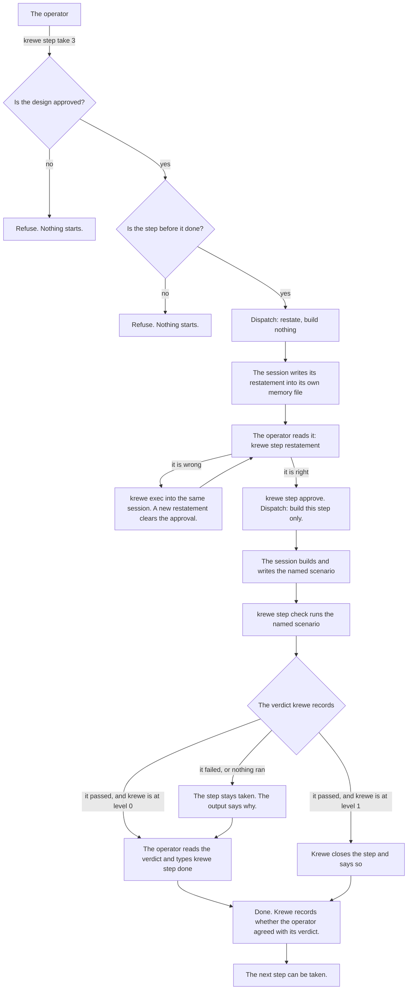
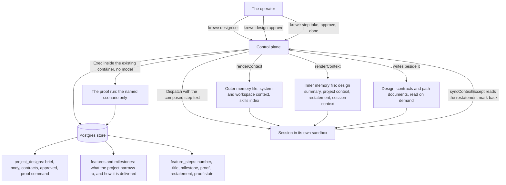
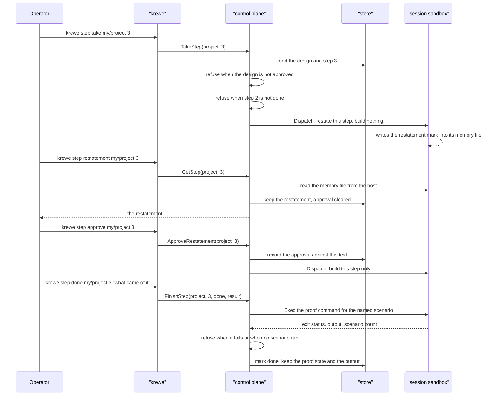
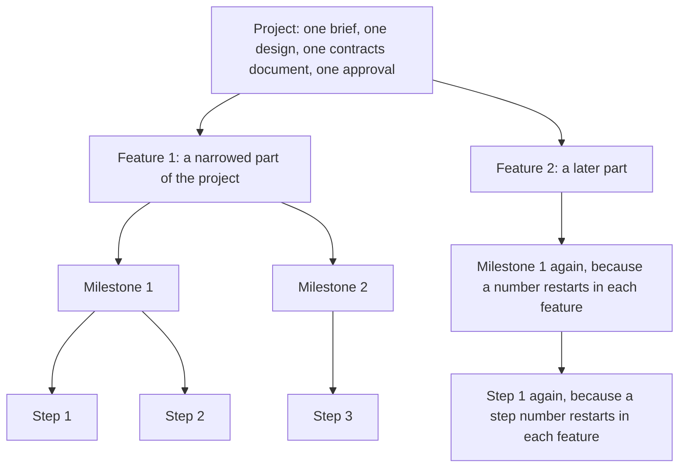

# System Design: a project carries its own context

Written 2026-09-04, revised the same day after the operator read the first version.
Amended 2026-09-05, after the operator settled the four levels.
Amended again on 2026-09-05, after the session listing was measured.

Status: proposed. The decisions in section 12 are settled. No code exists yet.

## 1. The question this design answers

The first version of this document argued about whether the system is a controller. That is the wrong
question. The operator stated the right one:

The problem is not the fan out and it is not the dispatch. The problem is trust. The operator must
know that the tool understood what it builds. The operator must know that it built the thing right.

The first version delivered context to a session and stopped there. It had no check between the
moment a session starts and the moment somebody says the step finished. It stated the problem and
dismissed it: a step's finish is what somebody declared, because nothing can see inside a container.
That sentence is true about the container and false about the work. The scenario, the test run and
its output all sit outside the sandbox. The control plane can run them.

So this design adds two things to the delivery of context.

**A session proves it understood before it builds.** Taking a step dispatches the session to restate
the step in its own words. The session writes the restatement and stops. It writes no code. The
operator reads the restatement and approves it. Approving is what dispatches the build.

**Krewe checks the finished work against the proof the step promised.** Each step names a scenario.
Krewe runs that scenario inside the session's own sandbox and states a verdict: the exit status, the
count of scenarios that ran, and the output.

**The word done starts with the operator and moves to krewe as krewe earns it.** The operator settled
this on 2026-09-04. The proof that it works comes from the operator at first. Over time it balances
to krewe, because the problem is trust.

So krewe checks and the operator speaks. Krewe counts how often the operator agreed with its verdict.
After a run of agreements it offers to close a passing step itself, and the operator accepts the
offer. One wrong close takes the level back down.

### The three gates

Each gate refuses one of the operator's own commands. A refusal costs one line of output and starts
nothing.

1. `krewe step take` refuses while the design carries no approval.
2. `krewe step take` refuses while the step before it is not done.
3. `krewe step done` refuses until krewe checks the promised proof and shows its verdict.

Two more refusals belong to the shape of the first and third gates rather than standing on their own.
`krewe step approve` refuses when the session wrote no restatement to approve. `krewe step check`
refuses when the step names no scenario.

### What each gate is worth, and what it is not

Gate 1 makes the operator's rule real: no code exists before the operator approves the path.

Gate 2 stops the path running ahead of what is proved. A step built on an unproven step inherits its
faults.

Gate 3 is the one the first version did not have. Before it, done meant somebody said done, with
nothing to read. Now the operator cannot say done without first reading a verdict on the named
scenario.

The word itself stays with the operator, and that is the second version of this decision. The first
version gave the word to krewe, so a failing run refused the operator's own command. The operator
settled it the other way: krewe has to earn the word. Section 4 states the ladder that moves it, and
section 4 also states that the number behind it is provisional.

State the limit plainly. Krewe cannot judge whether a scenario describes the value the step delivers.
It checks only that the named scenario exists and passes. The operator judges the value when the
operator approves the design, by reading what each step promises.

The gates are also on krewe's own commands. A session told to write code by an ordinary `krewe exec` is not stopped, and nothing inside
the sandbox is prevented from writing anything. The gates are a discipline the tool helps the
operator keep, not a restriction on the sandbox.

### The property that stays

Nothing dispatches by itself. Every session starts because the operator typed a command or pressed a
key. That property stays, and this design keeps the guard below, but it is no longer the point of the
document.

One session still builds one step. What changed is the count: the operator takes several ready steps,
and each take starts its own session. The operator types every one of them. A step that finishes
starts nothing.

The guard, stated so a later change can be measured against it. A later change may add a component
that dispatches a session without the operator asking. That component is the controller, and it is
the thing that failed on 3 September 2026. Refuse it. A later change may add a stage word to a
project or a session, with something that moves the row between stage values. Refuse that too.

Why the gates here are different from the gate that failed. That gate refused a controller, and the
controller then rebuilt the world. Each refusal ran four workers again from nothing. One day cost
about 1.23 billion cache read tokens and delivered one column on one listing. Source: the
hub decisions file, 3 September 2026, and migration
`internal/store/migrations/0060_remove_jobs_flows_and_roles.up.sql`, commit `f323024`, pull request
693. These gates refuse a command the operator typed. Nothing restarts. When a restatement is wrong,
the operator answers the same session with `krewe exec`, and that session already holds the
conversation.



### The honest risk

A table nobody writes is a table somebody reads a year later and believes. If the operator does not
read a restatement, this design creates exactly that table, and the approval becomes a keystroke.
Section 13 states that risk and its cost in full.

## 2. The riskiest assumption

The `proving` skill in this repository asks a design for three lines.

Riskiest assumption. A session starts holding a design, the project context and one atomised step. It
then produces work the operator accepts more often than a session that starts with a line of text.

Proved where. Not yet proved.

What came back. Nothing yet.

The narrowest thing that answers it. Take one real path of about five steps. Dispatch step one twice:
once with the composed step text, once with a line of text. Compare what comes back. That costs two
execs.

That proof cannot run before the delivery of context exists. So slice S-5 is the proof, and it sits
before every slice that costs real work. If the answer is no, every slice after it is cancelled. The
restatement and the proof check are built after S-5, because both cost more than the delivery under
them.

## 3. Requirements

### 3.1 Functional

Nine actions, where the first version had five. Action 4 is new and action 6 grew a check, both from
section 12.2. Action 7 is the trust ladder, from section 12.3. Action 8 is the operator's own
commands, from section 12.5. Action 9 is the four levels, from section 12.6. Nothing was added for
any other reason.

**Action 1. A project holds a brief and a design.**
- The operator sets a brief on a project. The brief is one paragraph: what this project is for.
- The project also holds a contracts document, a second body beside the design. It states the input,
  the output and every error of each thing the path builds.
- A design session reads the brief, the project context and the repository, and writes a design.
- The design is one document. It carries the requirements, the decisions and the shape.
- Any write to the design body clears the approval. An approved design that somebody rewrote is not
  approved.
- A project with no brief and no design is the normal state, and is not an error.

**Action 2. The design carries a numbered path of atomised changes.**
- The path is a list of steps. Each step is one intention and one reviewable change.
- Each step carries a number, a title, what changes and why, and what it touches.
- Each step also carries what proves it, and the name of the scenario that proves it.
- What proves it must state the value the step delivers. The scenario must describe that value.
- A step whose title needs the word "and" is two steps. The design session enforces this, not the
  system.
- Each step is written for a person who was not in the design conversation. That person must build it
  without asking a question.
- Writing the path replaces every step that nobody took. It refuses to drop or rename a step that is
  taken, done or stopped.

**Action 3. The operator takes a step, and the session proves it understood.**
- One command names a project and a step number.
- Several steps may be taken at once. Each take starts its own session, and each session builds one
  step.
- The command refuses while the design carries no approval.
- The command refuses while the step named by `after` is not done.
- The command refuses when the steps already taken reach the project's cap.
- The command refuses when the step writes a file that a step in flight also writes.
- The system composes the dispatch text from the step and starts a session with it.
- The text tells the session to restate the step and to write no code.
- The session writes the restatement into its own memory file, under a mark, and stops.
- The control plane reads the mark back into the store, the way it already reads context back.

**Action 4. The operator approves a restatement, and the session builds.**
- One command reads the restatement whole.
- One command approves it. The approval is recorded against that exact text.
- Approving dispatches the same session again, with the text that says to build this step only.
- A new restatement clears the approval. Approval is a statement about a specific text.
- When the restatement is wrong, the operator answers the same session with an ordinary exec. No new
  machinery, and the session keeps its conversation.

**Action 5. The operator reads the state of the path.**
- One command lists every step of a project, in number order.
- Each row says the number, the title, the state, the proof state, and which session took it.
- A step that waits for the operator to read a restatement is drawn as waiting. That is derived from
  the row, and is not a stored state.
- The next step is the lowest numbered step in state ready whose predecessor is done.

**Action 6. Krewe checks the proof, and a step records what came of it.**
- One command runs the step's named scenario inside the session's sandbox and prints the verdict.
- The command refuses when the step names no scenario.
- A run that fails, or that reports that no scenario ran, is a failing verdict.
- The result of the run is kept on the step: the state, the count, the time and the last of the
  output.
- A step moves to done with a result, or to stopped with a reason.
- Moving to done refuses until krewe checks the step. The operator reads a verdict before speaking.
- Moving to done does not refuse a failing verdict. The row records that the operator disagreed.
- The next session reads a path where the finished steps carry their results.

**Action 7. Krewe earns the word done, and can lose it.**
- Krewe counts the times the operator's word matched its verdict, in a run.
- When the run reaches the project's threshold, krewe offers to close a passing step itself.
- One command accepts the offer. Krewe never raises its own level.
- At the higher level, a passing check closes the step and says that krewe closed it. A failing check
  closes nothing.
- One command reopens a step krewe closed. That lowers the level by one and restarts the run.
- One command prints the level, the run, the threshold and the totals.

**Action 8. The operator drives krewe from a slash command in their own session.**
- One command writes the slash command files into the agent's command directory.
- An install replaces a file krewe wrote. It refuses a file somebody else wrote, and names it.
- `/krewe:init` asks what the project is for, then creates it and sets the brief.
- `/krewe:design` asks the design questions, dispatches a session to write the design, and shows
  the body back for approval.
- `/krewe:status` prints the steps in flight, what waits on the operator, the next step and the
  trust level.
- `/krewe:trust` prints the level and any standing offer, and raises it.
- A slash command asks, runs the command line tool, and reads back. It never designs the product.

**Action 9. A project holds features, and each feature is delivered in milestones.**
- The operator adds a feature to a project. A feature carries a title and one line saying which part
  of the project it narrows to.
- A project grows features over time. A project holds one design, and that does not change.
- The operator sets one feature's path. Setting it leaves every other feature's path whole.
- The path document carries the milestones. One heading above the steps names a milestone, and the
  steps under it belong to it.
- The path listing groups the steps under their milestone titles. It counts each milestone and the
  whole feature, so the operator reads where the work reached without counting rows.
- A step names the contracts it builds, and the scope of each. The scope says which part of the
  contract is this step's, and which part waits for a later step.
- The operator closes a feature. A closed feature keeps its steps, and it leaves the path document
  the session reads.

### 3.2 Non functional

**Context cost.** A memory file is read on every exec of every session in the project. An import in a
memory file loads eagerly and inlines, so it saves nothing. Therefore the design summary in the
memory file must stay under about 400 characters.

The restatement is rendered into the inner memory file, which one session reads. It is capped by a
warning at 2,000 characters. It stops being rendered once the step reaches done or stopped, so it
costs nothing after that.

The design body and the path live in files the session opens on demand. `internal/contextspend`
already measures where a session's context goes, so this is measurable rather than asserted.

**Proof run cost.** The proof run costs no model tokens. It is an exec inside a container that
already exists, and no model is started. Its budget is 900 seconds by default, set per project.

**Scale.** One operator, one machine. Tens of projects. Tens of steps in a path.

One query reads a whole path. No pagination is needed. A cap of 200 steps per path is a warning
rather than a refusal.

**Latency.** A path listing must answer inside the console's draw budget. It is one indexed query on
a primary key prefix. A proof run is not in that budget: `krewe step done` waits for the run and says
so while it waits.

**Durability.** The design, the path, every restatement and every proof result survive a control
plane restart, a sandbox teardown and a session reclaim. Postgres gives this. The in memory store
loses them on restart, which is what the in memory store already does with every other row.

**Availability.** Self hosted, single machine, no requirement stated.

### 3.3 Constraints

- The whole suite runs on this machine and in continuous integration. It takes about 42 seconds and
  peaks at about 1.18 gigabytes. The local gates are `make test`, `go build`, `go vet`, `gofmt` and
  `golangci-lint`.
- Every behaviour change ships its own scenario under `features/`. The promises gate refuses a
  behaviour change that carries no scenario.
- Anything removed from the command line or the console must refuse by name and say what to type
  instead. The mechanisms are `removedCommands`, `removedFlags` and `movedViews`.
- The store has two implementations behind one interface. Every new method runs against both through
  the conformance suite in `internal/store/storetest`.
- Every word the system puts in front of a person follows Simplified Technical English.
- No length cap refuses text a person wrote. Each cap is a warning that says the length.
- No code exists before the operator approves this path.

### 3.4 Explicitly out of scope

- No controller. No scheduler. No queue. Nothing runs above a session.
- No dispatch that the operator did not type. Several steps may be in flight, and each one starts
  because the operator took it. A step that finishes starts nothing.
- No stage field on any resource, and nothing that moves a row between stage values.
- No branches, no pull requests, no forge calls. The `git` and `github` skills already do that inside
  a conversation.
- No judgement by krewe of whether a scenario describes the value a step promised.
- No project level or session level attachment for skills and hooks.
- No new credential for an ordinary session. Only a driver session reaches the control plane.
- No visual acceptance evidence, no screenshot, no recording.
- No automatic advance from one step to the next.

## 4. Technical decisions

Each line is the decision, then what it rejects, then why.

- **The design and the path live in the store, not in files on a host.** Rejected: files in the
  repository as the truth. A pod has no host directory to bind mount. An interface cannot edit a file
  on somebody's laptop. A project's repository field is optional, so a repository truth leaves a
  project with no design.
- **The design renders into what a session reads, through the mechanism context already uses.**
  Rejected: a new delivery path. `renderContext` and `syncContextExcept` work and carry years of
  defect fixes in their comments.
- **The restatement travels the same way, in the other direction.** Rejected: a new credential so the
  session can write the restatement through a remote procedure call. Rejected: a file the control
  plane polls. The session writes a marked section into its own memory file, and the control plane
  reads it back on demand from the host. Nothing new is built.
- **The restatement is read back on demand, not only at the next dispatch.** Rejected: waiting for
  the next exec. The operator must read the restatement before approving, and the approval is what
  dispatches. A read that waited for a dispatch would arrive after the moment it is needed.
- **Approving the restatement dispatches the build.** Rejected: a separate build command. That is one
  extra command per step rather than two, and it reuses the session that did the restating.
- **The proof runs in the session's sandbox, and krewe makes one when the session was reclaimed.**
  Settled by the operator on 2026-09-04. `Provider.Existing` answers with the running container.
  When there is none, krewe starts one and restores the working tree into it. Rejected: a refusal on
  a reclaimed session, which leaves a step that nothing can close. Rejected: a read of the branch
  checks, which waits for a run the operator did not start.
- **The proof command carries a placeholder for the scenario name, and a command without it is
  refused.** Rejected: running the whole suite. A whole suite run passes while proving nothing about
  this step.
- **A run that reports zero scenarios is a failure.** Rejected: reading the exit status alone. A name
  filter that matches nothing prints success in most runners. This repository already guards against
  it: `features/suite_test.go` fails the run when the scenario count is zero. Krewe reads the count
  as well as the status.
- **A step's finish is checked by krewe and spoken by the operator.** This replaces the first
  version's decision, which made a finish only what somebody declared, and the second version's,
  which let krewe refuse the word. Krewe runs the scenario and states a verdict. The operator reads
  the verdict and says done. The result text is still the operator's words.
- **The proof that the work is right starts with the operator and moves to krewe as krewe earns it.**
  Settled by the operator on 2026-09-04. Rejected: krewe holding the word from the start, which asks
  the operator to trust a checker nobody tested. Rejected: the operator holding it for ever,
  which never repays the reading.
- **Two levels, and no third until one is measured.** Level 0: krewe checks, the operator says done.
  Level 1: krewe closes a step its own check passed, and says so. A failing check closes nothing at
  any level. Rejected: a level that skips the restatement, because nobody measured level 1 yet.
- **Krewe counts the agreements and offers the next level. The operator accepts it.** Rejected: krewe
  raising its own level, which takes the decision away from the operator. The count is a run of
  consecutive agreements, not a ratio, so one disagreement starts it again.
- **A disagreement lowers the level by one and restarts the run.** Settled by the operator on
  2026-09-04. Rejected: falling to level 0 from any height, which no measurement supports. Rejected:
  leaving the level and recording the miss, which lets a checker the operator does not believe keep
  the word.
- **The threshold is provisional and the design says so.** The default is five consecutive
  agreements. No measurement stands behind that number, because krewe never closed a step. It is a
  project setting. The number that replaces it comes from the first project to reach ten closes,
  read as how often the operator disagreed.
- **Agreement is read from the row, never judged.** The operator said done and the last check passed:
  agreed. The operator stopped the step and the last check failed: agreed. Anything else is a
  disagreement. Rejected: asking the operator whether they agreed, which is a question with an
  obvious answer and one more keystroke.
- **The step text is the dispatch text.** Rejected: a new field on `DispatchRequest`. The dispatch
  already carries text to the model.
- **The composition happens in the control plane, not in the command line tool.** Rejected: composing
  in `cmd/krewe`. The console and the command line must send the same words.
- **A step is a resource the project owns, not an exec with more on it.** Rejected: putting the step
  on an exec. A step outlives the session that took it.
- **The four step state words do not grow.** Rejected: a state word for restated, for building and
  for proved. The state says who holds the step. The flags and the proof state say what the checks
  found. A phase a reader wants is derived from the row and is never stored, which keeps the guard
  in section 1 honest.
- **The design carries an approval flag beside the body, and any write to the body clears it.**
  Rejected: one state column. A design somebody sent back for a rewrite carries the same text as a
  design nobody read.
- **A step whose predecessor is not done cannot be taken.** This replaces the first version's rule,
  which warned and continued. Rejected: a flag to override the refusal. The way past
  a step nobody will finish is to rewrite the path so the later step no longer waits for it.
- **Empty string, false and zero, never null, in every new text, boolean and integer column.** This
  follows every existing migration in this repository.
- **The word is "path", not "plan".** `plan` is already a permission mode.
- **Several steps may be in flight at once, and the operator starts every one of them.** Settled by
  the operator on 2026-09-04. Rejected: one command that takes every ready step, which reads the
  graph and dispatches for the operator. Rejected: krewe starting the next step when one finishes,
  which is the controller the design refuses.
- **A take is refused when the step writes a file that a step in flight also writes.** Settled by the
  operator on 2026-09-04. Krewe compares the `touches` field line by line. Rejected: a warning that
  starts the session anyway. Rejected: silence, which leaves the conflict to merge time. Section 5.1
  measured fourteen colliding pairs in this project's own graph, so the check has real work to do.
- **The number of steps in flight is capped per project, and the default is three.** Provisional, and
  no measurement stands behind it. Nobody measured how many restatements the operator reads at once.
  Rejected: no cap, which puts five sessions and five restatements in flight in this path's last
  wave. Rejected: a cap the trust level sets, because the ladder governs the word done and not the
  fan out.
- **Krewe writes the slash commands the operator's own session reads.** Settled by the operator on
  2026-09-04. The files ship with the build, embedded in the binary. Rejected: files written by hand
  on one machine, which the product never carries. Rejected: a copy in the hub that the repository
  also holds, because two copies drift.
- **A slash command asks, runs the command line tool, and reads back. It never designs the
  product.** The design work belongs to a krewe session in a sandbox. A command that thinks about the
  product makes the operator's terminal a second place the work happens, and nothing records what it
  did there.
- **The words "job", "flow", "role", "stage" and "controller" do not appear.** Each one names a thing
  that was removed.

## 5. Architecture

No new binary. No new container. No new port.

- `internal/store`: two new tables, migrations, new methods on the one `Store` interface, and both
  implementations proved against the shared conformance suite.
- `internal/controlplane/design.go`: a new file beside `capability.go` and `hooks_render.go`. It
  holds the new remote procedure call handlers, the render of the design into a session's directory,
  and the composition of the two step texts.
- `internal/controlplane/proof.go`: a new file. It runs a step's scenario inside the session's
  existing sandbox and reads the status, the output and the count.
- `internal/controlplane/server.go`: `renderContext` gains two sections, `syncContextExcept` gains
  one mark in its scope list, and one dead branch is removed. See section 10.
- `internal/sandbox/memory.go`: one new scope constant for the restatement mark.
- `cmd/krewe`: new verbs. `internal/console`: one new view.



Taking, approving and finishing one step:



Both diagrams render through the mermaid command line tool.

### 5.1 A known limit: the dependency graph orders by meaning, not by file

The graph of slices records what a slice needs before it can be built. It does not record what a
slice writes. Those are different questions, and the difference is measurable.

Measured on `.greenlight/GRAPH.json` as it stands. Take every pair of slices with no dependency path
between them in either direction. Then intersect the files each one names:

Measured on the graph of 44 slices, on 2026-09-05, after the archive amendment added one:

- 213 pairs have no ordering between them, and 104 of those share at least one file.
- `internal/manual/manual.go` is in 54, because it holds the usage text that every new command
  writes. `features/path.feature` is in 43, and `proto/quaycrew/v1/controlplane.proto` is in 38.
  The four store files are in 35 each.
- The widest single collision is seven files. S-44 shares seven with each of thirteen other slices,
  and S-11 shares seven with each of eleven.
- The archive slice is what moved these numbers. It depends on nothing, so it has no ordering with
  any of the other 43. It touches the four store files, the protobuf file and the usage text.
  At 43 slices the same measurement read 170 pairs, 70 of them sharing a file.

This is an observation from the graph, and the design now acts on it. Several steps may be in flight,
so two sessions can write one file. The take refuses that: it compares the `touches` field of the
step against every step already taken, and names the file it shares.

The check is only as good as the `touches` field. A step that writes a file its `touches` does not
name goes through. The design session writes that field, and section 12.4 records the limit.

The second limit is worse, because the check passes and both steps look correct. A sequential number
is a shared resource, and no list of filenames describes it. Two features run at once and each adds
a migration. One step names `internal/store/migrations/0075_add_payments.up.sql` and the other names
`internal/store/migrations/0075_add_sessions.up.sql`. The filenames differ, so the collision check
finds nothing, and both features take number 0075.

This repository already numbers migrations that way, and this design already reserves numbers for
slices nobody built: `0070` to `0074` belong to five unbuilt slices. So the shape is not
hypothetical here.

What it costs. The two migrations apply in an order the file names do not decide, and one of them
may never apply at all. The failure lands at merge time or at the next start, and not at the take.

The same shape holds for any sequential number a project hands out: a protobuf field number, a port,
a slice identifier.

No fix is built here. Section 14 defers it. The answer is a reservation, and a reservation is a
capability rather than a check. It needs a place to live. It needs a way to release a number a
stopped step held. It needs a rule for every kind of number a project shares.

What a fan out would need before it is safe, stated so nobody adds one on the strength of the graph
alone:

1. A slice must declare the files it writes, and the graph must refuse two slices that write the same
   file with no ordering between them.
2. The shared registries must stop being shared, or the write to them must be serialised. The usage
   text, the store interface, the protobuf file and each feature file are single files that almost
   every slice appends to.
3. Two sessions must not write in one checkout. Each would need its own worktree, and the merge back
   would need an order.

None of this is designed here. This section exists so a later reader does not read the dependency
edges as a statement about safety to run in parallel.

### 5.2 The four levels: a project, a feature, a milestone and a step

The operator settled this shape on 2026-09-05, and section 12.6 records it.

The layer exists because a project delivers several features at the same time.

Take a website. It runs an authentication feature and a payment feature at once. Authentication ships
sign up, then sign in, then reset, then sessions. Payment ships checkout, then refunds, then
webhooks. Those are two paths, each with its own milestones, and neither one waits for the other.

Without the layer, a project holds one path. The two sets of work then interleave in one numbered
list, and nobody can read where either one reached. With the layer, each feature holds its own path,
and each path is read on its own.

A project is one. It holds one brief, one design, one contracts document and one approval. Nothing
about that moves down a level.

A feature is many per project. It carries a number, a title, and one line saying which part of the
project it narrows to. A project grows features over time.

A milestone belongs to one feature. It carries a number, a title and one line.

A step belongs to one milestone. It carries everything the step table holds.



Read the two branches under the project as two paths running at the same time. Authentication sits
on its third milestone while payment sits on its first. Neither one waits for the other.

This project's own build is one feature. Its roadmap holds twenty two milestones: sixteen from the
first design, five that the four level revision added, and one that the archive amendment added.

Two rules fall out of the shape, and neither one is obvious.

Feature numbers restart in each project, and milestone numbers restart in each feature. Step numbers
restart in each feature, and not in each milestone. So a feature holds one step 3, and `after` keeps
naming a lower step number in the same path.

Gate 1 still reads the project's design. A feature carries no approval of its own. Taking a step is
refused while the project's design carries no approval, whichever feature the step sits in.

## 6. Data model, field level

### 6.1 What exists today, read from the migrations

Table `projects`, from `0001_init`, `0003_projects`, `0043_project_deploy_target` and
`0044_project_repository`:

- `id` text, primary key
- `workspace` text not null, references `workspaces (id)`
- `name` text not null
- `created_at` timestamptz not null default now()
- `updated_at` timestamptz not null default now()
- `deleted_at` timestamptz, null while the project lives
- `repository` text not null default ''
- `visibility` text not null default ''
- `deploy_account` text not null default ''
- `deploy_region` text not null default ''
- `deploy_identity` text not null default ''

Index: `projects_workspace_idx on projects (workspace) where deleted_at is null`.

Table `contexts`, from `0006_contexts`:

- `scope` text not null
- `owner` text not null
- `body` text not null default ''
- `created_at` timestamptz not null default now()
- `updated_at` timestamptz not null default now()
- primary key (`scope`, `owner`)

This design adds no column to either table.

Table `sessions` carries one column this design reads and never writes, from
`0004_archive_sessions`, dated 2026-04-11:

- `archived_at` timestamptz, null while the session is in the default listing
- with the partial index `sessions_live_idx on sessions (project) where archived_at is null`

The stamp is not a state word. A session keeps the status it ended on, and an archived session still
reads `stopped` or `failed` or `reclaimed`. Milestone 22 reads the stamp from the command line, and
it adds no column.

Measured on 2026-09-05: `krewe sessions system` reported 296 sessions and printed 298 lines. 282 of
those sessions read `stopped`, 9 read `idle`, 3 read `awake` and 2 read `running`. So 282 rows of
finished work buried the four rows a person wanted. Fourteen session containers stood behind those
296 rows, so the cost is the listing and not the disk. That number came from a run, on the date
above, and not from a feeling.

### 6.2 New table `project_designs`

One row per project. Created when somebody sets a brief or a design. A project with no row has no
design, which is the normal state.

- `project` text, primary key, references `projects (id)` on delete cascade
- `brief` text not null default ''. What the project is for. One paragraph. The operator writes it.
- `body` text not null default ''. The design document, whole. Markdown.
- `contracts` text not null default ''. The contracts document, whole. Markdown. It is a second
  body, and writing it does not clear the approval. The approval is the operator's word about the
  design body, and the contracts document is read from that body.
- `approved` boolean not null default false. The operator's word. Any write to `body` sets it false.
- `approved_at` timestamptz, null while `approved` is false
- `written_by` text not null default ''. The session identifier that last wrote `body`. Empty when
  the operator wrote it. Not a foreign key: the session may be archived or deleted, and the record of
  who wrote the design must survive that.
- `proof_command` text not null default ''. The command krewe runs inside the session's sandbox to
  run one scenario. It must carry the token `{scenario}`, which krewe replaces with the step's
  scenario name as one shell word. The token carries no quotes of its own, because krewe supplies
  them. For this repository the value is
  `go test ./features/ -count=1 -v -run TestFeatures/{scenario}'$'`.
- `proof_count_pattern` text not null default '([0-9]+) scenarios'. A regular expression with one
  capture group, read against the run output to get the number of scenarios that ran. The default
  matches the runner this repository uses.
- `proof_timeout_seconds` integer not null default 900. The budget for one proof run.
- `trust_level` integer not null default 0. 0: krewe checks and the operator says done. 1: krewe
  closes a step its own check passed.
- `trust_threshold` integer not null default 5. The run of agreements that earns an offer of the next
  level. Provisional, and section 4 says why.
- `trust_run` integer not null default 0. Consecutive agreements since the last disagreement or the
  last level change.
- `trust_offered` boolean not null default false. True after krewe offers the next level, until the
  operator answers.
- `trust_agreements` integer not null default 0. Every agreement this project recorded.
- `trust_disagreements` integer not null default 0. Every disagreement this project recorded.
- `steps_in_flight_cap` integer not null default 3. How many steps of this project may be in state
  `taken` at one time, counted across every feature. Provisional, and section 4 says why.
- `created_at` timestamptz not null default now()
- `updated_at` timestamptz not null default now()

Indexes: the primary key is the only read path. A design is read by project identifier and never
scanned.

Rules, each proved by a scenario:
- Setting `body` sets `approved` to false and `approved_at` to null, in the same write.
- Setting `brief` does not touch `approved`.
- Setting `proof_command`, `proof_count_pattern` or `proof_timeout_seconds` does not touch `approved`.
  None of them changes what the design says.
- A `proof_command` without the token `{scenario}` is refused. The refusal says why: a command that
  runs everything proves nothing about one step.
- A `proof_command` whose `{scenario}` sits inside a single quoted or a double quoted span is
  refused. Krewe quotes the name itself, so a second pair of quotes splits the name and the shell
  reads the rest of it as code. The refusal shows the same command with the token outside the quotes.
- A `proof_count_pattern` that does not compile is refused, naming the position of the fault.
- A `proof_timeout_seconds` below 1 or above 3600 is refused.
- Approving a design whose `body` is empty is refused. There is nothing to approve.
- Writing `body` does not touch any trust column. Trust records the checking, not the text.
- A `trust_level` below 0 or above 1 is refused. Section 4 says why there is no level 2.
- A `trust_threshold` below 1 or above 100 is refused.
- A `steps_in_flight_cap` below 1 or above 20 is refused.
- Raising the level is refused while `trust_offered` is false. Krewe offers and the operator accepts.
- Raising the level sets `trust_run` to zero and `trust_offered` to false.
- A disagreement at level 0 records the disagreement and leaves the level alone. The level never goes
  below zero.
- Deleting a project deletes its design row through the cascade.

A separate table rather than columns on `projects`, for two reasons. Every project listing reads
`projects`, and a design body is the largest text in the system. The row also carries its own
timestamps and its own writer, which are facts about the design and not about the project.

### 6.3 New table `feature_steps`

One row per step of one feature's path. The first version of this document called it
`project_steps` and keyed it by the project. Section 12.6 moved the key to the feature, and the
table is named after the row's owner, as `project_designs` is.

- `feature` text not null, references `features (id)` on delete cascade
- `milestone` integer not null default 0. Which milestone of the feature this step belongs to. Zero
  means the step belongs to no milestone.
- `contracts` text not null default ''. The contracts this step builds, one identifier per line.
- `contract_scope` text not null default ''. One line per contract, reading
  `<identifier>: <sentence>`. The sentence says which part is this step's, and which part waits for
  a later step.
- `number` integer not null. Where in the path, counting from one.
- `title` text not null. One line, one intention.
- `intention` text not null default ''. What changes and why, in the words a stranger needs.
- `touches` text not null default ''. The files or packages this step writes, one per line.
- `proof` text not null default ''. What proves it, and the value it delivers, in prose. The operator
  reads this when approving the design. Krewe never judges it.
- `proof_scenario` text not null default ''. The exact name of the scenario that proves it, as it is
  written in the feature file. This is what krewe runs.
- `proof_state` text not null default 'unproven'. One of 'unproven', 'passing', 'failing'.
- `proof_scenarios_run` integer not null default 0. How many scenarios the last run reported. Zero
  means nothing ran, and zero never passes.
- `proof_output` text not null default ''. The last 4,000 characters of the last run, kept so the
  operator reads why it failed without running it again. When output was cut, the first line says how
  much.
- `proof_ran_at` timestamptz, null until a proof runs
- `restatement` text not null default ''. What the session wrote back about this step, before it
  built anything. Section 7 states what it contains.
- `restated_at` timestamptz, null until the session writes one
- `restatement_approved` boolean not null default false. The operator's word about this exact text.
- `restatement_approved_at` timestamptz, null while `restatement_approved` is false
- `after` integer not null default 0. The step number this one waits for. Zero means nothing blocks
  it.
- `state` text not null default 'ready'. One of 'ready', 'taken', 'done', 'stopped'.
- `session` text not null default ''. The session that took it. Empty until taken. Not a foreign key,
  for the same reason `written_by` is not one.
- `result` text not null default ''. What somebody wrote that the step produced. A reason when the
  state is stopped. Krewe writes the scenario name and the count here when it closes a step itself.
- `closed_by` text not null default ''. Who spoke the word: 'operator' or 'krewe'. Empty while the
  step is ready or taken.
- `operator_agreed` text not null default ''. Whether the operator's word matched krewe's last
  verdict: 'yes', 'no', or empty while nothing is decided. Written by the same statement that writes
  `state`.
- `taken_at` timestamptz, null until taken
- `finished_at` timestamptz, null until done or stopped
- `created_at` timestamptz not null default now()
- `updated_at` timestamptz not null default now()
- primary key (`feature`, `number`)

Step numbers restart in each feature, so `after` keeps its meaning: a lower step number in the same
path.

Indexes:
- The primary key serves the only ordinary read: one feature's path in number order.
- `create index if not exists feature_steps_session_idx on feature_steps (session) where session <> ''`.
  This answers "which step is this session on", which a session listing needs to draw one row.
- No index on `proof_state`, on `state` or on `milestone`. A whole path is read by the primary key
  prefix, then filtered and grouped in memory. An index nothing reads is a cost with no reader.

The four state words:
- `ready`: nobody took it.
- `taken`: a session holds it. `session` names that session and `taken_at` says when.
- `done`: the step finished and its proof passed.
- `stopped`: somebody stopped it. `result` says why.

Three phases a reader wants, each derived from the row and none of them stored:
- Waiting for a restatement: `state` is taken and `restatement` is empty.
- Waiting for the operator: `state` is taken, `restatement` is not empty, `restatement_approved` is
  false.
- Building: `state` is taken and `restatement_approved` is true.

Rules, each proved by a scenario:
- A step number must be one or greater. Zero and negative numbers are refused.
- `after` must name a lower numbered step that exists in the same feature's path, or be zero. A step
  cannot wait for itself.
- `milestone` must be zero, or a milestone number that exists for the same feature.
- `contract_scope` names only identifiers that `contracts` names.
- Writing a path replaces one feature's path. Another feature of the same project is untouched.
- When the path document names no predecessor, krewe sets `after` to the previous number in the path.
  Step one gets zero. A numbered path is a chain unless the document says otherwise, and the gate is
  worth nothing when every step defaults to waiting for nothing.
- Writing a path replaces every step in state `ready`. It refuses when the new path drops or renames
  a step in state `taken`, `done` or `stopped`. The refusal names those steps.
- A path may change `after` on a step in state `ready`, including away from a stopped step. This is
  the way past a step nobody will finish, and it is the only way. There is no override flag.
- Taking a step in state `taken` or `done` is refused. The refusal says which session holds it.
- Taking a step is refused while the step named by `after` is not in state `done`. The refusal names
  that step and its state.
- Taking a step is refused when the count of steps in state `taken` reaches `steps_in_flight_cap`.
  The refusal names the steps in flight, their features, and the cap.
- Taking a step is refused when a line of its `touches` matches a line of `touches` on a step in
  state `taken`. The refusal names the file, the step that holds it, and that step's feature. Lines
  are compared after the spaces at each end are removed.
- **Both of those read the whole project, across every feature, and never one feature.** This is the
  trap in the key move. The step table is keyed by the feature now, so the natural query is "steps
  in flight in this feature". That query lets two features write the same file at the same moment.

  A feature must not collide with another feature, the same way a step must not collide with another
  step. It is one rule at one level. The store joins the step table to `features` on the project to
  read them.
- `after` is the one thing that stays inside the feature. A step waits for a lower step of its own
  path, and never for a step of another feature.
- The refusal lands on the step, never on the feature. Nothing blocks a feature, queues a feature or
  orders one feature against another. Authentication and payment share the user model, the router
  and the configuration, so the collision is real. Only the step that names the shared file waits,
  and only while the step it collides with is in flight. Payment carries on with the rest of its
  path.
- Taking a step again after it was stopped sets `proof_state` to 'unproven', clears `restatement`,
  clears `restatement_approved` and clears the proof fields. A new attempt proves itself again.
- Any write to `restatement` sets `restatement_approved` to false and its timestamp to null.
- Approving a restatement that is empty is refused.
- Finishing a step whose `proof_scenario` is empty is refused. The refusal says to set the scenario
  in the path document.
- Finishing a step whose `restatement_approved` is false is refused. The refusal says to approve the
  restatement first.
- Finishing a step whose `proof_ran_at` is null is refused. The refusal says to run `krewe step check`
  first. The operator reads a verdict before speaking.
- Finishing a step is not refused for a failing verdict. The operator's word closes the step, and the
  row records the disagreement.
- Reopening is allowed only on a step in state `done` whose `closed_by` is 'krewe'. It sets `state`
  back to `taken`, writes `operator_agreed` of 'no', and lowers the project's trust level by one.
- Reopening a step the operator closed is refused. Nothing about trust is learned from the operator
  disagreeing with the operator.
- Deleting a project deletes its features. Each feature deletes its steps and its milestones through
  the cascades.

### 6.4 The single dependency field, and its limit

`after` is one integer, not a list. A path is numbered and mostly runs in order, so one predecessor
answers most real paths.

This is now an observation, and the first version of this document marked it an inference. The
measurement is on `.greenlight/GRAPH.json`, which holds the only real path this project has. Of its
44 slices, none carries more than one dependency. Two slices carry none, and 42 carry exactly one.
The same held at 35 slices and at 43 slices. So one predecessor carries this
path, and nothing is lost by the limit.

The limit stays, and so does the deferral. One path is one measurement, and a later path may need
two predecessors on one step. A step that truly waits for two others names the later of the two, and
says the rest in its `intention`. Section 14 records the full dependency graph as deferred, and
section 5.1 states what the graph does not record.

### 6.5 Field mapping, store to wire

Every field of `project_designs` maps to the message `Design`, under the same name. The fields, in
order:

`project`, `brief`, `body`, `approved`, `approved_at`, `written_by`, `proof_command`,
`proof_count_pattern`, `proof_timeout_seconds`, `trust_level`, `trust_threshold`, `trust_run`,
`trust_offered`, `trust_agreements`, `trust_disagreements`, `steps_in_flight_cap`, `updated_at`,
`contracts`.

`created_at` is not on the wire. Nothing reads it.

Every field of `feature_steps` maps to the message `Step`, under the same name. The fields, in
order:

`feature`, `number`, `title`, `intention`, `touches`, `proof`, `proof_scenario`, `proof_state`,
`proof_scenarios_run`, `proof_output`, `proof_ran_at`, `restatement`, `restated_at`,
`restatement_approved`, `restatement_approved_at`, `after`, `state`, `session`, `result`,
`closed_by`, `operator_agreed`, `taken_at`, `finished_at`.

Then the three fields this revision added: `milestone`, `contracts` and `contract_scope`.

`created_at` and `updated_at` are not on the wire.

Every field of `features` maps to the message `Feature`, under the same name. Every field of
`milestones` maps to the message `Milestone`, under the same name, except its two stamps, which
nothing reads.

### 6.6 New table `features`

Many rows per project. One row is one narrowed part of the project.

- `id` text, primary key. The identifier the step table and the milestone table point at.
- `project` text not null, references `projects (id)` on delete cascade
- `number` integer not null. Where in the project, counting from one. This is the number a person
  types.
- `title` text not null. One line.
- `intention` text not null default ''. One line. Which part of the project this feature narrows to.
- `state` text not null default 'open'. One of 'open', 'done', 'stopped'.
- `created_at` timestamptz not null default now()
- `updated_at` timestamptz not null default now()
- unique (`project`, `number`)

Rules, each proved by a scenario:
- The number is the highest number in the project plus one. The first feature of a project is 1.
- The read of the highest number and the insert are one statement. Two callers at one moment then
  never take the same number.
- A number is never reused. A feature that stopped keeps its number.
- Closing a feature keeps its steps and its milestones. A state is not a delete.
- A feature carries no design and no approval. Those belong to the project.
- Deleting a project deletes its features through the cascade.

### 6.7 New table `milestones`

Many rows per feature. A milestone groups the steps of one feature.

- `feature` text not null, references `features (id)` on delete cascade
- `number` integer not null. Where in the feature, counting from one.
- `title` text not null. One line.
- `intention` text not null default ''. One line.
- `created_at` timestamptz not null default now()
- `updated_at` timestamptz not null default now()
- primary key (`feature`, `number`)

Rules, each proved by a scenario:
- Numbers are unique inside the feature, and one or greater. They need not be contiguous.
- Milestone numbers restart in each feature.
- A milestone holds no state of its own. What a milestone reached is counted from the steps under
  it, and it is never stored.
- Only the path write makes a milestone. There is no command that writes one on its own, so one
  document carries the whole path of one feature.
- Zero is never a row. A step whose `milestone` is 0 belongs to no milestone.
- Deleting a feature deletes its milestones through the cascade.

## 7. What a session gets, and how the restatement comes back

### 7.1 What a session gets at birth

Today a session gets two memory files, both named `CLAUDE.md`. It also gets the shared volume, the
skills mounts, the hooks mount, the secrets mount and the environment.

The outer file, at `/home/agent/.claude/CLAUDE.md` inside the sandbox: unchanged. It holds system
context, workspace context and the skills index.

The inner file, at `/home/agent/workspace/CLAUDE.md` inside the sandbox: gains one design section at
the top, before the project context. The section carries, and nothing else:

- one line: the project name and its brief, cut at 200 characters for the file and kept whole in the
  store
- one line: whether the design carries an approval, and when
- one line: the path to the design document, `.krewe/design.md`, and an instruction to read it before
  starting. The contracts document is not named here, and the take text names it instead. This file
  is read on every exec of every session in the project. It is capped at 400 characters.
- one line: the step this session took, its number and its title, when a step was taken

Target size: under 400 characters. Measured on every exec by `internal/contextspend`.

Two documents sit in the session's working directory and are written fresh before every exec that
builds a sandbox:

- `/home/agent/workspace/.krewe/design.md`: the whole design body.
- `/home/agent/workspace/.krewe/contracts.md`: the whole contracts document. It is a second body
  beside the design, and it is large, which is why it is a file the model opens.
- `/home/agent/workspace/.krewe/path.md`: every open feature, its milestones, and every step in
  number order, with its state, its proof state and its result. A session on step 4 reads what steps
  1 to 3 produced. A feature that is done or stopped is left out, which keeps the file from growing
  with every finished feature.

Neither is a memory file, so the model does not load them automatically. A dot directory rather than
the working directory root, because a repository cloned into the working directory may hold its own
file of that name.

### 7.2 The restatement: where the session writes it

The session writes the restatement into its own inner memory file, at
`/home/agent/workspace/CLAUDE.md`, inside one marked section:

```
<!-- quay:restatement -->
...the restatement...
```

The mark is the same mechanism the memory files already use. `internal/sandbox/memory.go` defines the
marks as HTML comments, and `Compose`, `Decompose` and `WithoutSection` already read and write them.
This design adds one constant, `sandbox.RestatementScope`, with the value `restatement`.

Nothing new reaches the sandbox. The session already has this file, already writes to it, and the
control plane already reads it back on every dispatch.

### 7.3 What the restatement contains

The step text asks for six named parts. The design skill states the same six, so a session that holds
the skill writes them without being told twice.

1. What this step changes, in the session's own words.
2. What this step will not touch.
3. What it assumed, that the step did not say.
4. What it does not know.
5. The scenario it will write, by name, and the value that scenario describes.
6. How sure it is, as a percentage, and what lowers it.

Part 5 is the one the operator reads hardest. A session that names a scenario describing the value is
a session that understood the step. A session that names a scenario describing a function call is
not.

Part 6 follows the same rule the operator applies to a plan: a coverage below about 80 per cent is
raised before anything is built.

Cap: 2,000 characters, as a warning that says the length. Nothing is refused for being long.

### 7.4 How the control plane reads it back

The read back is `syncContextExcept` in `internal/controlplane/server.go`, unchanged in shape.

The function builds a list of scopes and calls `sandbox.Decompose` with it. A mark that is not in
that list is text this build does not know. `Decompose` sweeps that text into the last scope in the
list, which is the session's own context. Swept there, it is stored as though a person typed it.
The next exec then renders it again underneath itself. The comments in this function already record
that defect for the skills index.

So `RestatementScope` is named in the scope list, before the levels and never last, exactly where
`SkillsScope` is named today. Named, it is recognised, and what sits under it is handed to the
restatement handler instead of to session context.

The handler, in `internal/controlplane/proof.go`:

1. Find the step this session holds, through the session index on `feature_steps`.
2. When there is no such step, drop the text and do nothing. A restatement with no step is noise.
3. When the text equals what the store holds, do nothing.
4. When it differs, write it to `restatement`, set `restated_at`, set `restatement_approved` to false
   and its timestamp to null.

Two things call it. `syncContextExcept` calls it at the start of every dispatch, which is the
ordinary path. `GetStep` calls it too, reading the file from the host with `sandbox.ReadMemory`, so
`krewe step restatement` shows what the session wrote without waiting for a dispatch. Reading a file
on the host needs no container and no model.

The render is the other half, and without it the mechanism loses the text. `renderContext` writes the
whole file from the store on every exec that builds a sandbox. A section it does not render is a
section that disappears. So `renderContext` renders the restatement back into the inner file from the
store, the way it renders the skills index. It does this while the step is in state `taken`. Once the
step is `done` or `stopped` the section is no longer rendered, and it stops costing context.

### 7.5 The two composed dispatch texts

Taking a step composes this:

```
Step 3 of 7 on the path for <project>.
Feature <feature number>: <feature title>
Milestone <milestone number>: <milestone title>

<title>

What changes and why
<intention>

What this touches
<touches>

What proves it
<proof>
The scenario that proves it is named: <proof_scenario>

The contracts this step builds
<contracts>

The scope of each contract
<contract_scope>

The design is in .krewe/design.md. The contracts are in .krewe/contracts.md. The whole path is
in .krewe/path.md. Read all three.

Write no code. Change no file in the repository. Write what you understood into your own
CLAUDE.md, inside a section marked <!-- quay:restatement -->, with these six headings:
what this step changes, what it will not touch, what you assumed, what you do not know,
the scenario you will write and the value it describes, how sure you are and what lowers it.
Then stop and say you are ready.
```

Approving the restatement composes this, and dispatches it to the same session:

```
Your restatement of step 3 is approved. Build this step only. Do not take work from another
step.

The scenario named <proof_scenario> must exist and must pass when the step is finished. It
must describe the value in "What proves it" above, not the shape of the code.
```

The contracts block and the scope block are there for a measured reason. Every step brief this
project wrote by hand carried that scoping, copied out of the graph. The one time a contract was
wrong, a session refused to build and asked, which cost a slice of work. The system carries it now,
so nobody types it.

Nothing else changes. No new environment variable, no new mount, no new credential.

### 7.6 The check, the word, and who holds it

Two commands. Which one closes the step depends on the trust level.

`krewe step check` runs the proof and states a verdict.

1. Read the step. Refuse when `proof_scenario` is empty. Refuse when `restatement_approved` is false.
2. Read the design row. Refuse when `proof_command` is empty, and say what to set.
3. Get the session's sandbox with `Provider.Existing`. When there is none, the session was reclaimed,
   so start a container for the proof and restore the working tree into it. Say that krewe starts a
   container, because the step then costs longer than the operator expects.
4. Replace `{scenario}` in `proof_command` with the step's `proof_scenario`.
5. Run it with `Sandbox.Exec`, in the session's working directory, under `proof_timeout_seconds`. No
   model starts and no tokens are spent.
6. Read the exit status. Read the output. Read the scenario count with `proof_count_pattern`.
7. Write `proof_state`, `proof_scenarios_run`, `proof_output` and `proof_ran_at`, whatever the result.
   `proof_state` becomes 'passing' only when the status is zero, the pattern matched, and the count is
   above zero.
8. Print the verdict, the count and the last of the output.
9. At trust level 1, and only when `proof_state` says 'passing', close the step. Set `state` to done,
   `closed_by` to 'krewe', `result` to the scenario name and the count, and `finished_at`. Add one to
   the run and to the agreement total. Say plainly that krewe closed it.

Step 7 is the part that matters. A name filter that matches nothing prints success in most runners, so
the exit status alone is not evidence. This repository already guards against it: the scenario suite
fails its own run when the count of scenarios executed is zero. Krewe reads the count as well, so the
guard holds for a project whose suite has no such check.

`krewe step done` is the operator's word.

1. Refuse when `proof_ran_at` is null. The operator reads a verdict before speaking.
2. Set `state` to done, `closed_by` to 'operator', `result` to the text, and `finished_at`.
3. Write `operator_agreed`: 'yes' when `proof_state` says 'passing', 'no' when it does not.
4. Move the counters. An agreement adds one to the run and one to the total. A disagreement sets the
   run to zero, adds one to the disagreement total, and lowers `trust_level` by one when it is above
   zero.
5. When the run reaches `trust_threshold` and the level is below 1, set `trust_offered` and print the
   offer with the count behind it.

`krewe step stop` records the word the other way. A stop after a failing verdict is an agreement. A
stop after a passing verdict is a disagreement, and it moves the counters the same way.

`krewe step reopen` is the correction, and it is allowed only on a step krewe closed. It sets the
state back to `taken`, records a disagreement, and lowers the level by one.

A refusal is not a dead end. The step stays taken, the session still holds the conversation, and the
operator answers it with an ordinary exec. Nothing restarts.

## 8. The command line and console surface

### 8.1 Command line

Following the existing shape: a noun, then verbs under it, addresses instead of flags.

`krewe design` on a project:
- `krewe design [<address>]` prints the brief, the approval state and the design body.
- `krewe design brief [<address>] "<text>"` sets the brief.
- `krewe design set [<address>] --file <path>` writes the design body from a file.
- `krewe design edit [<address>]` opens the design body in the editor, then writes it back. This
  follows `krewe context edit` exactly.
- `krewe design approve [<address>]` records the approval.
- `krewe design proof [<address>] "<command>"` sets the proof command. With no command it prints the
  one that is set, with the timeout and the count pattern.
- `krewe design contracts [<address>] --file <path>` writes the contracts document from a file. With
  no file it prints the document whole. It never clears the approval, and the output says so.

`krewe feature` on a project:
- `krewe feature [<address>]` lists every feature with its number, title, state and step counts.
- `krewe feature add [<address>] "<title>"` adds a feature and prints the number it took.
- `krewe feature intention [<address>] <feature> "<text>"` sets the one line.
- `krewe feature done [<address>] <feature>` and `krewe feature stop [<address>] <feature>
  "<reason>"` close it. `krewe feature open [<address>] <feature>` is the way back.

`krewe path` on a feature:
- `krewe path [<address>] [<feature>]` lists the steps of that feature, grouped under their
  milestone titles, with a count on each milestone and a count for the whole feature. With no feature
  number it prints every open feature.
- `krewe path set [<address>] <feature> --file <path>` replaces one feature's path from a file. It
  leaves every other feature whole.

`krewe step`, where a step is named as one token, `<feature>.<number>`. A bare number named a whole
step before the four levels, so it is in somebody's notes. It is refused now, and the refusal says to
type `<feature>.<number>` and lists the features that exist.
- `krewe step take [<address>] <number>` dispatches a session to restate that step.
- `krewe step restatement [<address>] <number>` prints what the session wrote back, whole, with the
  time it was written and whether it is approved. It reads the session's file first, so it shows the
  latest text.
- `krewe step approve [<address>] <number>` approves the restatement and dispatches the build.
- `krewe step check [<address>] <number>` runs the named scenario and prints the verdict, the count
  and the last of the output. At trust level 1 a passing check also closes the step.
- `krewe step done [<address>] <number> "<result>"` marks it done. It refuses until krewe checks the step.
- `krewe step stop [<address>] <number> "<reason>"` marks it stopped. It runs no check.
- `krewe step reopen [<address>] <number> "<why>"` puts a step krewe closed back to taken, and lowers
  the trust level by one.
- `krewe step show [<address>] <number>` prints one step whole, including the proof state, the count
  from the last run, who closed it and the last of the output.

`krewe trust` on a project:
- `krewe trust [<address>]` prints the level, the run of agreements, the threshold, and the totals of
  agreements and disagreements. It prints the offer when one stands.
- `krewe trust raise [<address>]` accepts a standing offer. It refuses when none stands.
- `krewe trust threshold [<address>] <number>` sets the threshold.

`krewe path` gains one verb for the cap:
- `krewe path cap [<address>] <number>` sets how many steps may be in flight. With no number it
  prints the cap and the steps in flight now.

The path file format for `krewe path set`: markdown, one heading per step, numbered, with a named
field for the scenario. The design session writes it. The exact grammar is the architect's contract.

Nothing is removed from the command line, so no entry is added to `removedCommands` or
`removedFlags`. Five words become taken in this section: `design`, `path`, `step`, `trust` and
`feature`. Section 8.3 takes a sixth, `commands`.

One form is replaced rather than removed. A step used to be one bare number, and it is
`<feature>.<number>` now. The refusal names what to type, so the way off the old form is tested and
not guessed at.

### 8.2 Console

One new resource in `internal/console/resources.go`, following `Projects` and `Sessions`:

- A `path` view, drilled into from a project. Columns: number, title, state, proof state, who closed
  it, session, age. A step that waits for the operator to read a restatement draws "waiting on you". A
  step whose check passed and whose word is missing draws the same. Both come from the row.
- Enter on a step row opens the session that took it, when there is one.
- The project row gains three cells. The first counts the done steps out of the total. The second
  shows the trust level with the run behind it. The third shows the steps in flight out of the cap.

Nothing moves out of the console, so `movedViews` gains no entry.

### 8.3 The operator's own session

The operator drives krewe from a terminal that runs an agent. That agent reads slash commands from
markdown files, one file per command, and the directory name is the namespace. Krewe writes those
files.

`krewe commands` on the machine:
- `krewe commands` prints where the files went and which build wrote them.
- `krewe commands install` writes them into the agent's command directory.
- `krewe commands list` names each command and what it does.

Four commands ship. Each one asks its questions in the operator's session, then runs the command
line tool. None of them designs the product.

- `/krewe:init` asks what the project is for, which workspace holds it, and which repository the
  work lands in. It then runs `krewe project create`, `krewe project repository` and
  `krewe design brief`. It prints the address.
- `/krewe:design` asks the design questions in the operator's session. It then dispatches a krewe
  session to write the design up, reads the body back, and shows it. On a yes it runs
  `krewe design approve`.
- `/krewe:status` runs `krewe path`, `krewe sessions` and `krewe design`. It prints one readout: the
  steps in flight against the cap, what waits on the operator, the next step, and the trust level.
- `/krewe:trust` prints the level, the run, the threshold and any standing offer. On a yes it runs
  `krewe trust raise`.

Where the files come from. They live in `commands/` in this repository, and the binary carries them
with `go:embed`. So the files and the build never disagree.

How an upgrade behaves. Each file carries a marker line naming the build that wrote it. An install
replaces a file that carries the marker. It refuses a file without one, names it, and says to remove
it. There is no flag that forces the write.

Nothing here touches the store. No migration, no table, no protobuf message.

Two commands are missing on purpose. The path and the step have no slash command. Taking a step and approving a restatement are one line
each on the command line tool. A slash command would
add a layer and no answer.

## 9. The protobuf changes

In `proto/quaycrew/v1/controlplane.proto`. Four messages and twenty one service methods.

Message `Design`, message `Step`, message `Feature` and message `Milestone` carry the fields
listed in section 6.5, in that order.

Five methods come from the four levels: `ListFeatures`, `AddFeature`, `SetFeatureIntention`,
`FinishFeature` and `SetContracts`. A milestone gets no method of its own. `SetPath` writes the
milestones from the path document, and `ListStepsResponse` carries them back, so a grouped listing
needs one call.

`SetPathRequest`, `ListStepsRequest` and every request that reaches a step carry a `feature` field
where the first version carried a `project` field.

Sixteen methods are added to `ControlPlaneService`:
- `GetDesign`, `SetBrief`, `SetDesign`, `ApproveDesign`, `SetProofCommand`
- `SetPath`, `ListSteps`, `GetStep`
- `TakeStep`, `ApproveRestatement`, `CheckStep`, `FinishStep`, `ReopenStep`
- `RaiseTrust`, `SetTrustThreshold`, `SetStepsInFlightCap`. All three read back with `GetDesign`,
  because they live on the same row.

`TakeStepResponse` and `ApproveRestatementResponse` each carry the `Session` and the composed text.
A caller then shows what the session was asked to do, without a second call.

`TakeStepResponse` also carries the count of steps in flight and the cap. A refusal on a file
collision names the file and the step that holds it.

`GetStepResponse` carries the `Step` after the restatement read back, so one call both refreshes and
returns.

`FinishStepRequest` carries `state`, which must be `done` or `stopped`. An unknown value is refused
rather than stored. `FinishStepResponse` carries the proof state, the scenario count, the output,
`operator_agreed`, the trust level and the run. One call then prints both the refusal and any offer.

`CheckStepResponse` carries the `Step` after the run, and a boolean saying whether krewe closed it.

`DispatchRequest` gains no field. `Session` gains no field. `Project` gains no field.

## 10. Security

- **No new credential.** An ordinary session still cannot reach the control plane. Only a driver
  session carries the address and a token. This design does not change that. The restatement travels
  through a file the session already writes, which is why no credential is needed.
- **No new network surface.** No port, no service, no external call.
- **Nothing inside a sandbox can approve anything.** A session can write a design body and a
  restatement. Neither approval reaches the store except through the operator's own command. This is
  the boundary that makes the gates real.
- **The proof command is the operator's, never the session's.** It is set through a command on the
  project. A session cannot set it, so a session cannot choose what proves its own work.
- **The proof command runs inside the session's sandbox, not on the host.** It is an exec in a
  container that already exists, with the same isolation every other exec has.
- **Everything in a design reaches the model.** That is already true of context. A secret written
  into a design reaches the model, exactly as a secret written into context does today. This design
  adds no scanner, and the deferred list records that.
- **Input validation.** The project must exist and must not be deleted. A step number must be one or
  greater. A state must be one of the four words.
- **Every proof setting is validated.** A proof command must carry the scenario token. A count
  pattern must compile. A timeout must be between 1 and 3600 seconds.
- **Every refusal names the value and says what is accepted.**
- **No string concatenation into a query.** Every statement is parameterised, as every statement in
  `internal/store/postgres.go` already is.
- **The proof output may carry anything the run printed.** It is stored and shown to the operator. It
  is never executed and never rendered into a memory file.

### One piece of dead code to remove in the same work

`internal/controlplane/server.go` lines 585 to 599 hold a dead role brief path. `brief` is assigned
the empty string and never reassigned, so the `RoleScope` section never renders, and an `if false`
branch remains from the roles removal. `sandbox.RoleScope` at `internal/sandbox/memory.go:36` and its
read back handling still exist and decompose a section nothing writes.

It looks exactly like a working mechanism for handing a session a brief. It is inert. This design
does not build on it, and the restatement mark replaces nothing of it. Slice S-1 removes it, together
with `Config.Role` at `internal/sandbox/sandbox.go:75` and the role branch in `layout` at
`internal/sandbox/storage.go:87`. `staticcheck` is not in the enabled linter set, which is why
neither `go vet` nor `golangci-lint` reports any of it.

Removing it first matters more now than it did. The restatement mark is added to the same scope list
`RoleScope` sits in. A reader who finds two marks there, one live and one dead, cannot tell which
mechanism to copy.

## 11. Deployment

No change to `deploy/docker-compose.yml`. No new environment variable. No new image.

What ships: thirteen migration pairs, `0062` to `0074`, one per slice that adds columns; one
protobuf regeneration through `make proto`; a rebuilt tool and control plane.

Migration `0066` is the one to read before it runs. It renames a table and moves a primary key. It
also writes rows. Every project that already holds steps gets one feature, and its steps point at
that feature. Its down migration cannot reverse a feature the operator added afterwards, and it says so in
its own comment.

The existing `make upgrade` covers all of it. An operator on an older tool sees `unimplemented` for
the new calls, which is the ordinary result of a new call against an old server.

The down migrations drop both tables. The data goes with them, and it exists nowhere else. Each down
migration says so in its own comment.

## 12. Decisions the operator settled

### 12.1 The first four, settled 2026-09-04

1. The design and the path live in the store only. A file committed into the repository stays
   deferred.
2. The operator marks a step done, with one command and the result.
3. The design reaches the model as a summary of about 400 characters and a pointer to
   `.krewe/design.md`.
4. An unapproved design refuses `krewe step take`.

A fifth question, whether `after` holds one predecessor or a list, was not put to the operator. It
stays as one predecessor, and section 6.4 states the limit.

### 12.2 The four settled after reading the first version, 2026-09-04

The operator read the first version and said the design answered the wrong question. The problem is
trust. The operator must know what the tool builds, and that it built it right. These four
followed, and each one is settled.

1. **A session proves it understood before it builds.** It writes back what it understood of the
   step, then stops. It writes no code until the operator approves the restatement. This is a second
   command per step, and the operator accepted that cost.
2. **Krewe checks the finished work against the proof the step promised.** The step's proof must
   state the value the step delivers, and the scenario must describe that value. The operator judges
   that when approving the design. Krewe checks only that the named scenario exists and passes.
3. **`krewe step done` refuses a step whose promised proof was never run.** Section 12.3 narrows
   this: the first version refused a failing run as well, and it no longer does.
4. **`krewe step take` refuses while the step before it is not done.** The refusal lands on both
   commands.

Decision 2 of section 12.1 is not reversed by these. The result text on a step is still what somebody
wrote.

### 12.3 The trust ladder, settled 2026-09-04 after the operator read the second version

The operator read the second version. The proof that it works comes from the operator at first, and
over time it balances to krewe. The reason is trust. Three questions
followed and each is settled.

1. **At the start, krewe runs the check and the operator decides.** Krewe prints the exit status, the
   scenario count and the output. The step closes on the operator's word. Krewe records whether the
   operator agreed with its verdict. Rejected in the same question: krewe running nothing and the
   operator testing by hand, which teaches krewe nothing.
2. **A run of agreements earns the next level, and krewe offers it.** After the threshold, krewe
   offers to close a passing step on its own. The operator accepts or refuses the offer. Rejected in
   the same question: krewe raising its own level with no approval.
3. **A wrong close lowers the level by one and restarts the run.** Rejected in the same question:
   falling to level 0 from any height, and leaving the level where it is.

What this changes in the rest of the document. Gate 3 now refuses an unchecked step rather than a
failing one. `krewe step check` and `krewe step reopen` are new commands, and `krewe trust` is a new
noun. `project_designs` carries six trust columns and the step table carries two.

The number five is provisional and section 4 says so. Nothing measured it, because krewe never
closed a step.

### 12.4 The fan out, settled 2026-09-04

The operator said a session builds one thing, and that slices which can run in parallel may start
several sessions. Three questions followed and each is settled.

1. **The operator takes each step, and many may be taken at once.** No new command reads the graph
   and dispatches. Rejected in the same question: one command that takes every ready step. Rejected
   in the same question: krewe starting the next step when one finishes.
2. **A take is refused when two steps write the same file.** The refusal names the file and the step
   that holds it. Rejected in the same question: a warning that starts the session. Rejected in the
   same question: silence.
3. **A project setting caps the steps in flight, and the default is three.** Rejected in the same
   question: no cap. Rejected in the same question: a cap the trust level sets.

   The four levels did not change this. The cap stays one number, on the project, counting across
   every feature. Rejected: a second cap per feature. Nothing can collide across features, because the
   check reads the whole project. So a cap protects the machine and the operator's reading, and one
   number does that. A per feature cap would let a project with five features run fifteen
   sessions while every number in the design still read three.

The limit of the collision check. It reads the `touches` field, which a design session writes. A step
that writes a file its `touches` does not name goes through the check. Nothing in this design reads
the diff, so nothing catches that.

Measured on this project's own graph, at 44 slices. It is 33 waves deep, and the widest wave holds
three slices. Ten pairs that could run in one wave share a file. So a cap of three refuses no wave
of this path. The file collision check is the part that does work here.

### 12.5 The operator's own commands, settled 2026-09-04

The operator asked for the shape greenlight has: a slash command in the terminal, such as
`/krewe:init`. Greenlight is markdown, twenty files in a command directory, plus its agent
definitions. Three questions followed and each is settled.

1. **Krewe writes the files, so they ship with the product.** Rejected in the same question: files
   held by hand in the hub. Rejected in the same question: a copy in both places.
2. **A command asks its questions in the operator's session, then dispatches a krewe session to
   build.** Rejected in the same question: a command that only dispatches and asks nothing. Rejected
   in the same question: a command that does the work in the operator's session.
3. **Four commands ship: init, design, status and trust.** The path and the step get none. Taking a
   step and approving a restatement are one line each on the command line tool.

### 12.6 The four levels, settled 2026-09-05

The operator asked how we know where the project reached. The honest answer was that somebody reads
the git log. The design had two levels where the work has four, it stored no contracts, and
`krewe path` counted nothing. Seven things followed and each is settled.

1. **A project holds one design, and many features.** A feature is a narrowed part of the project.
   It carries a title and one line saying what it narrows to. Nothing about the brief, the design,
   the contracts document or the approval moves down a level.

   The reason for the layer is parallel delivery. A website runs an authentication feature and a
   payment feature at once, and each one holds its own path of milestones. One path per project
   interleaves the two, and then nobody can read where either one reached.
2. **A feature is delivered in milestones, and a milestone holds steps.** A milestone carries a
   number, a title and one line. A step carries what the step table already holds.
3. **The step table is keyed by the feature, and it is renamed `feature_steps`.** Rejected: keeping
   the project key and adding a feature column beside it, which leaves two answers to the question
   of who owns a step. The cost of doing it now is one migration and an amendment to three merged
   slices, S-8, S-9 and S-10. The cost at slice thirty is the same migration plus every slice built
   on the old key.
4. **The path write replaces one feature's path.** Before this, a second feature would wipe the
   first.
5. **The path document carries the milestones.** One heading above the steps names a milestone. One
   document still carries the whole path of one feature, so there is one grammar in one place.
   Rejected: a second document, and rejected a command that writes a milestone on its own.
6. **The project carries a contracts document, and it renders into the session's working
   directory.** It is a second body beside the design, and the render is the one that already
   carries the design. This project holds 127 contracts across 44 slices, which is too large for a
   memory file and right for a file the model opens.
7. **A step names the contracts it builds, and the scope of each.** The take text carries both.
   Every step brief this project wrote by hand carried that scoping, copied out of the graph. The
   one time a contract was wrong, a session refused to build and asked, which cost a slice of work.
8. **The cap and the collision check read the whole project, across every feature.** A feature must
   not collide with another feature, the same way a step must not collide with another step. It is
   one rule at one level. The refusal lands on the step, never on the feature: only the step naming
   the shared file waits, and the feature carries on.

   Rejected: a query scoped to the feature. That is what the new key invites, and it lets two
   features write one file at the same moment. Rejected: a second cap per feature. Section 12.4 says
   why one number is enough.

The single `after` integer is not reopened by any of this. Section 6.4 now measures it, and the
answer is that one predecessor carries this path.

## 13. The new risk: the step stops twice

State this honestly, because it is the cost of the four decisions above.

Before, one step cost the operator two commands and one read. Take it, then read what came back and
mark it done. Now one step costs five commands and two reads at trust level 0. Take it, read the
restatement, approve it, run the check, read the verdict, then mark it done. At level 1 it costs four
commands and two reads, because a passing check closes the step.

On a path of 43 steps, which is the size of the path in this project's own graph today:

- Commands go from about 86 to about 215 at level 0, and about 172 at level 1.
- Points where the path stops and waits for the operator go from 43 to 86.
- Restatements to read go from 0 to 43. A restatement of about 1,500 characters takes one to two
  minutes to read properly. That is about 43 to 86 minutes of reading, spread across the path.
- The proof run adds machine time, not operator time. In this repository one scenario runs in a few
  seconds inside a suite that takes about 42 seconds whole. That is an observation about the suite,
  and the time for one filtered scenario is not yet measured.

These are counts derived from the path length, not measurements of a run. Nobody ran this yet.

**What happens if the operator does not read a restatement.** The approval becomes a keystroke. The
step then costs the extra command and buys nothing, and the record says the understanding was
checked when it was not. That is worse than having no gate, because a later reader believes the
record. The failure is silent: nothing in the system can tell an approval that followed a careful
read from one that followed no read at all.

Three things reduce it, and none of them removes it:

- The restatement is short by design, six named parts, capped at 2,000 characters.
- Part 6 asks for a confidence figure, which gives the operator one number to look at first.
- The proof gate is independent of the restatement gate. A step whose restatement nobody read still
  refuses to close until krewe checks it and the operator reads the verdict.

What would prove the gate is worth its cost: count, over the first ten steps, how many restatements
the operator sent back before approving. Zero sent back over ten steps means either the sessions
understand every step or nobody reads them. Both readings are worth having, and the second is the one
to watch for.

## 14. Deferred

Each item matters and is not in this design.

- **The design written into the project's repository.** It serves a reader who was not in the
  conversation. It needs a commit, a push and a branch.
- **A full dependency graph on a step.** One predecessor covers a numbered path. A list needs its own
  table and a cycle check.
- **A conflict check that reads the diff rather than the `touches` field.** The take now compares
  what each step says it writes. Nothing compares what a session actually wrote.
- **A reservation for a sequential number.** The collision check compares filenames, and a migration
  number is not a filename. Two features that each add a migration take the same number, and both
  takes pass. Section 5.1 measures the shape and states what it costs. A fix hands out the number at
  take time, releases it when a step stops, and covers every sequential number a project shares.
- **A second proof kind, beyond a named scenario.** A build, a linter run or a manual check with
  written steps. One kind is enough to learn whether the gate helps.
- **Krewe judging whether a scenario describes the value.** The operator does that at design
  approval, and no design here tries to automate it.
- **A trust level above 1.** A level that skips the restatement is the obvious next one. Nobody
  measured level 1 yet, so nothing above it is designed.
- **A trust level that is per step kind rather than per project.** Krewe may deserve the word on a
  migration and not on a console view. One number per project is enough to learn from.
- **Project level and session level attachment for skills and hooks.**
- **A secret scanner over the design body.** Nothing scans context either.
- **Taking or approving a step from the console with a key press.** The console draws the path. Acting
  from it is a second change.
- **A path that spans two projects.** Probably wrong: a path belongs to one project.
- **Krewe checking that a contract a step names exists in the contracts document.** A step names its
  contracts and their scope, and nothing reads the document to confirm the identifier is real. A
  wrong identifier reaches the session, which is what happens today by hand.
- **A milestone that carries its own state.** What a milestone reached is counted from the steps
  under it. A stored state would be a second answer that can disagree with the first.
- **A step that moves between features.** A path write replaces one feature's path, and there is no
  way to carry a taken step across.
- **Visual acceptance evidence on a step.** A picture or a recording is a whole capability.
